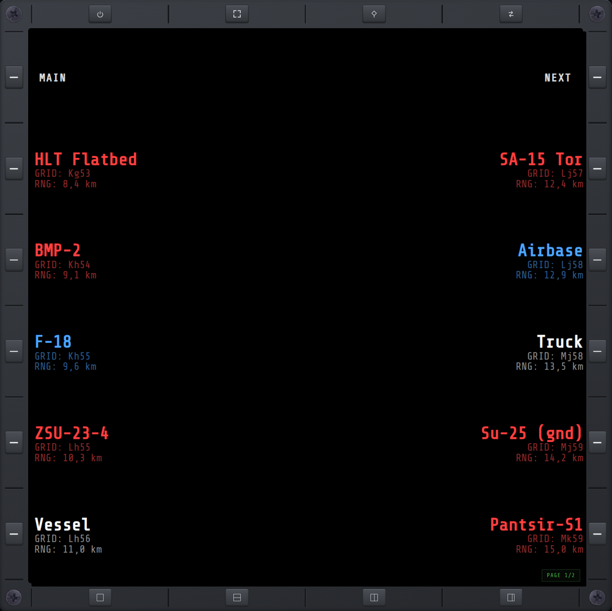

# Nuclear Option eXternal MFD


NO XMFD is a BepInEx plugin for [Nuclear Option](https://store.steampowered.com/app/2168680/)
that reads live flight telemetry from the game and serves it over the local
network as a browser-based multi-function display (MFD). The display opens in
any web browser, on the same PC or on another device on the same network.

## Requirements

- **Nuclear Option** (PC, via Steam).
- **BepInEx 5** (x64) installed into the game.
- A device with a modern web browser — the same PC, or a tablet/phone on the
  same local network.

### BepInEx setting

Set `HideManagerGameObject = true` under `[Chainloader]` in
`BepInEx/config/BepInEx.cfg`. The plugin itself runs without it, but the in-game
**ConfigurationManager** menu — used to change settings live — will not open
unless it is set: Nuclear Option destroys BepInEx's manager GameObject on the
boot → main-menu transition, and ConfigurationManager lives on it. (Settings can
still be edited by hand in the `.cfg` file either way.) Its default open key is
`F1`, rebindable in that menu's *General* section.

## Installation

NO XMFD ships as a single BepInEx plugin (the web display is bundled inside the DLL).

1. **Install BepInEx 5** (x64) into Nuclear Option — grab it from the
   [BepInEx releases](https://github.com/BepInEx/BepInEx/releases). Run the game
   once so BepInEx creates its folders.
2. **(Optional) Install ConfigurationManager** — the in-game settings editor, much
   friendlier than editing the config file by hand. Download the **BepInEx 5** build
   from its [releases](https://github.com/BepInEx/BepInEx.ConfigurationManager/releases)
   and extract the DLL into `BepInEx/plugins/`.
3. **Download the latest NO XMFD release** from the
   [Releases page](https://github.com/roke77/NOXMFD/releases).
4. **Extract it** into a subfolder of BepInEx's plugins directory:

   ```
   BepInEx/plugins/NOXMFD/
   ```

5. **Launch the game.** Open `http://localhost:5005/` in a browser to see the
   display. To reach it from a tablet or phone on your network, see
   [docs/networking.md](docs/networking.md).

The in-game settings menu (Declutter HUD toggles, keybinds) needs ConfigurationManager
installed **and** `HideManagerGameObject = true` (see [BepInEx setting](#bepinex-setting)).
Without it the settings still work — edit them in `BepInEx/config/com.roque.NOXMFD.cfg`.

## Features

NO XMFD's features are built around flight immersion. It declutters Nuclear
Option's in-game HUD instruments and relocates those readouts onto external
displays — a second monitor, tablet, or phone — the way a physical flight-sim
rig spreads its instrumentation across dedicated screens and panels around the
pilot, with HOTAS-friendly keybinds to match.

### MFD pages

- **MAIN** — landing page: connection status and the URL(s) to open the display.

  <details>
  <summary>Show screenshot</summary>

  

  </details>

- **AVN** — aircraft status at a glance: airframe damage, fuel, throttle, and engine-fire warnings.

  <details>
  <summary>Show screenshot</summary>

  

  </details>

- **MAP** — full-screen tactical map with friendly/hostile units and your own position; click a unit to target it, FLW toggles follow, Z+/Z− zoom.

  <details>
  <summary>Show screenshot</summary>

  

  </details>

- **RWR** — radar threats around you by bearing, with incoming-missile warnings.

  <details>
  <summary>Show screenshot</summary>

  

  </details>

- **TGL** — scrollable list of detected targets with type, map grid, and range; tap a target to deselect it.

  <details>
  <summary>Show screenshot</summary>

  

  </details>

- **TGP** — targeting-pod camera feed zoomed on the locked target, with range and bearing.

  <details>
  <summary>Show screenshot</summary>

  

  </details>

- **WPN** — weapon loadout and rounds remaining, plus IR-flare count and jammer charge.

  <details>
  <summary>Show screenshot</summary>

  

  </details>

### MFD shell

The shell frames the active page with dedicated bezel buttons — function
controls along the top, layout presets along the bottom.

- **PWR** — screen on/off.
- **FULL** — fullscreen toggle.
- **PIN** — pin a page.
- **SWAP** — jump to/from pin.
- **F_VIEW** — single page.
- **H_SPLIT** — top/bottom split.
- **V_SPLIT** — left/right split.
- **V_WIDE_SPLIT** — left/right 2:1 split.

### Declutter HUD

Optional toggles to hide native in-game HUD elements, available in the BepInEx
configuration menu.

- **Master switch** — hide the native in-game HUD elements as a set.
- **Weapon & ammo** — hide the top-right weapon name / ammo and countermeasure count readouts.
- **Minimap** — hide the bottom-left corner minimap.
- **Top boxes** — hide the boxed heading / airspeed / altitude readouts flanking the heading tape.

### Extended Keybinds

Optional dedicated keybinds, available in the BepInEx configuration menu
(keyboard/mouse or HOTAS button).

- **Dispense flares** — select + deploy IR flares (tap to pop, hold to keep popping).
- **Activate radar jammer** — select + activate the radar jammer (hold to jam).
- **Gear up** — raise the landing gear.
- **Gear down** — lower the landing gear.

## Security & privacy

NO XMFD is open source and runs entirely on your machine and local network — it
makes **no internet connections** and collects nothing. It does run a local web
server (so a tablet can connect) and can optionally add a Windows firewall rule
for its own port. Like all BepInEx mods it runs unsandboxed, so it's worth
knowing exactly what it can access: see **[SECURITY.md](SECURITY.md)** for the
full capability disclosure, the one network caveat (the LAN server is
unauthenticated), and how to verify the build yourself. Network/firewall setup
is covered in [docs/networking.md](docs/networking.md).
