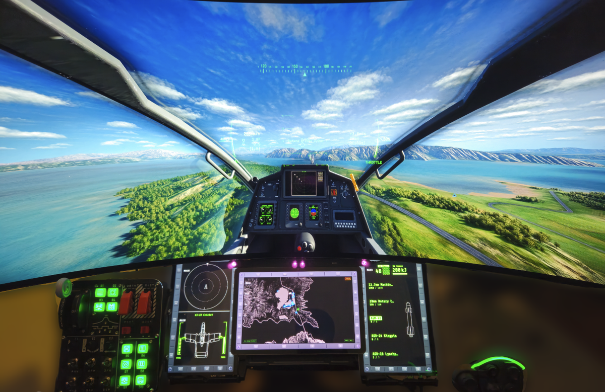
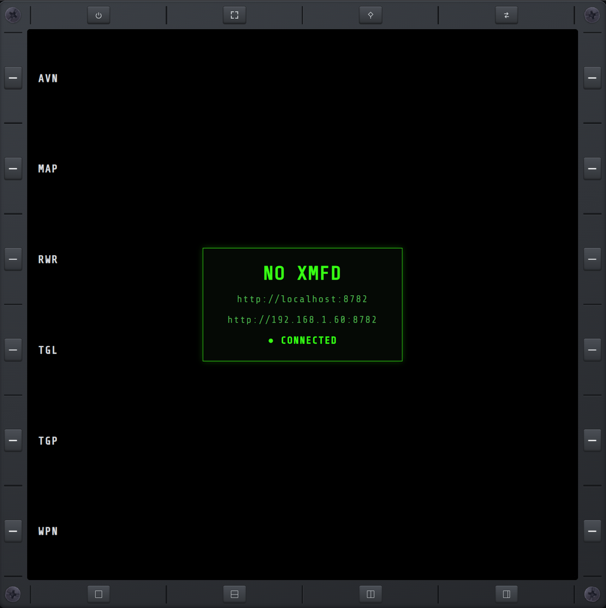
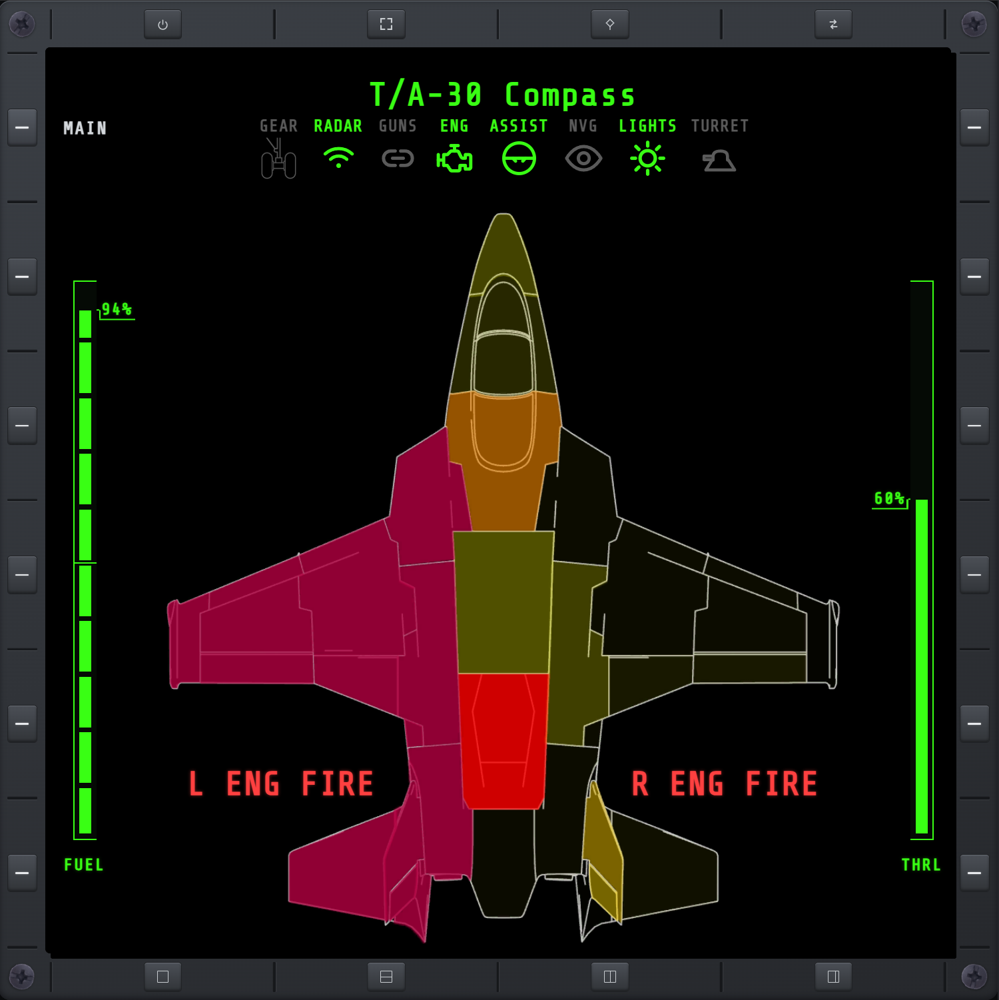
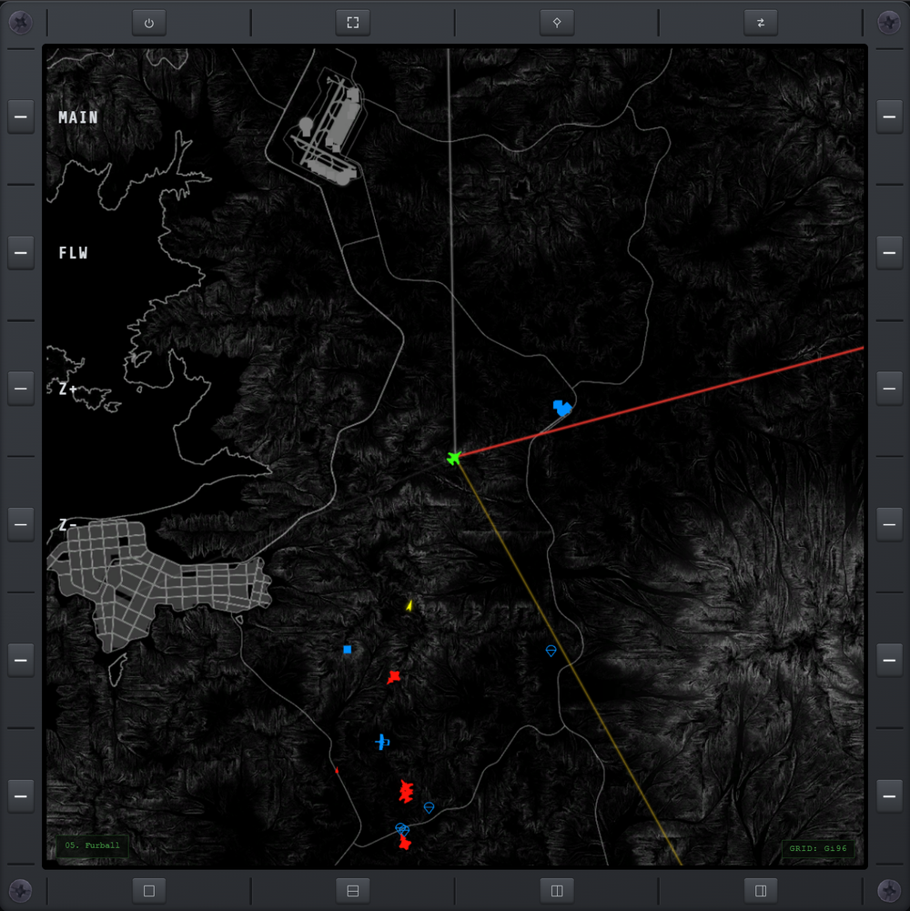
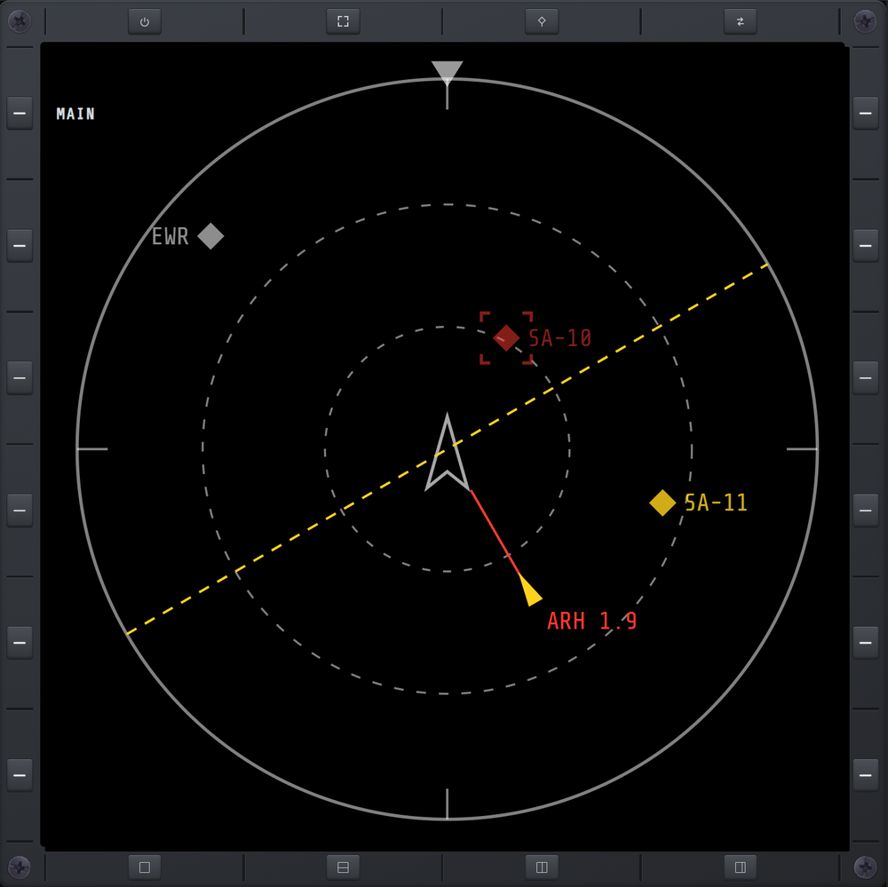
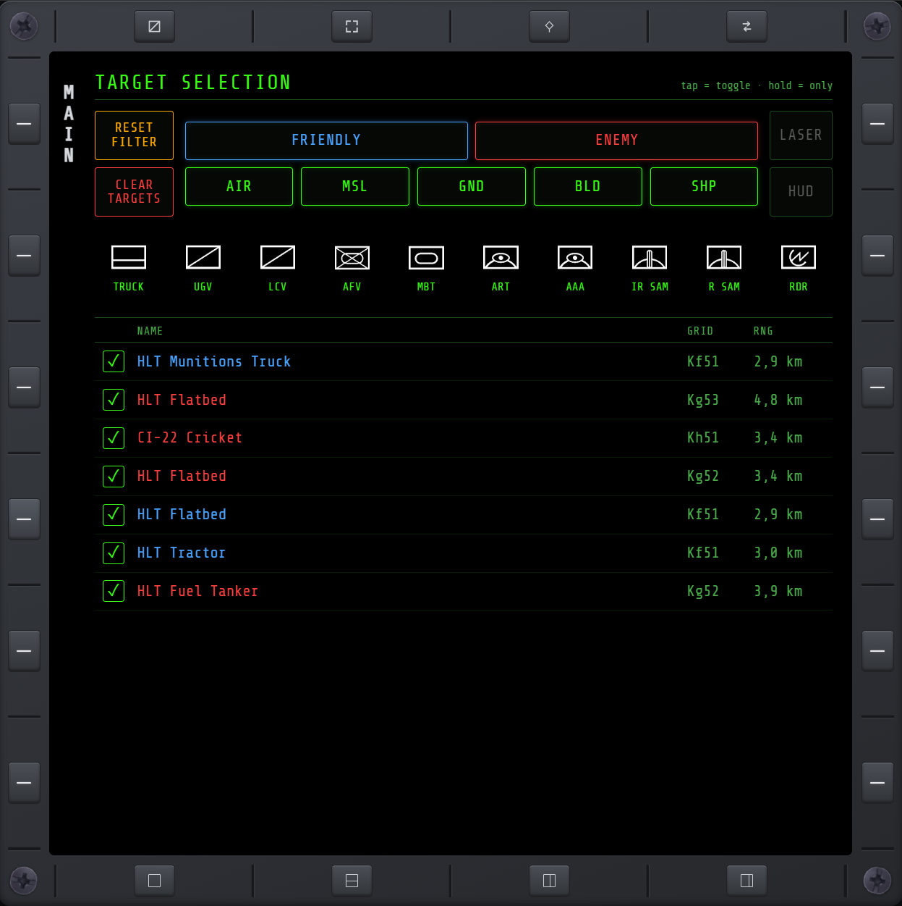
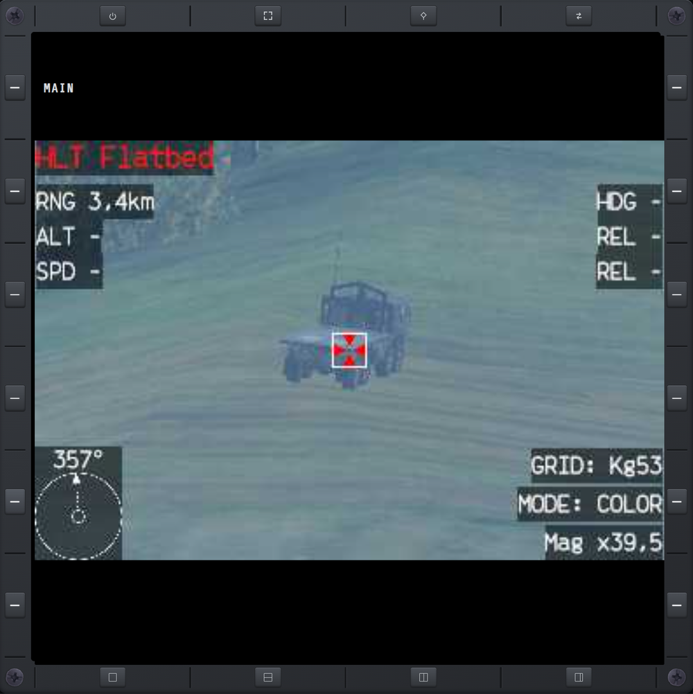
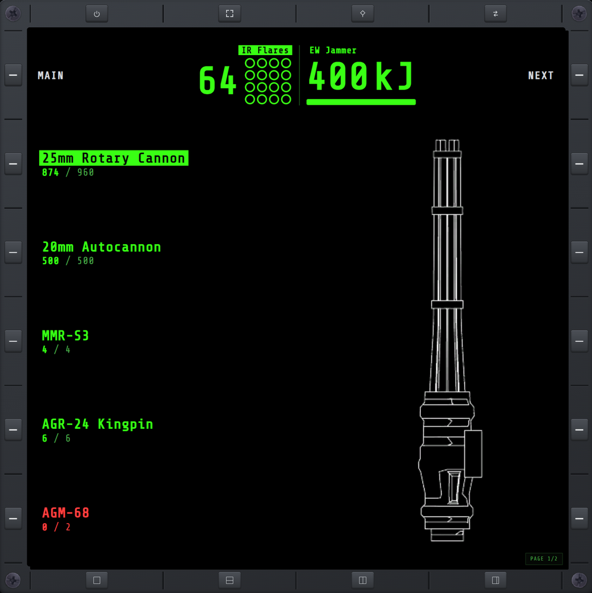
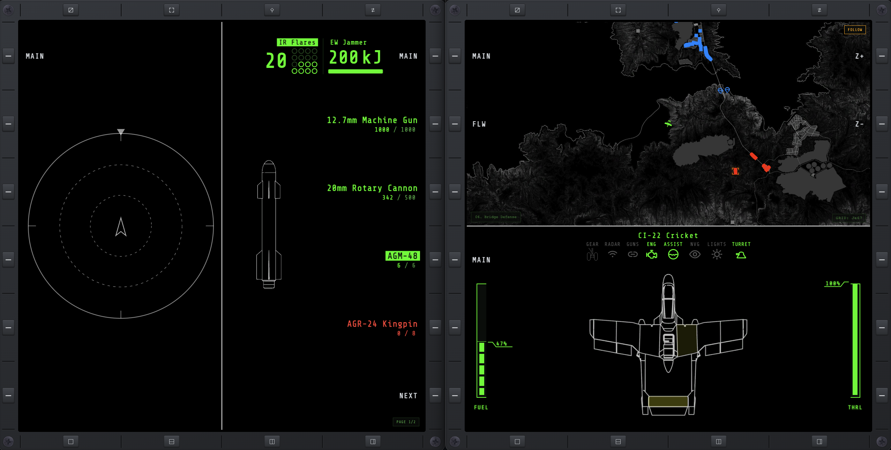
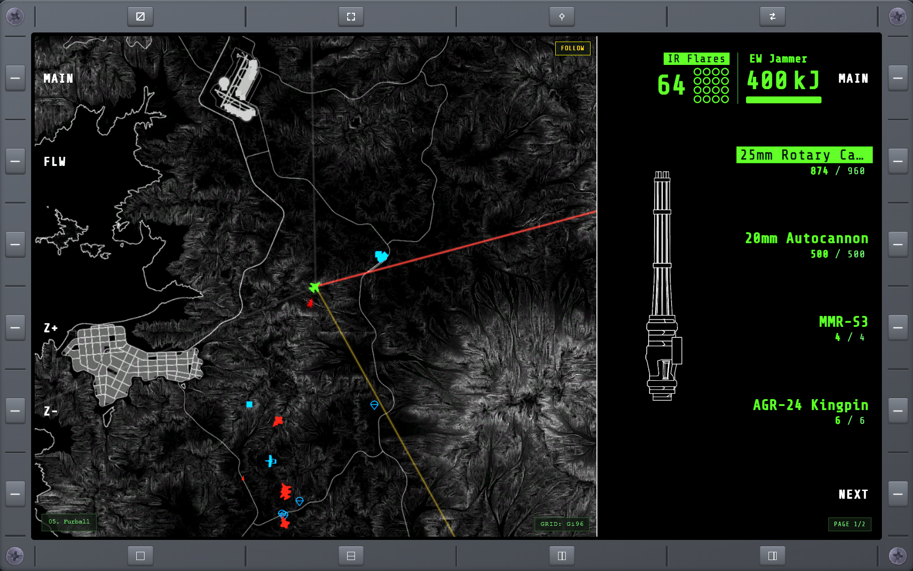

#  Nuclear Option eXternal MFD



NO XMFD is a BepInEx plugin for [Nuclear Option](https://store.steampowered.com/app/2168680/)
that reads live flight telemetry from the game and serves it over the local
network as a browser-based multi-function display (MFD). The display opens in
any web browser, on the same PC or on another device on the same network.

## Requirements

- **Nuclear Option** (PC, via Steam).
- **BepInEx 5** (x64) installed into the game.
- A device with a modern web browser — the same PC, or a tablet/phone on the
  same local network.

## Installation

NO XMFD ships as a single BepInEx plugin (the web display is bundled inside the DLL).

<details>
<summary><strong>With NOMM (recommended)</strong></summary>

[NOMM](https://github.com/Combat787/NOMM) (Nuclear Option Mod Manager) installs BepInEx and
NO XMFD for you, and keeps it up to date.

1. **Install NOMM** from its [latest release](https://github.com/Combat787/NOMM/releases/latest)
   — on Windows, the `portable.exe` or the `.msi` installer.
2. **Find "Nuclear Option eXternal MFD"** in NOMM's mod list and install it. NOMM pulls in
   BepInEx automatically if it isn't already present.
3. **Launch the game** and open `http://localhost:5005/` in a browser. To reach it from a
   tablet or phone on your network, see [docs/networking.md](docs/networking.md).

</details>

<details>
<summary><strong>Manually</strong></summary>

1. **Install BepInEx 5** (x64) into Nuclear Option — grab it from the
   [BepInEx releases](https://github.com/BepInEx/BepInEx/releases). Run the game
   once so BepInEx creates its folders.
2. **Download the latest NO XMFD release** from the
   [Releases page](https://github.com/roke77/NOXMFD/releases).
3. **Extract it** into a subfolder of BepInEx's plugins directory:

   ```
   BepInEx/plugins/NOXMFD/
   ```

4. **Launch the game.** Open `http://localhost:5005/` in a browser to see the
   display. To reach it from a tablet or phone on your network, see
   [docs/networking.md](docs/networking.md).

</details>

<details>
<summary><strong>Changing settings (ConfigurationManager)</strong></summary>

NO XMFD's own settings — the Declutter HUD toggles and the extended keybinds —
are changed either in the in-game **ConfigurationManager** menu or by hand in
`BepInEx/config/com.roque.NOXMFD.cfg`. The plugin runs fine without any of this;
you only need it to adjust those settings.

To use the in-game menu, install **ConfigurationManager** — the settings editor,
much friendlier than editing the config file by hand. Download the **BepInEx 5**
build from its
[releases](https://github.com/BepInEx/BepInEx.ConfigurationManager/releases) and
extract the DLL into `BepInEx/plugins/`. It also needs `HideManagerGameObject =
true` under `[Chainloader]` in `BepInEx/config/BepInEx.cfg`: Nuclear Option
destroys BepInEx's manager GameObject on the boot → main-menu transition, and
ConfigurationManager lives on it, so the menu will not open unless the setting is
on. Its default open key is `F1`, rebindable in that menu's *General* section.

Either way the settings work — skip ConfigurationManager and edit the `.cfg` by
hand.

</details>

## Features

NO XMFD's features are built around flight immersion. It declutters Nuclear
Option's in-game HUD instruments and relocates those readouts onto external
displays — a second monitor, tablet, or phone — the way a physical flight-sim
rig spreads its instrumentation across dedicated screens and panels around the
pilot, with HOTAS-friendly keybinds to match.

### MFD pages

- **MAIN** — landing page: connection status and the URL(s) to open the display.

  <details>
  <summary>$\color{green}\textsf{Show screenshot}$</summary>

  

  </details>

- **AVN** — aircraft status at a glance: airframe damage, fuel, throttle, engine-fire warnings, and a row of system annunciators (gear, radar, guns, engine, flight assist, night vision, nav lights, turret) that light up with each system's live state.

  <details>
  <summary>$\color{green}\textsf{Show screenshot}$</summary>

  

  </details>

- **MAP** — full-screen tactical map with friendly/hostile units and your own position; click a unit to target it, FLW toggles follow, Z+/Z− zoom.

  <details>
  <summary>$\color{green}\textsf{Show screenshot}$</summary>

  

  </details>

- **RWR** — radar threats around you by bearing, with incoming-missile warnings.

  <details>
  <summary>$\color{green}\textsf{Show screenshot}$</summary>

  

  </details>

- **TGT** — target-selection filter mirroring the in-cockpit TARGET SELECTION panel: toggle which factions, categories, and vehicle types can be targeted (plus LASER/HUD), with RESET and CLEAR, above your live selected-target list. Full-view only for the moment — selecting it from a split view switches back to full view.

  <details>
  <summary>$\color{green}\textsf{Show screenshot}$</summary>

  

  </details>

- **TGP** — targeting-pod camera feed zoomed on the locked target, with range and bearing.

  <details>
  <summary>$\color{green}\textsf{Show screenshot}$</summary>

  

  </details>

- **WPN** — weapon loadout and rounds remaining, plus IR-flare count and jammer charge.

  <details>
  <summary>$\color{green}\textsf{Show screenshot}$</summary>

  

  </details>

### MFD shell

The shell frames the active page with dedicated bezel buttons — function
controls along the top, layout presets along the bottom.

- **HIDE** — hide the bezel so the screen fills the viewport.
- **FULL** — fullscreen toggle.
- **PIN** — pin a page.
- **SWAP** — jump to/from pin.
- **F_VIEW** — single page.
- **H_SPLIT** — top/bottom split.
- **V_SPLIT** — left/right split.
- **V_WIDE_SPLIT** — left/right 2:1 split.

<details>
<summary>$\color{green}\textsf{See screenshots}$</summary>





</details>

### Declutter HUD

Optional toggles to hide native in-game HUD elements, available in the BepInEx
configuration menu.

- **Weapon & ammo** — hide the top-right weapon name / ammo and countermeasure count readouts.
- **Minimap** — hide the bottom-left corner minimap.
- **Top boxes** — hide the boxed heading / airspeed / altitude readouts flanking the heading tape.

### Extended Keybinds

Optional dedicated keybinds, available in the BepInEx configuration menu
(keyboard/mouse or HOTAS button).

- **Dispense flares** — select + deploy IR flares (tap to pop, hold to keep popping).
- **Activate radar jammer** — select + activate the radar jammer (hold to jam).
- **Gear up** — raise the landing gear.
- **Gear down** — lower the landing gear.

## Reporting & collaboration

Found a bug, or want a feature? Open an issue on the
[issue tracker](https://github.com/roke77/NOXMFD/issues) — include your game and
NO XMFD versions, and steps to reproduce for bugs. It's also where planned and
in-progress work is tracked.

Pull requests are welcome. For anything non-trivial, open an issue first so we
can agree on the approach before you write code. Security issues have their own
process — see [Verifying and reporting](SECURITY.md#verifying-and-reporting).

## Security & privacy

NO XMFD is open source and runs entirely on your machine and local network — it
makes **no internet connections** and collects nothing. It does run a local web
server (so a tablet can connect) and can optionally add a Windows firewall rule
for its own port. Like all BepInEx mods it runs unsandboxed, so it's worth
knowing exactly what it can access: see **[SECURITY.md](SECURITY.md)** for the
full capability disclosure, the one network caveat (the LAN server is
unauthenticated), and how to verify the build yourself. Network/firewall setup
is covered in [docs/networking.md](docs/networking.md).
