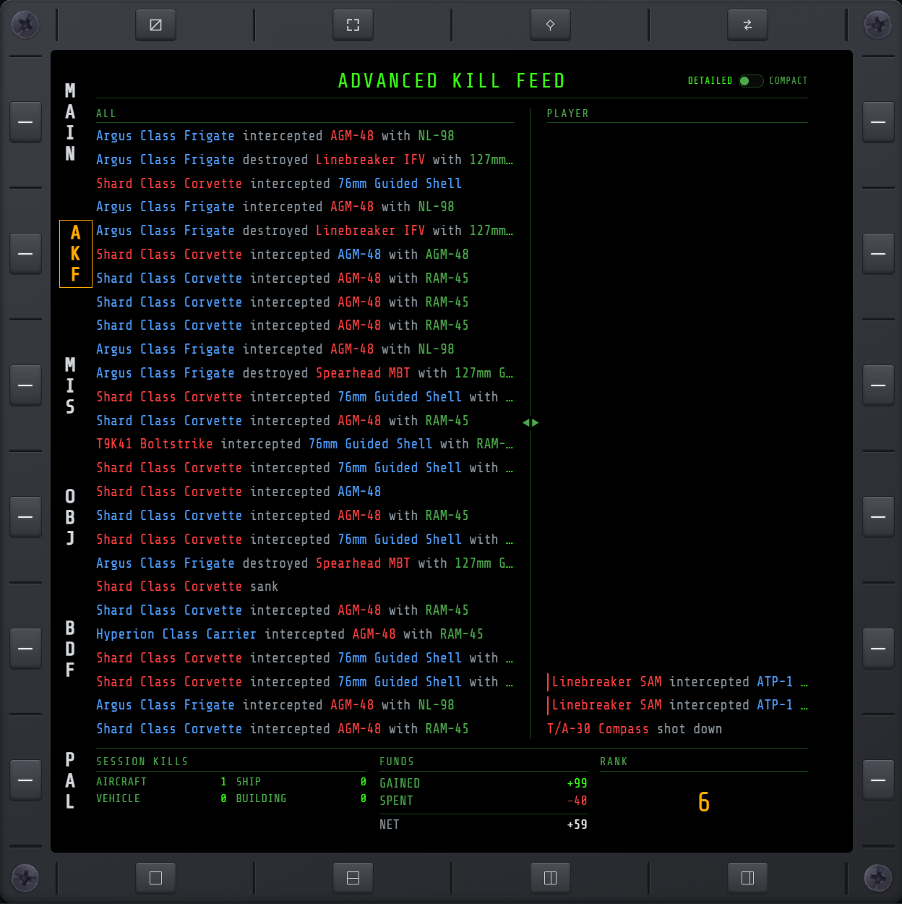
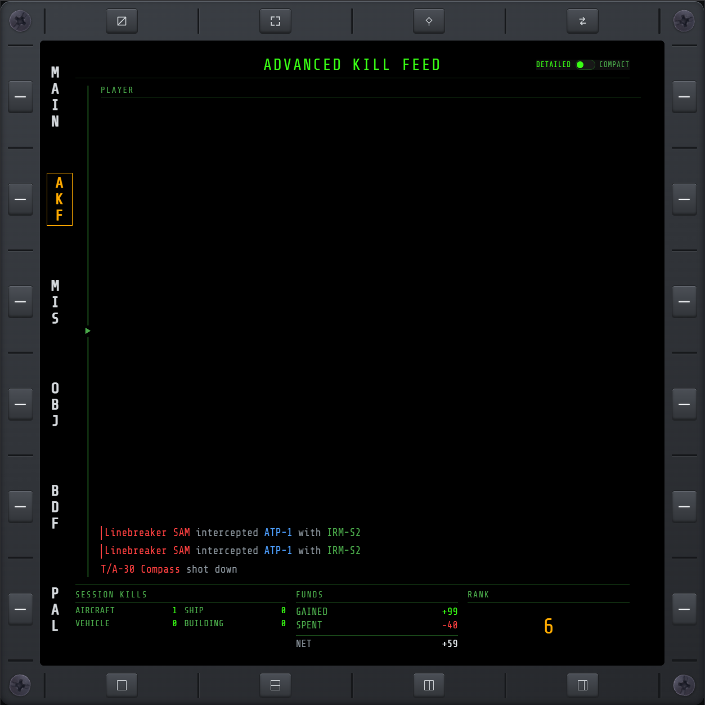
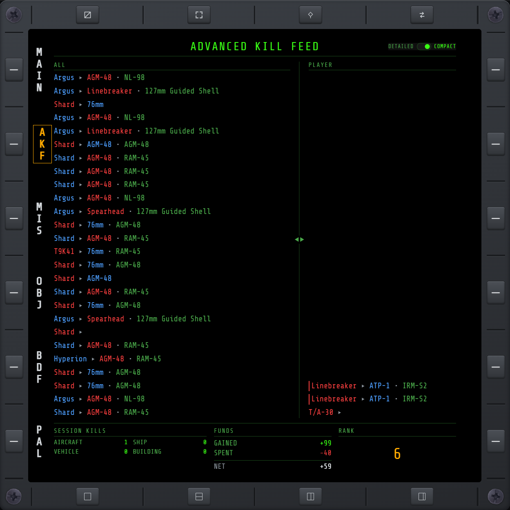

# AKF

Part of the **MD** (Mission Data).

A replica of the game's own kill-feed ticker, split into an ALL column (every kill) and a PLAYER
column (yours — weapon name included where resolvable, plus lines for when you're shot down or
your own ordnance is intercepted). Session kill tally, funds gained/spent, and current rank are
shown below the feeds.

The native kill-feed ticker this replicates can be hidden from the in-cockpit HUD with
[HUD](hud.md#declutter)'s **FEED** toggle, without affecting this page.

## ALL / PLAYER split

A divider with triangle grips separates the two feeds. Dragging it resizes the ALL/PLAYER column
widths. Dragging a column below a minimum width collapses it, leaving only an arrow pointing
toward the remaining column. Clicking the arrow restores the default split.

The split (custom or collapsed) is not persisted; reloading the page resets it to the default.

## Density toggle

DETAILED/COMPACT toggle, top right. DETAILED shows the full line: `Attacker verb Victim with
Weapon`. COMPACT truncates each unit name to its first word, replaces the verb with a `▸` glyph,
and replaces `with` with a `•` glyph. The weapon name is unaffected in both modes. The setting
applies to both feeds and only changes how entries render.

## PAD cursor

The resizer and density toggle are drivable from a HOTAS [PAD cursor](keybinds.md#pad-cursor).
Holding Select over the resizer drags it. A Select tap activates the density toggle, or restores
the split if the resizer is collapsed.
