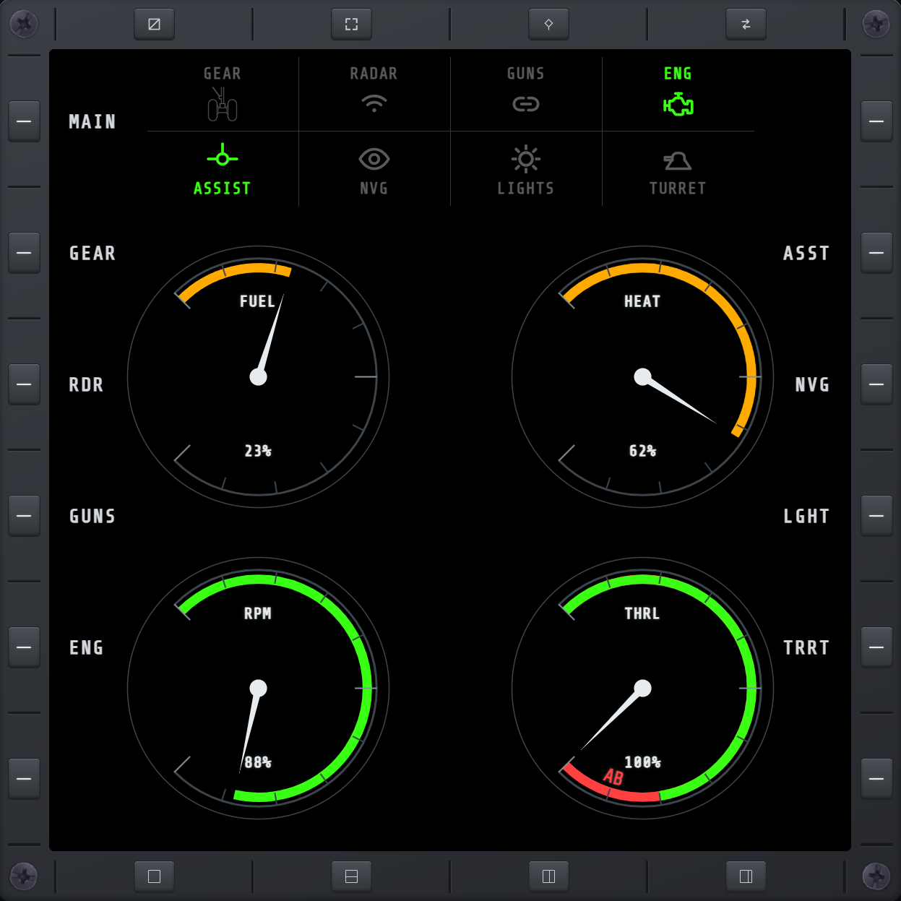

# AVN

Avionics at a glance: circular gauges for engine RPM, fuel, IR heat signature, and throttle
(with an afterburner range on the dial), plus a bank of system toggles — gear, radar, guns,
engine, flight assist, night vision, nav lights, turret — that show live state and double as
bezel-actuated switches. GEAR follows the game's own gear key: it only moves the gear in the air,
and not while it is already moving. GUNS lights whenever the game has guns linked, on any aircraft.

