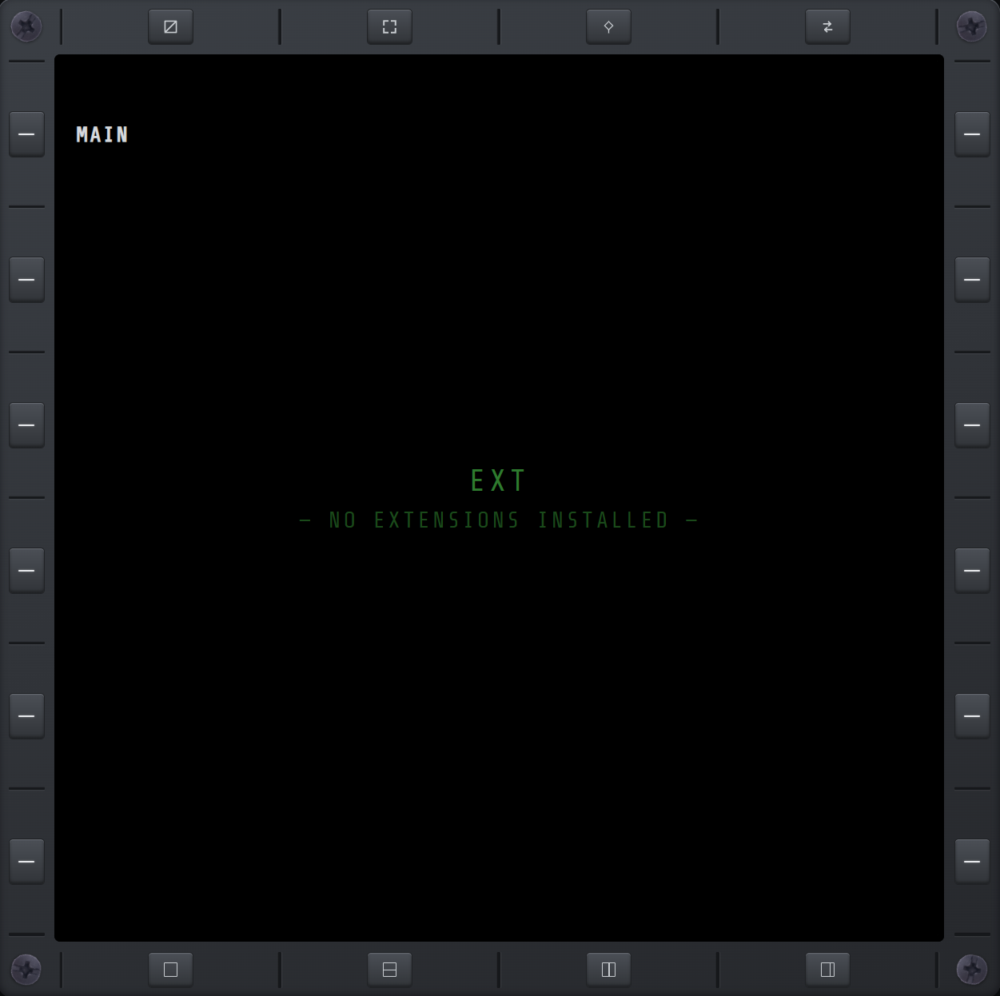

# EXT

NO XMFD supports third-party extensions that add their own MFD pages. A separate BepInEx plugin
can declare a dependency on NO XMFD and register its own page at runtime — no fork of this repo,
no pull request — and it shows up automatically under the **EXT** nav alongside NO XMFD's own
pages. See [EXTENSIONS.md](../EXTENSIONS.md) for the full guide to building one.

