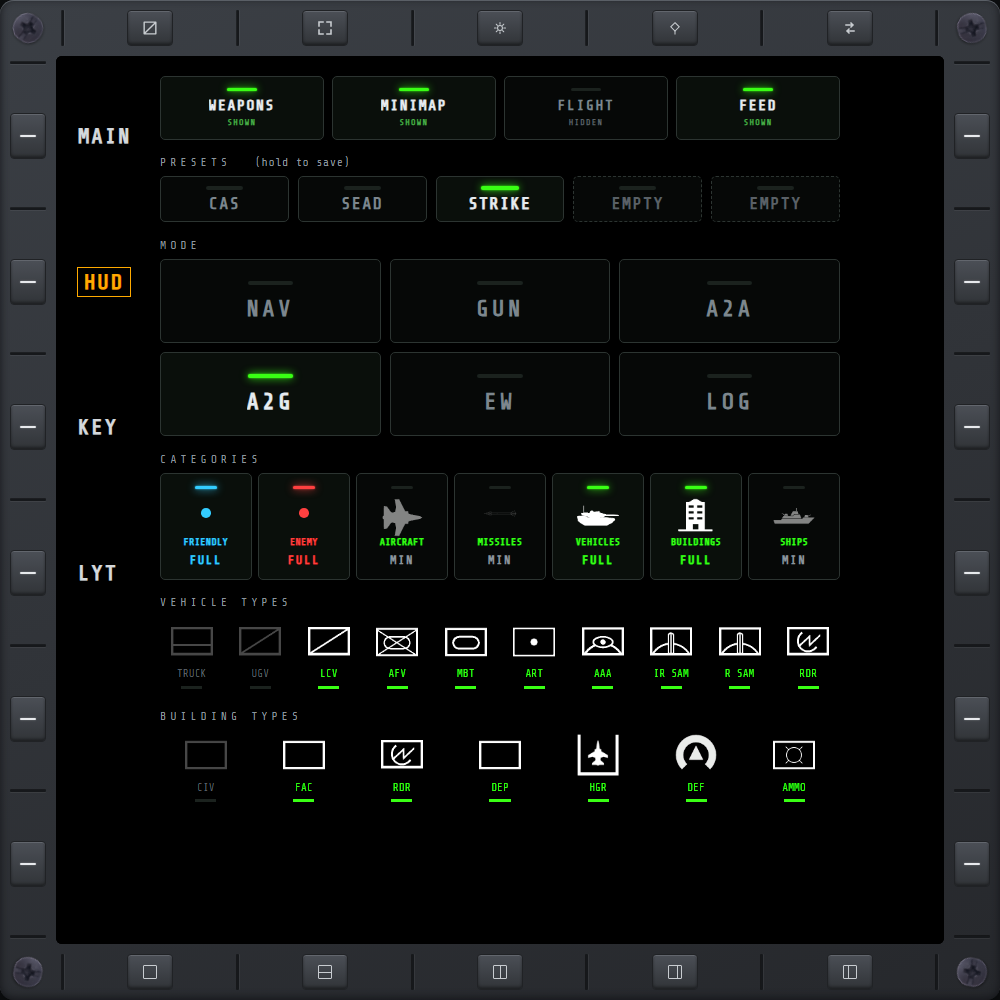

# HUD

A clickable replica of the game's in-cockpit HUD OPTIONS screen, plus a declutter strip for the
mod's own HUD-hiding toggles.

## Layout

Every toggle is a dark pushbutton with an indicator lamp above its label. The lamp glows when the
setting is on and stays dark when it is off. Top to bottom: declutter, presets, mode, categories,
vehicle types, building types.

## Declutter

Four cards for the mod's own native-HUD hiding — **WEAPONS** (the weapon panel), **MINIMAP** (the
corner minimap), **FLIGHT** (the boxed flight readouts) and **FEED** (the native kill-feed ticker
— the game's own version of what [AKF](akf.md)'s ALL feed replicates). A lit card reads **SHOWN**:
that widget is on the HUD. A dark card reads **HIDDEN**. Independent of everything below; these
aren't part of the game's own HUD OPTIONS.

## Presets

Five cards of your own named presets, saved server-side so any connected browser can save or load
one. The lit card is the current preset; an empty slot reads **EMPTY** with a dashed border. The
heading reads **PRESETS (hold to save)**.

- **Tap** a card — applies that preset's saved filters (every category, vehicle and building
  toggle) and makes it the current preset. Tapping an empty slot just makes it current.
- **Hold** a card — opens the **SAVE PRESET** dialog for that slot, empty or not. **SAVE** captures
  the page's current filters into the slot under the name you typed (and makes it current), **CLEAR**
  empties the slot back to empty (name and data both), **CANCEL** closes the dialog. To rename a
  preset, hold its card, retype the name and save.
- The 5 numbered keybinds on [KEY](keybinds.md#hud-presets) recall a preset directly, and also
  become the current preset.
- Presets are separate from the mode buttons below: a mode applies one of the game's own built-in
  presets (NAV/GUN/A2A/A2G/EW/LOG); these 5 are your own, named by you.
- See [KEY](keybinds.md#immersion-options)'s **Force HUD filters on combat mode** setting for how
  switching weapons mode to A/A or A/G can automatically apply the matching mode here.

## Mode

NAV / GUN / A2A / A2G / EW / LOG — six buttons in two rows of three; the lit one is the active
mode. Pressing one applies that mode's saved preset, switching every category and type toggle
below to whatever that mode has configured.

## Categories

FRIENDLY, ENEMY, AIRCRAFT, MISSILES, VEHICLES, BUILDINGS, SHIPS — each can be maximized (**FULL**,
lit) or minimized (**MIN**) independently. FRIENDLY glows blue and ENEMY red. Minimized enemy icons
shrink to a small dot; minimized friendly icons disappear entirely. Two things to know:

- **Aircraft always show at full size**, regardless of this toggle — the game itself exempts
  them.
- **A newly-spotted unit stays maximized for a few seconds** before this setting applies to it,
  so a toggle only affects units already established on the HUD, not ones just appearing.

## Vehicle & building types

Within VEHICLE TYPES and BUILDING TYPES, individual types (e.g. TRUCK, MBT, AAA for vehicles;
FAC, HGR, DEF for buildings) toggle independently of their parent category. A green label over a
full-brightness icon with a lit line beneath it is on; a dim label and icon is off.

## PAD cursor

This page is fully drivable from a HOTAS [PAD cursor](keybinds.md#pad-cursor).
