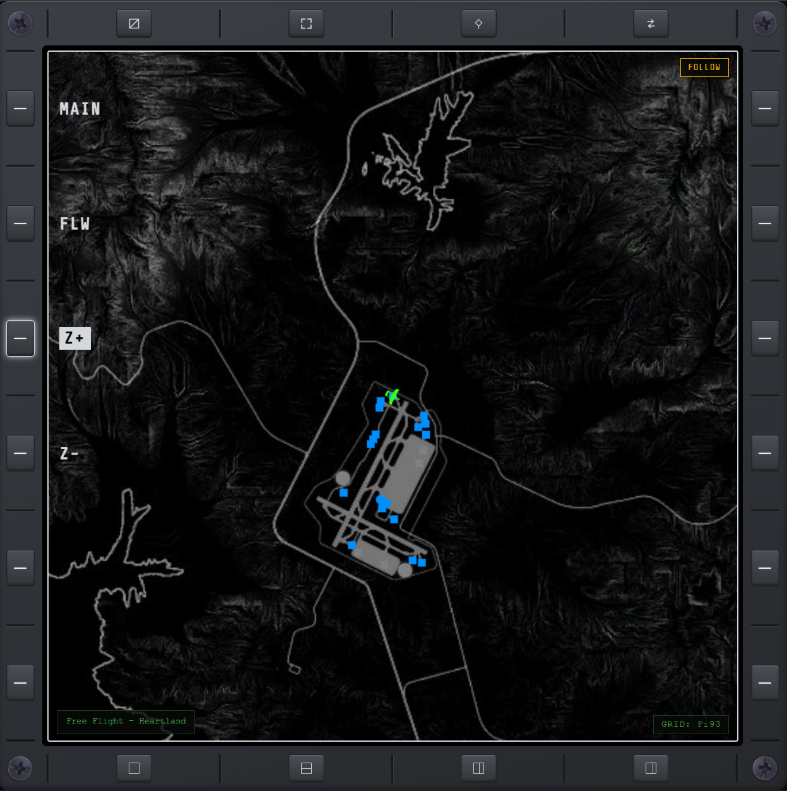
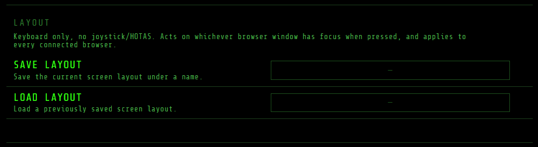
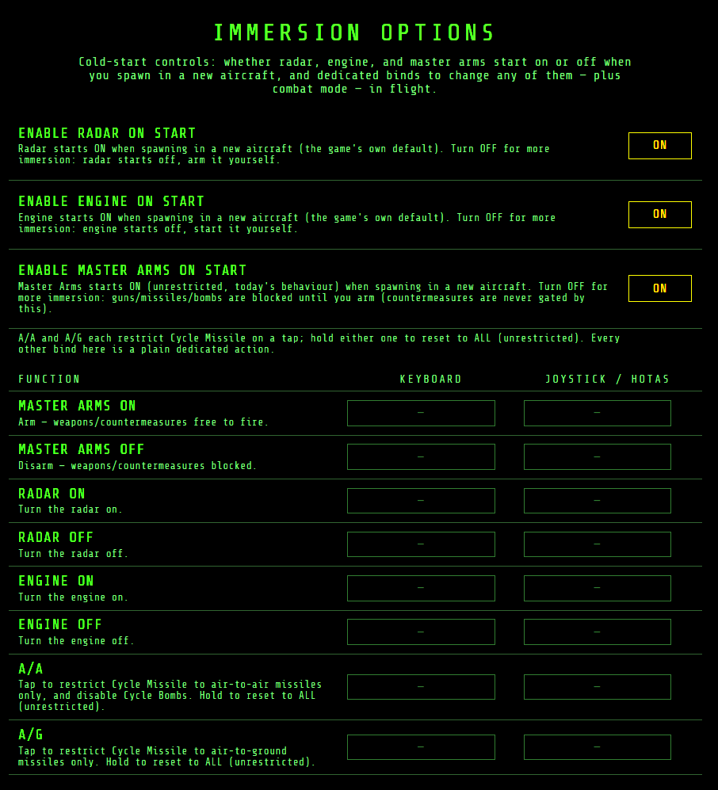

# KEY

Optional dedicated keybinds for cockpit functions the game has no native bind for. Each function
takes a keyboard/mouse key, a joystick/HOTAS button, or both — click a cell on the page and press
the key or button to bind it. Multi-stick HOTAS setups are supported; each bind remembers which
stick it came from.

## Weapons

- **Flares** — select + deploy IR flares (tap to pop, hold to keep popping).
- **Jammer** — select + activate the radar jammer (hold to jam).
- **Jamming Pod** — select + activate a weapon-mounted radar jamming pod (e.g. the Medusa's), hold
  to keep jamming.
- **Cycle guns / missiles / bombs** — select the last soft-selected weapon of that type, or the
  first in the list; repeated presses cycle to the next one, skipping depleted weapons. Cycling to
  a different type leaves the current one soft-selected.
- **Gun trigger / Weapon release** — per-class fire keys (hold for continuous fire). If the active
  weapon is from the other class, the first press only switches — bringing up the right reticle —
  and the next press fires. Current gun and missile/bomb choices show as outlines on
  [WPN](wpn.md).
- **Single Target Weapon Release** — releases one missile/bomb at only the *focused* locked target
  (see [Target list](#target-list) below), even with others also locked, instead of Weapon
  Release's own staggered one-round-per-lock salvo. Same switch-then-fire behavior and HOLD-to-keep-
  releasing as Weapon Release. The focused lock's own on-screen symbol also gets a small amber "+"
  at its top-left ([RDR](rdr.md#in-game-hud-cue)) so you can tell which target this will hit.

## Gear

- **Gear up / Gear down** — dedicated raise/lower (the stock bind is a single toggle).

## Map & waypoints

Direct binds for what [MAP](map.md)'s FLW/R+/R− and context-sensitive W+/W− or S+/S− controls do
on the focused display:

- **Follow**
- **Next Route**, **Previous Route** — stay usable to switch INTO a route as long as one is saved,
  even with none currently active.
- **Next Waypoint / Steer Point**, **Previous Waypoint / Steer Point** — step route progress while
  a route is active; otherwise cycle the selected steer point.

Zoom In/Out aren't here — they're the shared **Cursor Zoom In/Out** pair under [Cursor](#cursor)
below, which also drives [manual TGP camera](tgp.md#manual-camera-control) zoom.

## Target list

- **Next Target / Previous Target** — steps which one of your locked targets is the *focused* lock,
  the one [TGT](tgt.md) outlines and [FCR/HSD](rdr.md#when-a-target-is-locked) both draw amber and
  read out in the bottom readout. This shared focus is not SOI-gated: it moves on every open
  TGT/FCR/HSD page, in every browser. On the SOI-focused TGT display, the same press hides the PAD
  crosshair and makes **Cursor Select** deselect the focused row directly; moving the crosshair hands
  Select back to the cursor.
- **Clear Datalink / Clear Stale** — the keybind equivalents of tapping [TGT](tgt.md)'s own
  DATALINK/STALE buttons.

## Cursor

**Cursor Up / Down / Left / Right / Select**, plus two HOTAS axis binds (horizontal/vertical) —
drive the [PAD cursor](#pad-cursor) below.

**Cursor Zoom In / Zoom Out**, plus a calibrated **Cursor Zoom Axis**, zoom the focused MAP display
(or scroll a scrollable page) the same way MAP's old dedicated Zoom In/Out did — see
[PAD cursor](#pad-cursor) below — and additionally drive [manual TGP camera](tgp.md#pointing-the-camera)
zoom while it holds SOI. Zoom Axis is camera-only: a calibrated slider (e.g. a HOTAS throttle
slider) whose moved position jumps the camera straight to that zoom level; Zoom In/Out still work
between axis moves.

## TGP

Manual pointing of the targeting-pod camera, independent of the game's own auto-lock — see
[TGP](tgp.md#manual-camera-control) for what manual control actually does. Pointing itself uses
the shared [PAD cursor](#pad-cursor) binds above, not a dedicated pan/tilt/zoom of its own.

- **Manual Control Toggle** — turn manual camera control on/off. Centers on the aircraft's nose at
  minimum zoom on entry, and claims PAD Cursor SOI immediately. Turns off on its own the moment a
  real target locks, the aircraft is lost, or the landing-gear camera takes over.
- **Manual Control Reset** — recenter the camera on the aircraft's forward direction at minimum
  zoom, without turning it off.
- **Point Track** — lock the camera onto whatever it's currently pointed at, holding that world
  point steady as the aircraft moves. Press again to release. Only acts while manual control is on.
- **Toggle IR** — switch the active TGP camera between COLOR and IR: the manual camera, or a real
  unit lock. The game normally switches this automatically by time of day, distance, or the
  "always IR" setting; this overrides that with your own choice, which sticks until you flip it
  again.
- **Full Screen Toggle** — show the TGP camera feed full screen: a cinematic, independently
  rendered view, not a stretch of the small in-cockpit screen. Turns off on its own if the aircraft
  is lost, the landing-gear camera takes over, or the pause menu/map opens.
- **Full Screen HUD Toggle** — show or hide the readout overlay (range/altitude/heading/mode)
  while full screen is active, for a clean, unobstructed view of the feed itself.

## Other settings

Two toggles sit above the bind table (neither is a bind itself):

An **Input When Game Unfocused** toggle — turn it on if you run the display in a browser on the
same PC as the game, so your HOTAS stays live while that browser window has focus. Off by default;
leave it off for a tablet or phone, where the game keeps focus anyway.

**Listen for Keybinds (Remote)** lets this browser send the keyboard binds configured on this page
back to the game, so a tablet, laptop, or WSO station can operate the same MAP/TGT/SOI/weapon
actions without physical access to the game PC. It is off by default and stored per browser. Keep it
enabled only on the browser you intend to use for input; if the page detects that it is running on
the game PC, it warns that the game may also receive the same physical keypress and double-fire an
action.

## Sensor of Interest (SOI)

Operate a display from your HOTAS without touching it. One screen at a time is selected — it is
outlined in white — and the SOI keys move a cursor over its buttons and press them. In a split the
selection is a single pane; on the [F-35 layout](layouts.md#f-35) it is a single portal. Nothing
is selected until you press a SOI key.

- **SOI Next / SOI Prev** — select the next / previous screen (every open display, and each F-35
  portal).
- **Nav Up / Nav Down** — move the cursor over the selected screen's buttons.
- **Nav Select** — press the button under the cursor.

## PAD cursor

When a display's focused page is interactible — [MAP](map.md), [HUD](hud.md), [TGT](tgt.md),
[FCR](rdr.md#fcr), [HSD](rdr.md#hsd), [WPT](wpt.md), or [AKF](akf.md) — a crosshair can move over
it and act on whatever's underneath, the same thing a mouse click or touch tap already does, but
from the HOTAS, without touching the screen.

- **Cursor Up/Down/Left/Right** (or a bound analog axis) slews it.
- **Cursor Select** picks whatever it's over: a contact on MAP, a toggle on HUD, a filter or
  target row on TGT (holding it also mirrors that page's own long-press action, where it has one),
  a contact on FCR or HSD (locking/unlocking it — the same target set TGT itself reads), a
  waypoint row or button on WPT, or the density toggle on AKF (holding it over AKF's pane divider
  drags the split instead, and a tap there while collapsed restores it). On TGT
  specifically, after Next/Previous Target, Select instead deselects the focused row directly until
  the cursor moves again — see [Target list](#target-list) above.
- **Zoom In/Out** zoom the MAP view as usual, or scroll the page up/down on HUD/TGT.
- On MAP, pushing the cursor against the edge with FLW off pans the view to reveal more terrain.

It only acts on whichever display currently has both SOI focus and one of these pages open.

**[Manual TGP camera control](tgp.md#manual-camera-control) works a little differently:** it's not
a crosshair drawn on a page, it's its own [SOI](#sensor-of-interest-soi) target — cycled to with
SOI Next/Prev, or reached by having the [TGP](tgp.md) page itself focused, since that page is the
camera's own display. While it holds SOI, the same Cursor Up/Down/Left/Right/axis pan and tilt the
camera instead of moving a crosshair, Zoom In/Out/Axis zoom it instead of the MAP view, and Cursor
Select tries to lock a real unit near the camera's aim instead of picking something under a
crosshair — see [TGP](tgp.md#pointing-the-camera) for the details.

## Layout

- **Save Layout** — save the current split/portal arrangement and which page each pane or portal
  shows, under a name.
- **Load Layout** — pick a saved arrangement by name and apply it immediately.

No joystick/HOTAS for these two — whichever browser window has keyboard focus when the key is
pressed is the one that acts, and the key you set here applies to every connected browser. The
same two actions are also available as **SAVE**/**LOAD** buttons on [LYT](layouts.md)'s own menu,
for a tablet with no keyboard.

## HUD Presets

- **HUD Preset 1** through **HUD Preset 5** — five ordinary binds (keyboard and joystick/HOTAS
  both work, unlike Layout's keyboard-only pair above). Pressing one instantly recalls that
  numbered preset's saved filters onto [HUD](hud.md#presets) and makes it the current one shown at
  the bottom of that page — the same thing clicking it in HUD's own LOAD list does.

## Immersion Options

Optional cold-start behavior and dedicated binds for radar, engine, power, and weapons safety,
configured in their own section at the bottom of this page.

- **Enable Radar / Engine / Master Arm / Power on start** — four toggles, all ON by default
  (matching the game's own behavior). Turn any of them off for more immersion: that system starts
  off when you spawn into a new aircraft, and you arm/start/power it up yourself.
- **Radar ON / Radar OFF**, **Engine ON / Engine OFF**, **Master Arm ON / Master Arm OFF**,
  **Power ON / Power OFF** — dedicated binds for each, on top of the on-start toggles, so you can
  flip them mid-flight. Master Arm OFF blocks guns, missiles, and bombs until it's back on —
  [WPN](wpn.md) shows a full-screen SAFE warning while it's off, and its ARM/SAFE controls mirror
  and drive the same state. Power OFF hides the entire in-cockpit HUD — every element, not a
  subset — simulating no power to drive any display or symbology; the mod's own web pages keep
  working, so a pilot can still fly off the tablet. Power ON restores it immediately.
- **A/A mode / A/G mode** — restrict missile cycling to air-to-air or air-to-ground weapons; guns
  fire in either mode, bombs only cycle in A/G. Tap to set the mode; hold either bind to reset to
  ALL (unrestricted) — there's no dedicated ALL bind, since neither showing lit already means ALL.
  [WPN](wpn.md)'s A/A · A/G controls mirror and drive the same state.
- **Force HUD filters on combat mode** — off by default. Turn it on to have switching to A/A or
  A/G automatically force [HUD](hud.md)'s matching preset (the same NAV/GUN/A2A/A2G/EW/LOG tabs
  HUD's own mode row applies), restoring whatever you had set yourself on returning to ALL.
  Pressing an already-active A/A or A/G again re-forces that preset, discarding any HUD tweaks
  made since it last applied — a quick way to reset back to it without leaving WPN.

