# KEY

Optional dedicated keybinds for cockpit functions the game has no native bind for, plus a handful
of settings. Reach it from **MAIN → CFG → KEY**. Each function takes a keyboard/mouse key, a
joystick/HOTAS button, or both — click a cell on the page and press the key or button to bind it.
Multi-stick HOTAS setups are supported; each bind remembers which stick it came from.

The page keeps itself short: a name and a one-line description per function. This manual is where
the detail lives — what each bind does exactly, and when it does nothing.

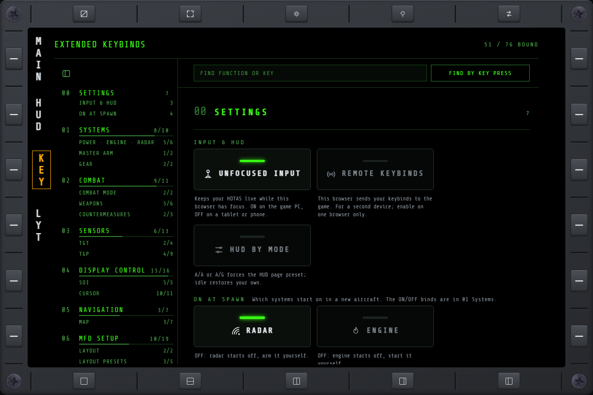

## The page

- **Header** — the page title and `51 / 76 BOUND`: how many functions have a key, a button or an
  axis, out of all of them.
- **Sidebar** — a link for every group, numbered in the order below, with how many of its
  functions are bound and a bar showing it. Its section links jump straight to a sub-section.
  **SETTINGS** is at the top.

  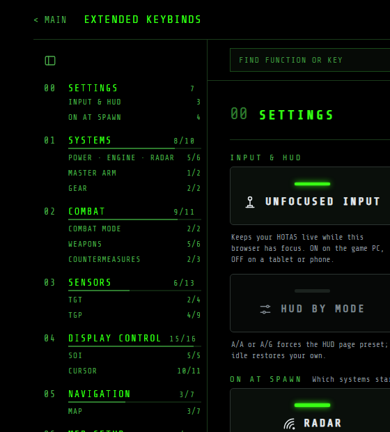

  The button at the top of the sidebar collapses it to a strip of group numbers (hover one for its
  name); click it again to reopen. The sidebar starts collapsed when the display is 1152 px wide
  or less and open otherwise, and whichever you pick last is remembered by this browser and
  restored every time you open KEY.

  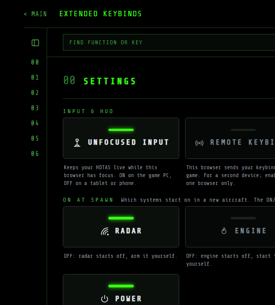
- **Search** — the box above the list filters it as you type. It matches a function's name, its
  description, and whichever key or button is bound to it, so `gear` finds the gear binds and
  `j2` finds everything on your second stick. The settings tiles are hidden while you search.

  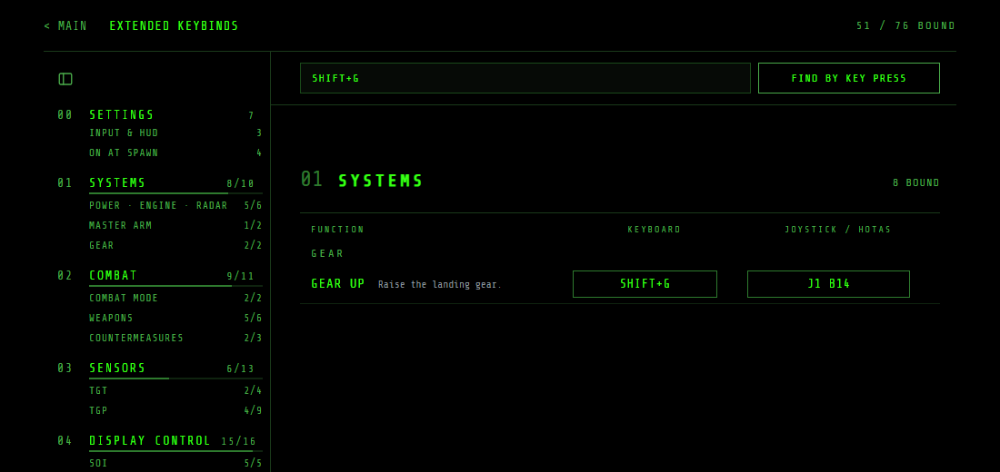
- **Narrow displays** — at 860 px or less the descriptions are hidden and the columns tighten, so
  a phone or a small pane still shows every function and its binds.

## Binding a function

Every row shows its function, then a **KEYBOARD** cell and a **JOYSTICK / HOTAS** cell. An unbound
cell shows `—`. Click a cell to bind it; a function can have a key, a button, or both.

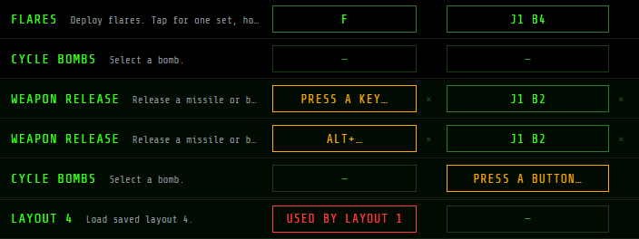

- **Keyboard** — click the cell, then press the key. `Esc` cancels. Mouse buttons can't be bound,
  because a click is how you drive this page. A key the page can't map (media keys, for one)
  flashes `UNSUPPORTED`.
- **Modifiers** — a keyboard bind can include **Ctrl**, **Alt** and/or **Shift**. Hold them, then
  press the key: the cell shows `ALT+…` while you hold Alt, then `ALT+1`. Press and release a
  modifier on its own to bind just that key. Left or right Ctrl/Alt/Shift both work. If one bind
  is `1` and another is `ALT+1`, Alt+1 fires only the second. With nothing bound to the
  combination, `1` still fires while a modifier is held, so a held key never blocks it. Browser
  shortcuts the browser keeps for itself (Ctrl+W, Ctrl+T, Alt+F4) can't be captured on this page.
- **Joystick / HOTAS** — click the cell, then press the button; the cell shows `PRESS A BUTTON…`
  while it waits. The game reads the button, not the browser, and your stick keeps working while
  the browser has focus. Buttons already held when you click are ignored, so a latched toggle
  switch isn't bound by accident — flip it off and on again to bind it on purpose. The cell shows
  the stick as well as the button (`J2 B11`), since one button number can exist on several sticks.
- **Clear** — hover a bound row; an `×` beside the cell clears it.
- **Axes** — a few functions (the cursor's horizontal/vertical movement and zoom) take a
  continuous HOTAS axis instead of a button. They show `AXIS ONLY` in the keyboard column; click
  the joystick cell and move the axis (`MOVE THE AXIS…`). **INV** flips its direction, and lights
  when on.
- **Keyboard only** — SAVE and LOAD LAYOUT show `KEYBOARD ONLY` in the joystick column: see
  [Layout](#layout).
- **Conflicts** — a [Layout Preset](#layout-presets) won't take a key or button another bind
  already uses, and no other bind will take one a Layout Preset uses: the cell shows `USED BY` and
  that bind's name for a moment. Anywhere else, two functions can share a key.

## Settings

The first block on the page, **00 SETTINGS**, is a set of lit buttons rather than binds. A lit
lamp means ON. They sit in two groups.

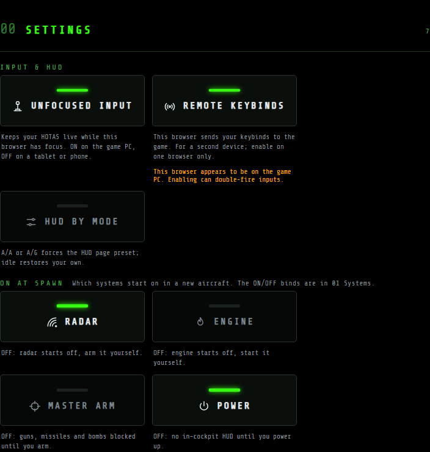

### Input & HUD

- **Unfocused Input** — keeps your HOTAS live while the browser window has focus. Turn it on if
  you run the display in a browser on the same PC as the game; otherwise the game has to keep
  focus for the stick to work. Off by default; leave it off for a tablet or phone, where the game
  keeps focus anyway.
- **Remote Keybinds** — lets this browser send the keyboard binds configured on this page back to
  the game, so a tablet, laptop, or WSO station can operate the same MAP/TGT/SOI/weapon actions
  without physical access to the game PC. It is off by default and stored per browser. Keep it
  enabled only on the browser you intend to use for input. If the page detects it is running on
  the game PC it shows an amber warning under the tile, because the game also receives the same
  physical keypress and an action can fire twice.
- **HUD By Mode** — off by default. Turn it on to have switching to A/A or A/G automatically force
  [HUD](hud.md)'s matching preset (the same NAV/GUN/A2A/A2G/EW/LOG tabs HUD's own mode row
  applies), restoring whatever you had set yourself on returning to ALL. Pressing an
  already-active A/A or A/G again re-forces that preset, discarding any HUD tweaks made since it
  last applied — a quick way to reset back to it without leaving WPN. See
  [Combat mode](#combat-mode).

### Immersion Options

The **ON AT SPAWN** group: whether radar, engine, master arm and power start on when you spawn
into a new aircraft. All four are ON by default, which matches the game's own behavior. Turn any
of them off for more immersion — that system starts off, and you arm, start or power it up
yourself.

- **Radar**, **Engine** — start on or off.
- **Master Arm** — off means guns, missiles and bombs are blocked until you arm.
- **Power** — off means no in-cockpit HUD until you power up.

The in-flight ON/OFF binds for all four are in [Systems](#systems), so you can flip any of them
mid-flight too.

## Systems

### Power, engine & radar

Plain ON/OFF pairs — **Power ON / Power OFF**, **Engine ON / Engine OFF**, **Radar ON / Radar
OFF** — on top of the [on-spawn settings](#immersion-options). The game already has a single
toggle for radar and engine; these set a state instead of flipping it.

**Power OFF** hides the entire in-cockpit HUD — every element, not a subset — simulating no power
to drive any display or symbology. The mod's own web pages keep working, so a pilot can still fly
off the tablet. **Power ON** restores it immediately.

### Master arm

**Master Arm ON / Master Arm OFF** — OFF blocks guns, missiles and bombs, including the stock
trigger, until it's back on. [WPN](wpn.md) shows a full-screen SAFE warning while it's off, and its
ARM/SAFE controls mirror and drive the same state.

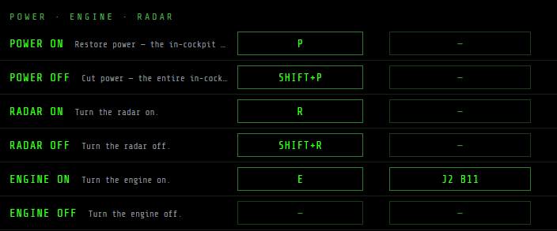

### Gear

**Gear Up / Gear Down** — dedicated raise/lower (the stock bind is a single toggle). Nothing
happens if the gear is already there, is still moving, or the aircraft is on the ground.

## Combat

### Combat mode

**A/A** and **A/G** restrict missile cycling to air-to-air or air-to-ground weapons; guns fire in
either mode, and bombs only cycle in A/G.

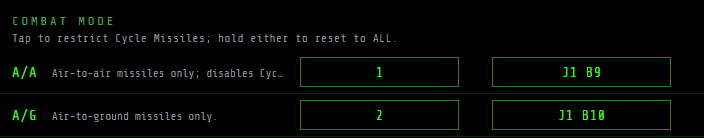

- **Tap** to set the mode. **A/A** also disables Cycle Bombs, and switches away from a selected
  bomb or A/G missile — to the first available A/A missile, else the first gun. **A/G** switches
  away from a selected A/A missile — to the first available A/G missile, else the first bomb, else
  the first gun. A gun that's already selected is left alone.
- **Hold** either bind to reset to ALL (unrestricted). There's no dedicated ALL bind, since
  neither showing lit already means ALL.

[WPN](wpn.md)'s A/A · A/G controls mirror and drive the same state. With
[HUD By Mode](#input--hud) on, the mode also drives the HUD page's preset.

### Weapons

- **Cycle guns / missiles / bombs** — select the last soft-selected weapon of that type, or the
  first in the list; repeated presses cycle to the next one, skipping depleted weapons. Cycling to
  a different type leaves the current one soft-selected.
- **Gun trigger / Weapon release** — per-class fire keys (hold for continuous fire). If the active
  weapon is from the other class, the first press only switches — bringing up the right reticle —
  and the next press fires. Current gun and missile/bomb choices show as outlines on
  [WPN](wpn.md).
- **Single Target Weapon Release** — releases one missile/bomb at only the *focused* locked target
  (see [Target list](#target-list)), even with others also locked, instead of Weapon Release's own
  staggered one-round-per-lock salvo. Same switch-then-fire behavior and hold-to-keep-releasing as
  Weapon Release. The focused lock's own on-screen symbol also gets a small amber "+" at its
  top-left ([RDR](rdr.md#in-game-hud-cue)) so you can tell which target this will hit.

### Countermeasures

- **Flares** — select and deploy IR flares. Tap for one set, hold to keep popping. Nothing happens
  if the aircraft has no flares.
- **Jammer** — select and activate the radar jammer. Hold to jam: a tap only jams for about a
  tenth of a second. Nothing happens if the aircraft has no jammer.
- **Jamming Pod** — select and activate a weapon-mounted radar jamming pod (the Medusa's, for
  one); hold to keep jamming. With another weapon selected, the first press only switches to the
  pod — press again to activate it. Nothing happens if the aircraft has no pod.

## Sensors

### Target list

- **Next Target / Previous Target** — steps which one of your locked targets is the *focused* lock,
  the one [TGT](tgt.md) outlines and [FCR/HSD](rdr.md#when-a-target-is-locked) both draw amber and
  read out in the bottom readout. This shared focus is not SOI-gated: it moves on every open
  TGT/FCR/HSD page, in every browser. On the SOI-focused TGT display, the same press hides the PAD
  crosshair and makes **Cursor Select** deselect the focused row directly; moving the crosshair hands
  Select back to the cursor.
- **Clear Datalink / Clear Stale** — the keybind equivalents of tapping [TGT](tgt.md)'s own
  CLEAR DATALINK / CLEAR STALE buttons. They work whichever display is focused, or none.

### TGP

Manual pointing of the targeting-pod camera, independent of the game's own auto-lock — see
[TGP](tgp.md#manual-camera-control) for what manual control actually does. Pointing itself uses
the shared [PAD cursor](#pad-cursor) binds, not a dedicated pan/tilt/zoom of its own.

- **Manual Control Toggle** — turn manual camera control on/off. Centers on the aircraft's nose at
  minimum zoom on entry, and claims PAD Cursor SOI immediately. Turns off on its own the moment a
  real target locks, the aircraft is lost, or the landing-gear camera takes over.
- **Manual Control Reset** — recenter the camera on the aircraft's forward direction at minimum
  zoom, without turning it off.
- **Point Track** — lock the camera onto whatever it's currently pointed at, holding that world
  point steady as the aircraft moves. Press again to release. The cursor nudges the point, and it
  redesignates when you let go. Only acts while manual control is on.
- **Snap To Head Tracker** — point the camera wherever your own view currently looks (TrackIR, VR
  head tracking, or plain mouse-look). Releases Point Track if it was active. Only acts while
  manual control is on.
- **Toggle IR** — switch the active TGP camera between COLOR and IR: the manual camera, or a real
  unit lock. The game normally switches this automatically by time of day, distance, or the
  "always IR" setting; this overrides that with your own choice, which sticks until you flip it
  again.
- **Toggle View** — switch the TGP page's [VIEW](tgp.md#man-clrir-wtvstv) between **WTV** (wide
  target view, the default: a lock on two or more targets zooms out to fit all of them) and
  **STV** (single target view: frames just the target Next/Previous Target has focused). No effect
  with zero or one locked targets.
- **Mark Steer Point** — mark whatever the TGP camera is currently showing (a real unit lock's
  position, or the manual camera's aim point) as a new [steer point](wpt.md#steer-points). Does
  nothing with neither a lock nor manual control on.
- **Full Screen Toggle** — show the TGP camera feed full screen: a cinematic, independently
  rendered view, not a stretch of the small in-cockpit screen. Turns off on its own if the aircraft
  is lost, the landing-gear camera takes over, or the pause menu/map opens.
- **Full Screen HUD Toggle** — show or hide the readout overlay (range/altitude/heading/mode)
  while full screen is active, for a clean, unobstructed view of the feed itself.

## Display control

### Sensor of Interest (SOI)

Operate a display from your HOTAS without touching it. One screen at a time is selected — it is
outlined in white — and the SOI keys move a cursor over its buttons and press them. In a split the
selection is a single pane; on the [F-35 layout](layouts.md#f-35) it is a single portal. Nothing
is selected until you press a SOI key.

- **SOI Next / SOI Prev** — select the next / previous screen (every open display, and each F-35
  portal). They work from the main menu too.
- **Nav Up / Nav Down** — move the cursor over the selected screen's buttons.
- **Nav Select** — press the button under the cursor, as if you had clicked that key.

A display, pane, or F-35 portal can be excluded from SOI Next/Prev entirely — on CLASSIC through
each saved layout's pane toggles ([the LYT page](layouts.md#the-lyt-page)), on F-35 through
[LOAD LAYOUT](layouts.md#saveload-layout)'s checkboxes.

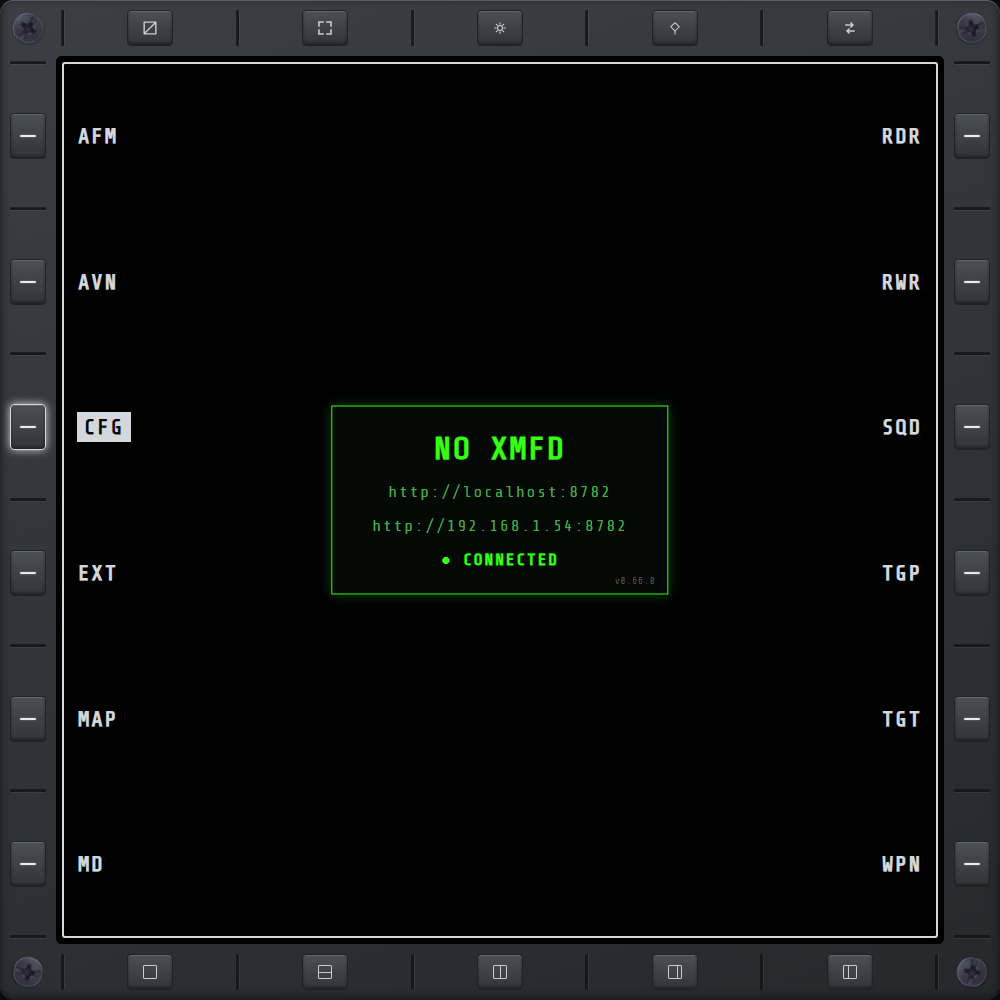

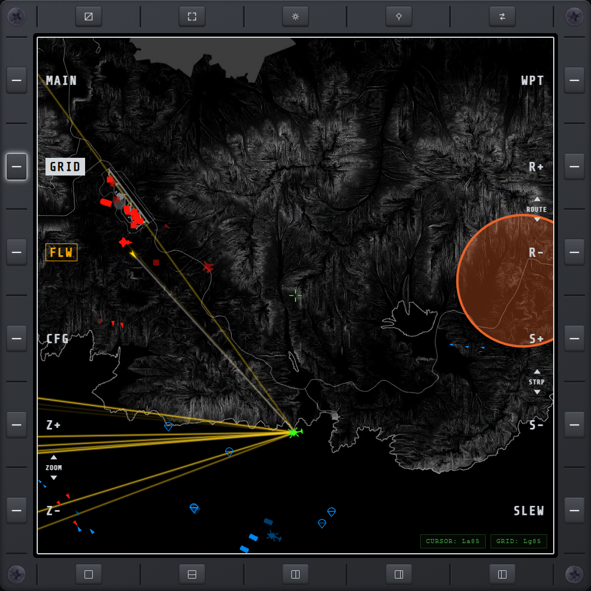

### Cursor

**Cursor Up / Down / Left / Right / Select / Deselect**, plus two HOTAS axis binds
(horizontal/vertical) — drive the [PAD cursor](#pad-cursor) below. A deflected axis overrides its
two keys, and **INV** flips an axis whose direction is backwards. The cursor only acts while a
display with a cursor is focused.

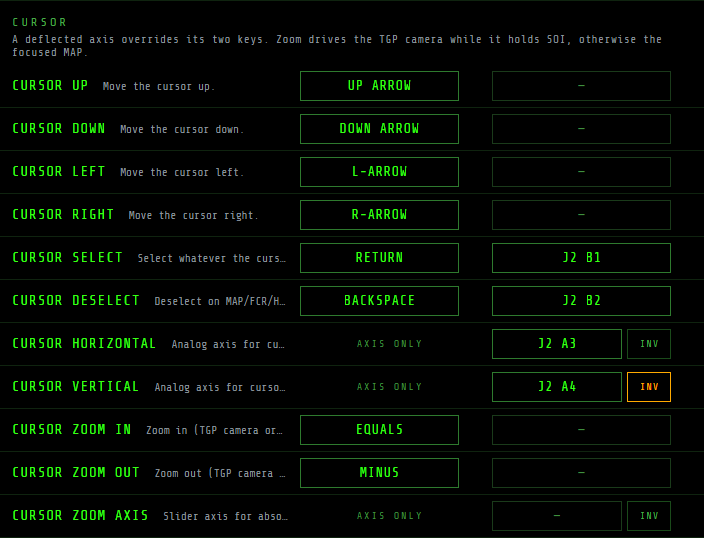

**Cursor Zoom In / Zoom Out**, plus a calibrated **Cursor Zoom Axis**, zoom the focused MAP display
(or scroll a scrollable page) — see [PAD cursor](#pad-cursor) below — and additionally drive
[manual TGP camera](tgp.md#pointing-the-camera) zoom while it holds SOI. Zoom Axis is camera-only:
a calibrated slider (e.g. a HOTAS throttle slider) whose moved position jumps the camera straight
to that zoom level; Zoom In/Out still work between axis moves.

### PAD cursor

When a display's focused page is interactible — [MAP](map.md), [HUD](hud.md), [TGT](tgt.md),
[FCR](rdr.md#fcr), [HSD](rdr.md#hsd), [WPT](wpt.md), or [AKF](akf.md) — a crosshair can move over
it and act on whatever's underneath, the same thing a mouse click or touch tap already does, but
from the HOTAS, without touching the screen. The green crosshair on the map above is the PAD cursor.

- **Cursor Up/Down/Left/Right** (or a bound analog axis) slews it.
- **Cursor Select** picks whatever it's over: a contact on MAP, a toggle on HUD, a filter or
  target row on TGT (holding it also mirrors that page's own long-press action, where it has one),
  a waypoint row or button on WPT, or the density toggle on AKF (holding it over AKF's pane divider
  drags the split instead, and a tap there while collapsed restores it). On TGT specifically, after
  Next/Previous Target, Select instead deselects the focused row directly until the cursor moves
  again — see [Target list](#target-list) above.
- On **FCR** or **HSD**, Select locks whichever contact the cursor is nearest to — like MAP, it
  only ever adds a lock, never removes one, so repeated presses over a crowded cluster lock one
  contact after another instead of re-toggling the same one. **Holding** Select there instead of
  tapping it toggles a fixed zoom centered on the cursor — useful for pulling an overlapping
  cluster of contacts apart to pick them out individually; hold again to zoom back out.
- **Cursor Deselect** — MAP/FCR/HSD only: removes whichever locked contact the cursor is nearest to.
  No effect on any other page.
- **Zoom In/Out** zoom the MAP view as usual, or scroll the page up/down on HUD/TGT.
- On MAP, pushing the cursor against the edge with FLW off pans the view to reveal more terrain.

It only acts on whichever display currently has both SOI focus and one of these pages open.

**[Manual TGP camera control](tgp.md#manual-camera-control) works a little differently:** it's not
a crosshair drawn on a page, it's its own [SOI](#sensor-of-interest-soi) target — cycled to with
SOI Next/Prev, or reached by having the [TGP](tgp.md) page itself focused, since that page is the
camera's own display. While it holds SOI, the same Cursor Up/Down/Left/Right/axis pan and tilt the
camera instead of moving a crosshair, Zoom In/Out/Axis zoom it instead of the MAP view, and Cursor
Select tries to lock a real unit near the camera's aim instead of picking something under a
crosshair — see [TGP](tgp.md#pointing-the-camera) for the details.

## Navigation

### Map & waypoints

Direct binds for what [MAP](map.md)'s FLW/R+/R− and context-sensitive W+/W− or S+/S− controls do
on the focused display:

- **Follow**
- **Next Route**, **Previous Route** — stay usable to switch INTO a route as long as one is saved,
  even with none currently active.
- **TGP Slew to Cursor** — point the TGP at the ground under the PAD cursor on the focused MAP.
- **TGP Slew Grid Entry** — open the MAP grid keypad; ENTER slews to the typed square. See [TGP slew](map.md#tgp-slew).
- **Next Waypoint / Steer Point**, **Previous Waypoint / Steer Point** — step route progress while
  a route is active; otherwise cycle the selected steer point. Hold **Previous Waypoint / Steer
  Point** to jump the active route straight back to its first waypoint — no effect with no active
  route.

Zoom In/Out aren't here — they're the shared **Cursor Zoom In/Out** pair under [Cursor](#cursor),
which also drives [manual TGP camera](tgp.md#manual-camera-control) zoom.

## MFD setup

### Layout

- **Save Layout** — save the current split/portal arrangement and which page each pane or portal
  shows, under a name (on CLASSIC, into a slot you pick).
- **Load Layout** — pick a saved arrangement and apply it immediately.

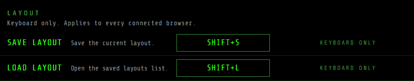

No joystick/HOTAS for these two — whichever browser window has keyboard focus when the key is
pressed is the one that acts, and the key you set here applies to every connected browser. They can
also be set on [the LYT page](layouts.md#the-lyt-page), under KEYBINDS.

### Layout Presets

- **Layout 1** through **Layout 5** load the 1st-5th [saved layout](layouts.md#the-lyt-page)
  for the view the browser is showing (CLASSIC or F-35), so one key works in both views. Nothing
  happens if no layout is saved at that position.

Keyboard and joystick/HOTAS both work. A key pressed in a browser loads the layout in that browser.
A joystick button, or a key pressed while the game window has focus, loads it in the browser holding
[SOI](#sensor-of-interest-soi). A slot holds a key or a joystick button, not both. You can also set
these from the key box on each row of the LYT page's SAVED list (and in the Load Layout popup). A key
or button already used by another bind is refused, and the cell names the bind that uses it.

### HUD Presets

- **HUD Preset 1** through **HUD Preset 5** — five ordinary binds (keyboard and joystick/HOTAS
  both work, unlike Layout's keyboard-only pair above). Pressing one instantly recalls that
  numbered preset's saved filters onto [HUD](hud.md#presets) and makes it the current (lit) preset
  card on that page — the same thing tapping the card does.

### TGT Presets

- **TGT Preset 1** through **TGT Preset 5** — same shape as HUD Presets above, applied to
  [TGT](tgt.md#presets)'s own faction/category/vehicle/LASER/HUD filters instead.

### Misc

- **Toggle Units** — switch every readout (cockpit HUD, NOXMFD pages) between Metric and Imperial —
  the same setting as the pause menu's Gameplay options, so it stays in sync with that menu and
  survives a restart.
- **Internal MFD POC Toggle** — turn the experimental in-cockpit NOXMFD overlay on or off during a
  mission. It is off and unbound by default. On aircraft with a calibrated cockpit screen, it
  replaces that screen with native RWR/HSD content and switches to TGP content while the TGP is
  active. See [the internal-MFD design record](../docs/internal-mfd.md) for supported layouts and
  current limitations.
