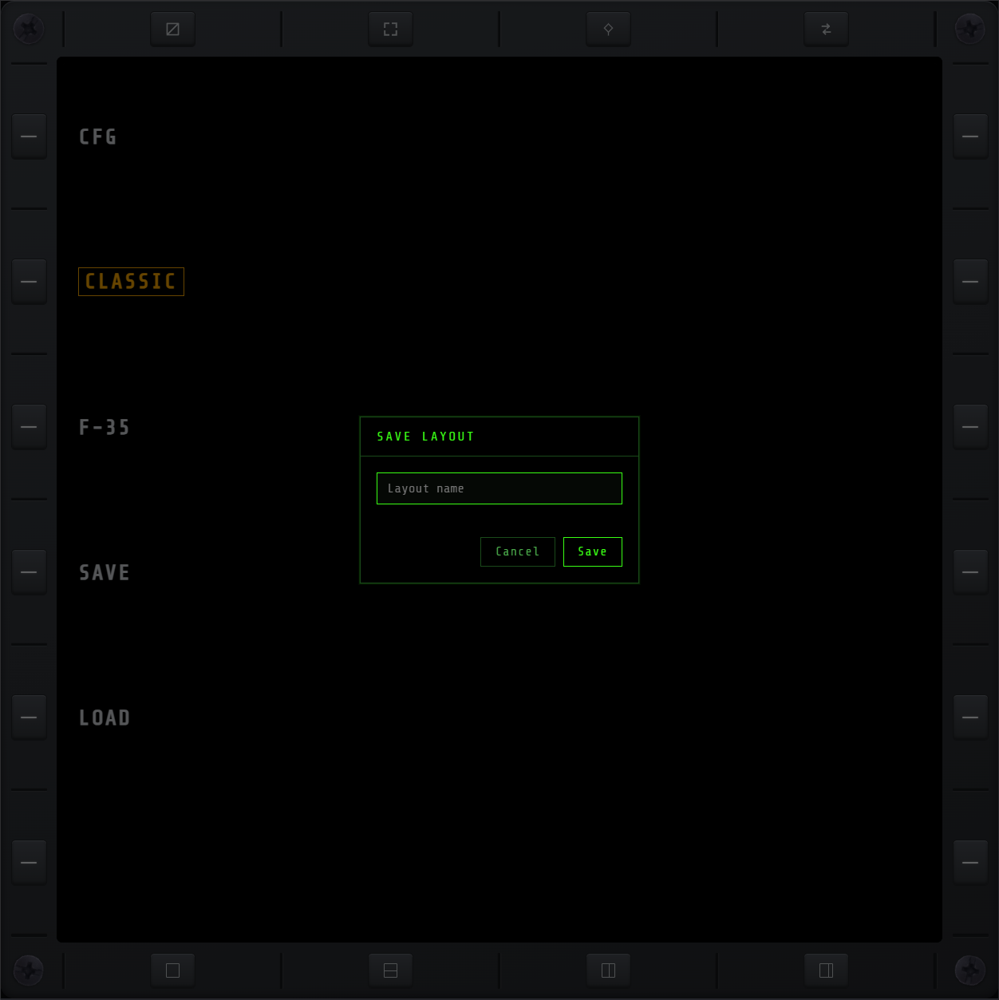
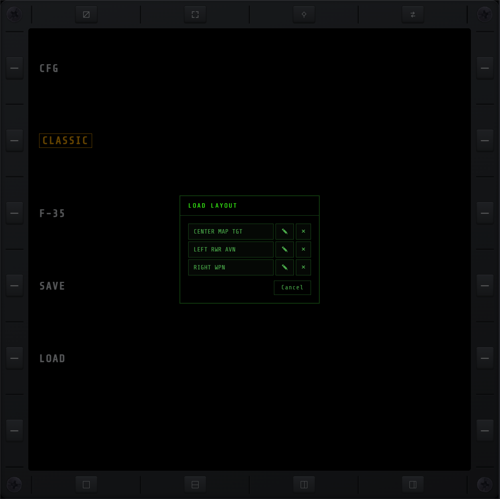

# LYT

NO XMFD can render in more than one shell layout — a different frame, navigation, and split model
over the same pages. Two are supported for now: **CLASSIC** and **F-35**.

## CLASSIC

The metallic bezel layout. A single active page fills the screen, or splits into two panes,
framed by dedicated bezel buttons — function controls along the top, layout presets along the
bottom.

**Function controls (top):**

- **HIDE** — hide the bezel so the screen fills the viewport.
- **FULL** — fullscreen toggle.
- **WAKE** — keep the screen from sleeping while NO XMFD is open. Off by default; lights amber
  while on. The preference is remembered by the browser and reapplies after a reload. If the
  device can't be kept awake at all, the key turns itself back off and **WAKE LOCK FAILED**
  briefly appears in the corner of the screen.
- **PIN** — pin a page.
- **SWAP** — jump to/from the pinned page.

**Layout presets (bottom):**

- **F_VIEW** — single page, full screen.
- **H_SPLIT** — top/bottom split.
- **V_SPLIT** — left/right split.
- **V_WIDE_SPLIT_L** — left/right split, 2:1, wide pane on the left.
- **V_WIDE_SPLIT_R** — left/right split, 2:1, wide pane on the right.

## F-35

A borderless, touch-driven layout modelled on the real F-35's panoramic cockpit display: there
are no bezel keys — the navigation labels are drawn on the glass and tapped directly, and the
screen divides into side-by-side portals, each an independent MFD, that you merge and split with
corner grips. A fixed strip across the top carries the aircraft-level readouts — connection,
throttle and fuel, and the avionics flags — plus **FULLSCREEN** and **WAKE** (keep the screen
awake, same as CLASSIC's WAKE key above), beside each other at the strip's end.

## Save/Load Layout

Save the current arrangement — the split (or F-35 portal arrangement) and which page each pane or
portal shows — under a name, and load it back later. Multiple named layouts can be saved at once.

- **Save Layout** — prompts for a name, then saves.
- **Load Layout** — lists every saved layout; pick one to apply it immediately. A pencil renames a
  saved layout and an × deletes it, right in that list.

Reach both from a keybind (configured on [KEY](keybinds.md), shared by every connected browser) or
from the **SAVE**/**LOAD** buttons on this LYT page — the touch-friendly path for a tablet with no
keyboard. **CFG** (top of the same menu) goes back to [KEY](keybinds.md) and the other CFG pages.

On CLASSIC, saving while on this LYT menu remembers LYT itself as the current page — but if you
had a page pinned, that's remembered too, so one SWAP after loading takes you straight back to it.

