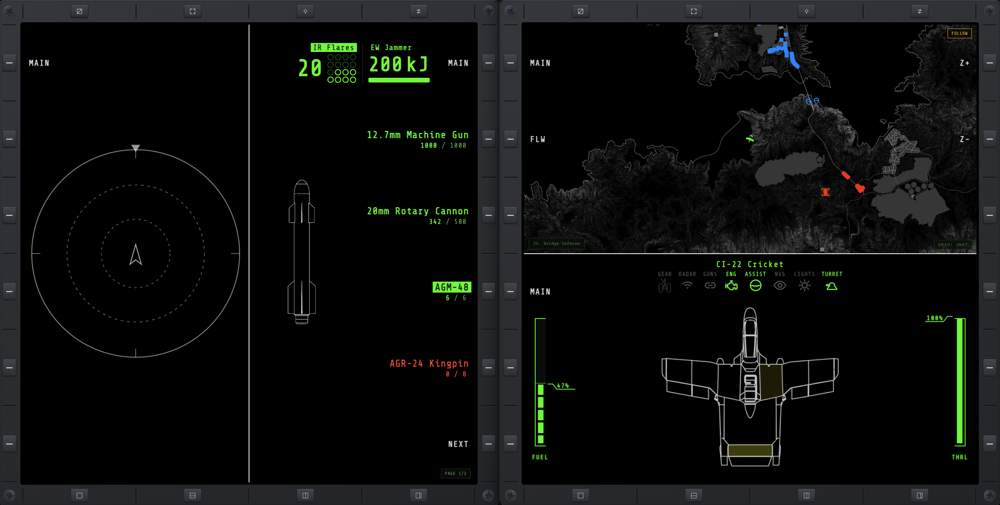
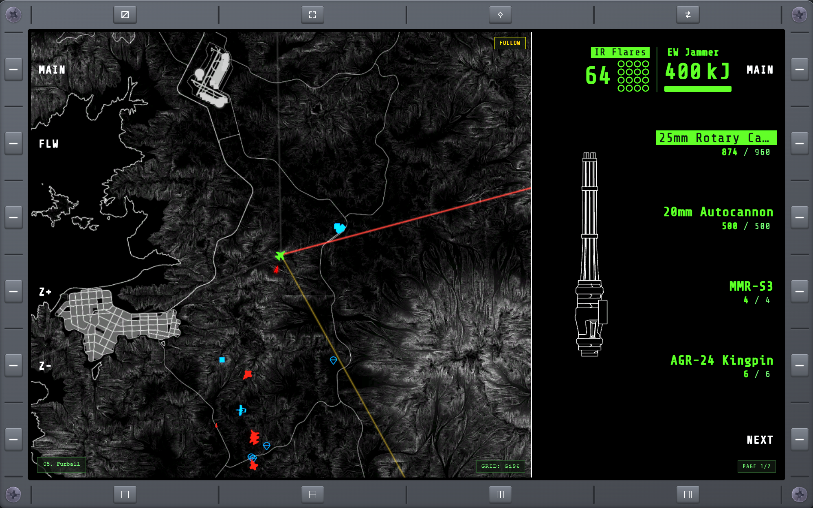
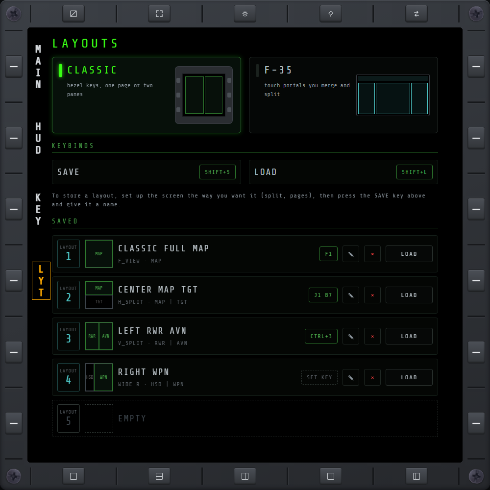
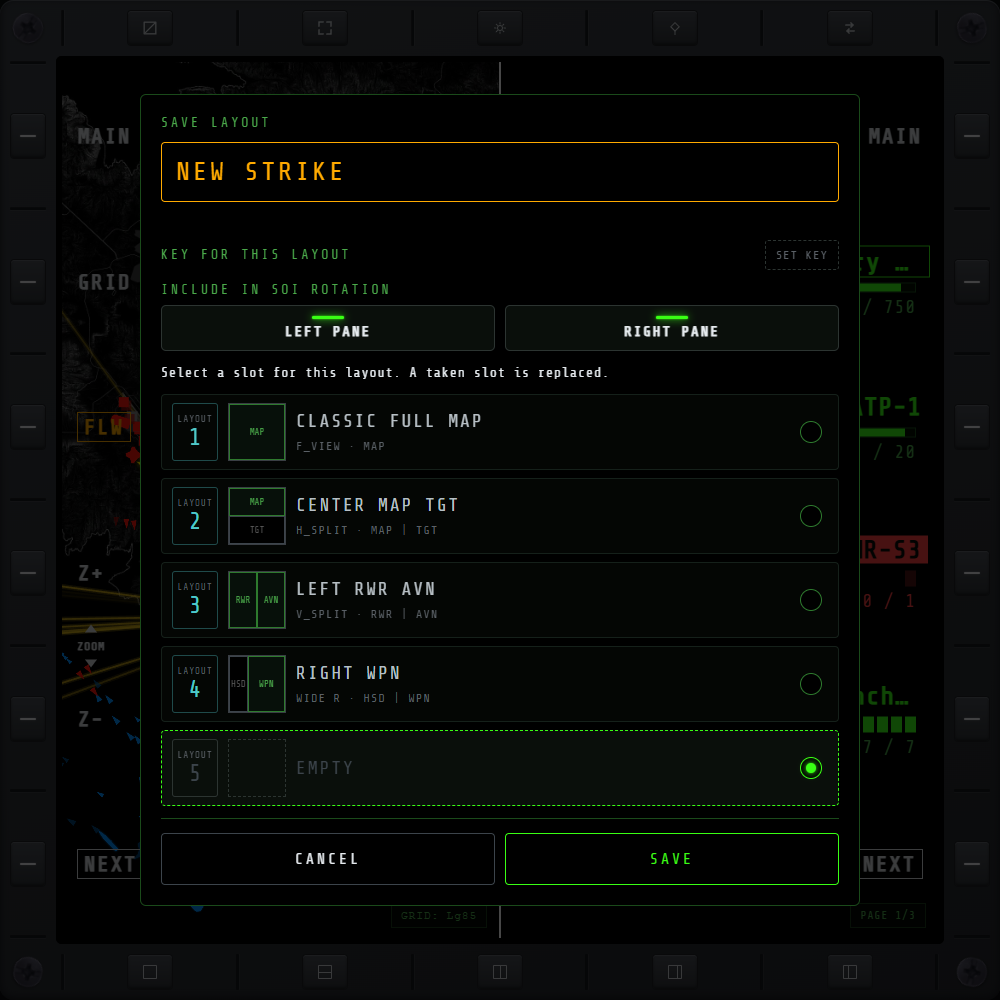
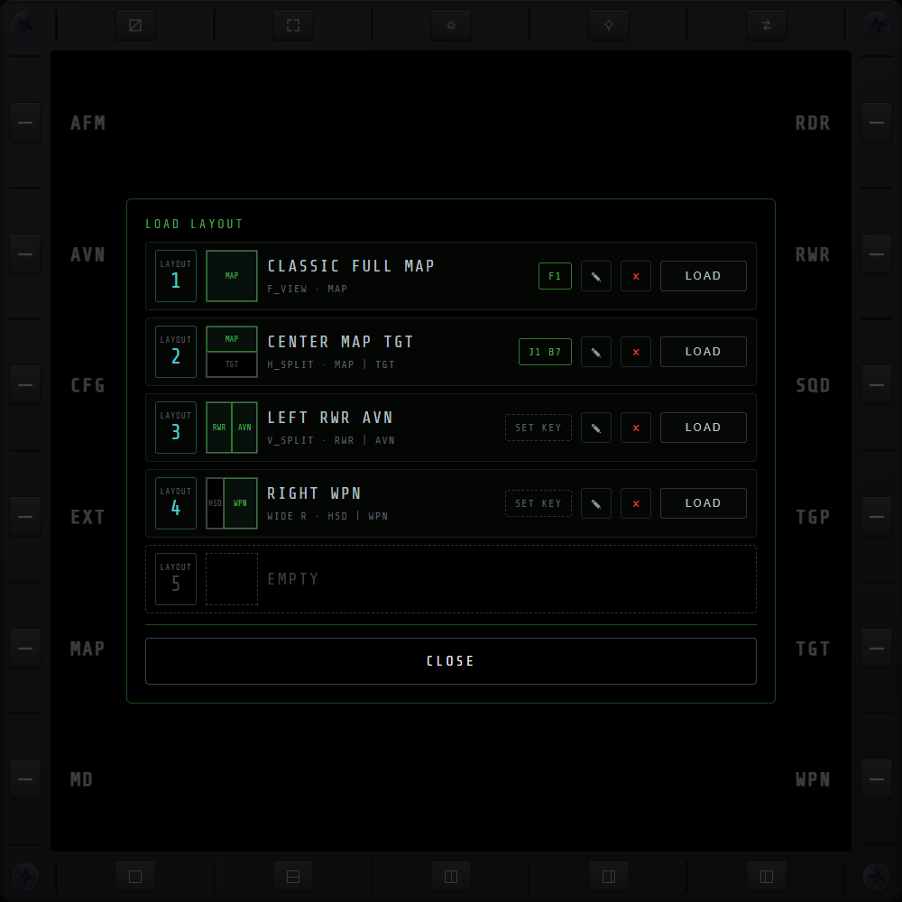

# LYT

NO XMFD can render in more than one shell layout — a different frame, navigation, and split model
over the same pages. Two are supported for now: **CLASSIC** and **F-35**.

## CLASSIC

The metallic bezel layout. A single active page fills the screen, or splits into two panes,
framed by dedicated bezel buttons — function controls along the top, layout presets along the
bottom.

**Function controls (top):**

- **HIDE** — hide the bezel so the screen fills the viewport.
- **FULL** — fullscreen toggle.
- **WAKE** — keep the screen from sleeping while NO XMFD is open. Off by default; lights amber
  while on. The preference is remembered by the browser and reapplies after a reload. If the
  device can't be kept awake at all, the key turns itself back off and **WAKE LOCK FAILED**
  briefly appears in the corner of the screen.
- **PIN** — pin a page.
- **SWAP** — jump to/from the pinned page.

**Layout presets (bottom):**

- **F_VIEW** — single page, full screen.
- **H_SPLIT** — top/bottom split.
- **V_SPLIT** — left/right split.
- **V_WIDE_SPLIT_L** — left/right split, 2:1, wide pane on the left.
- **V_WIDE_SPLIT_R** — left/right split, 2:1, wide pane on the right.

## F-35

A borderless, touch-driven layout modelled on the real F-35's panoramic cockpit display: there
are no bezel keys — the navigation labels are drawn on the glass and tapped directly, and the
screen divides into side-by-side portals, each an independent MFD, that you merge and split with
corner grips. A fixed strip across the top carries the aircraft-level readouts — connection,
throttle and fuel, and the avionics flags — plus **WAKE** (keep the screen awake, same as
CLASSIC's WAKE key above) and **FULLSCREEN**, beside each other at the strip's end. A dismissable
red banner drops down from the strip on a connection loss, above every portal regardless of page —
see [MAIN's Connection status](main.md#connection-status).

## The LYT page

On CLASSIC, **LYT** (MAIN → **CFG** → **LYT**) is the layout manager. Its one bezel key, **MAIN** (top
left), goes back to MAIN. The page has three parts:

- **LAYOUTS** — the two layouts as cards. Tap one to switch to it; CLASSIC is lit while you are on it.
- **KEYBINDS** — the **SAVE** and **LOAD** layout keys. Click a box, then press the key you want
  (Esc cancels, Delete clears). One line under it reminds you how saving works.
- **SAVED** — your saved layouts, one row each, in the order they were saved. A row shows its number,
  a small picture of the split with the page in each pane, its name, and which split it is. The first
  five rows carry a **Layout 1-5** key box, and empty slots show as dashed **EMPTY** rows. A pane the
  layout leaves out of the SOI rotation is drawn gray in the picture. Each row also has:
  - a **key box** — click it, then press a key *or* a joystick button; a slot holds one or the other.
    This is the same setting as [KEY's Layout Presets](keybinds.md#layout-presets): pressing it loads
    whichever layout is in that position;
  - **✎** — edit the layout's name and choose which of its panes stay in the
    [SOI](keybinds.md#sensor-of-interest-soi) rotation (one lit toggle per pane, or one for a full view);
  - **×** — delete it (the ones below move up a slot);
  - **LOAD** — apply it now.

The **F-35** layout keeps its own picker: two cards and **SAVE**/**LOAD** buttons on the glass.

## Save/Load Layout

Save the current arrangement — the split (or F-35 portal arrangement) and which page each pane or
portal shows — under a name, and load it back later. Saved layouts are kept on the game PC and
shared by every connected browser.

**CLASSIC**

- **Save Layout** key — set the screen up the way you want it, then press the key. A form opens:
  - a name;
  - a key for the layout (a keyboard key or chord);
  - **Include in SOI rotation** — one lit toggle per pane of the current screen (or **FULL VIEW**),
    starting from what is selected now;
  - the five slots. The first empty slot is selected, and the green button reads **SAVE**. Pick a
    taken slot instead and it reads **REPLACE** — the current screen replaces that layout and keeps
    its Layout key. When all five are taken you choose which one to replace.
- **Load Layout** key — opens the same **SAVED** rows as the LYT page: set keys, edit, delete, or **LOAD**.

**F-35**

- **Save Layout** — prompts for a name, then saves.
- **Load Layout** — lists every saved layout; pick one to apply it. A pencil renames and an × deletes.
  Above the list, one checkbox per portal ("Include portal N in SOI") removes that portal from
  [SOI Next/Prev](keybinds.md#sensor-of-interest-soi)'s cycle on this display.

Each view keeps its own list, and **Layout 1-5** load the 1st-5th in the list of the view the browser
shows. Both keys are configured on the LYT page or on [KEY](keybinds.md#layout); they are keyboard-only
and apply to every connected browser.
