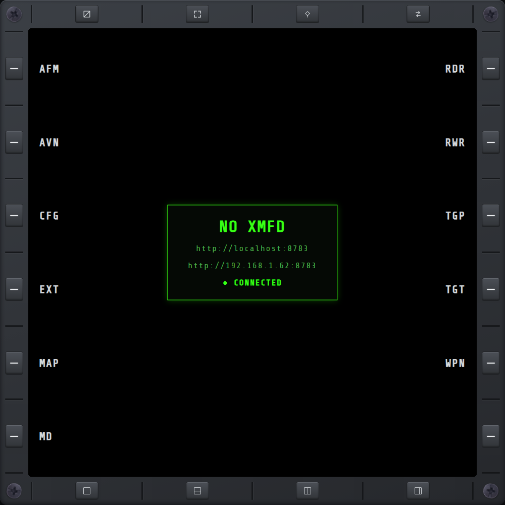

# MAIN

Landing page: connection status and the URL(s) to open the display.

## URLs

Up to two addresses are shown, whichever open the display:

- **`http://localhost:5005`** — always shown. Works from a browser on the same PC the game is
  running on.
- **A LAN address** (e.g. `http://192.168.1.42:5005`) — shown only when the server managed to bind
  to your network interface, not just localhost. Use this one from a tablet, phone, or any other
  device on the same local network. If it's missing, the server fell back to localhost-only — see
  [NETWORKING.md](../NETWORKING.md) for why and how to fix it.

## Connection status

- **● CONNECTED** — green. A mission is loaded — whether or not you've picked an aircraft yet.
  Live telemetry (position, weapons, etc.) only starts once you have.
- **● CONNECTED — no mission** — amber. The server is reachable and sending keepalives, but no
  mission is loaded (sitting at the main menu).
- **● DISCONNECTED** / **● DISCONNECTED — retrying…** — red. No telemetry has arrived in the last
  ~2.5 seconds — the game isn't running, the plugin hasn't started yet, or the connection dropped.
  The display keeps retrying on its own; nothing to do but wait or check the game/plugin is up.

A drop also shows a red banner across the top of whichever page you're on, so you don't have to be
looking at MAIN to notice — same on the F-35 layout's glass. Dismiss it with **✕**; it reappears on
the next drop, so dismissing one outage never hides a later one. It clears itself as soon as the
connection comes back, whether or not you dismissed it.
