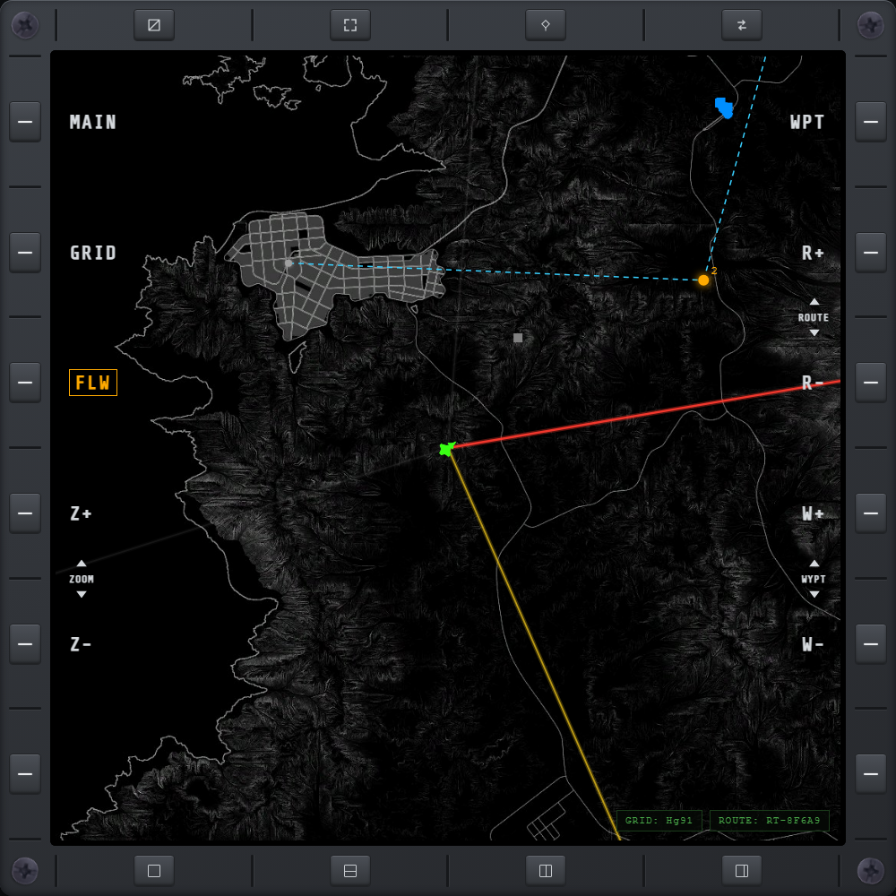

# MAP

Full-screen tactical map showing friendly/hostile units and your own position. Click a unit to
target it; right-click a targeted unit to drop it (or use the **Cursor Deselect**
[keybind](keybinds.md#pad-cursor)). Your own plane always renders green; while you're in a
[squad](sqd.md), every other squad member's plane renders in the squad's teal instead of its plain
friendly/hostile color, so you can spot them at a glance. [MAP CFG](mapcfg.md)'s SHOW PLAYER NAMES
toggle adds a pilot name label above any player-controlled aircraft — friendly or enemy — wherever
it's visible as a contact; off by default.

A click, tap or Cursor Select picks the nearest unit you can target. White dots (neutral units with no
faction) and units your [TGT](tgt.md) filters leave out can't be targeted, so they never take the
click from a targetable unit sitting under or next to them; they still show their hover label.

## Controls

- **FLW** — toggle follow: recenter the map on your own position as you fly, instead of staying
  wherever you last panned it.
- **CFG** — open [MAP's own settings page](mapcfg.md) (telemetry refresh rate, pilot name labels).
- **GRID** — toggle a coordinate grid overlay on the map. Off by default.
- **Z+ / Z−** — zoom in / out, from the whole map down to the in-game map's closest zoom. Pinch,
  the mouse wheel, and the Cursor Zoom keybinds cover the same range.
- **WPT** — open the [route and steer-point editor](wpt.md).
- **R+ / R−** — switch the active waypoint route to the next / previous one you've saved.
- **W+ / W−** — with a route active, manually step to its next / previous waypoint. Hold W− to
  jump straight back to the route's first waypoint.
- **S+ / S−** — the same controls relabel automatically when no route is active; they select the
  next / previous saved steer point instead. Holding S− does nothing — the reset only applies to
  an active route.

Long-press the map to append a waypoint to the active route. With no route active, the same gesture
creates a standalone steer point. Long-pressing directly on an existing waypoint or steer point
removes it instead — useful for undoing a placement without opening [WPT](wpt.md). Both kinds of
navigation point are otherwise managed there.

Units your [TGT](tgt.md) filters leave out — a faction, category or vehicle type switched off, or
anything not being lased while LASER is on — are drawn darker and slightly transparent, the same
way the in-game map dims them. With TGT's **HUD** button on, those filters follow your in-game HUD
settings, so changing the HUD screen dims the map the same way.

Hovering the mouse over a contact shows its type in a small floating label. For an aircraft or
missile whose position is currently trustworthy — the same condition [TGP](tgp.md) uses to show a
locked target's kinematics — the label adds stacked heading, speed, and altitude lines, live,
without needing to lock it first. A datalink-stale contact, or any non-aircraft contact, just shows
the type with no extra lines.

## TGP slew

Points the [TGP](tgp.md) at a spot on the map. The pod turns manual control on if needed and locks
[Point Track](tgp.md#area-track-and-point-track) on that ground point.

- **TGP Slew to Cursor** (keybind) slews to the PAD cursor at once.
- **SLEW** (bezel key) arms the map: the label flashes between its normal colour and bordered amber, and the next click, tap or
  Cursor Select slews. Tap SLEW again to cancel.
- **Hold SLEW**, or press **TGP Slew Grid Entry** (keybind), to open a keypad. Enter a grid
  reference such as `Ig69` (two letters, then two digits) and press ENTER to look at the centre of
  that square. The keypad shows the letters your map actually has, then A-J, then digits, and BACKSPACE
  steps back. An incomplete or off-map entry turns red and leaves the pod where it is. It takes the
  PAD cursor, mouse, touch or the keyboard, and pressing the keybind again while it is open changes nothing.

Slewing leaves focus on the MAP, so the PAD cursor keeps moving the map cursor and you can slew again
with the same keybind.

A grid square is large, so treat a grid slew as coarse and fine-tune with the PAD cursor. The pod
does not check line of sight: a spot behind a hill slews the same as a clear one.

## Nuclear exclusion zones

When a nuclear weapon is launched at a target, the map draws the same orange **exclusion zone**
ring the in-game map shows — a translucent orange disc around the target's position at launch,
sized to the weapon's blast. It stays up until the weapon detonates or is shot down. Like the
in-game map, you only see zones launched by your own side.

## One cursor at a time

The MAP shows either your mouse pointer or the keybind-driven PAD cursor, never both: whichever you used last.
Moving the mouse hides the PAD cursor, and every cursor keybind (Cursor Select, Cursor Deselect, zoom, TGP Slew to
Cursor) then acts where the mouse is. Pressing a cursor movement key brings the PAD cursor back and hides the
mouse pointer. Until the mouse moves over the MAP, the PAD cursor is the one shown.

## Status row

A row in the bottom-right corner, each item shown only while it applies:

- **CURSOR** — the grid square under your mouse or PAD cursor.
- **GRID** — the grid square you're currently in.
- **ROUTE** — the active route's name.

## HOTAS

Every control above can be driven without touching the screen — a HOTAS cursor works the map the
same way a mouse click does. See [PAD cursor](keybinds.md#pad-cursor).
