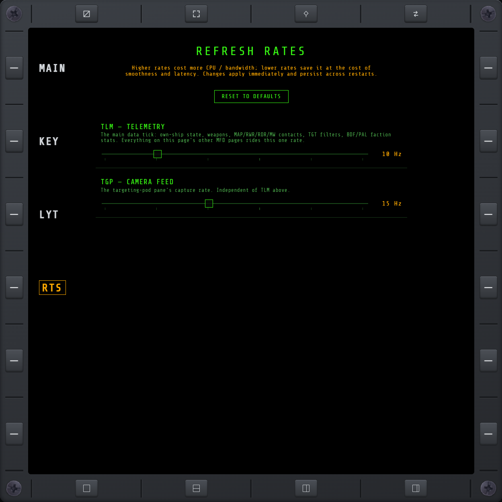

# RTS

Two sliders for the mod's live-adjustable refresh rates. Higher rates cost more CPU/GPU and
network bandwidth; lower rates save it at the cost of smoothness and latency. Changes apply
immediately and persist across restarts.

## TLM

The main telemetry tick — own-ship state, weapons, [MAP](map.md)/[RWR](rwr.md)/[RDR](rdr.md)/MW
contacts, [TGT](tgt.md) filters, and faction stats. Defaults to 10 Hz.

## TGP

The [targeting-pod camera feed](tgp.md). Defaults to 15 Hz.

## RESET TO DEFAULTS

Restores both sliders to their defaults (10 Hz / 15 Hz).
