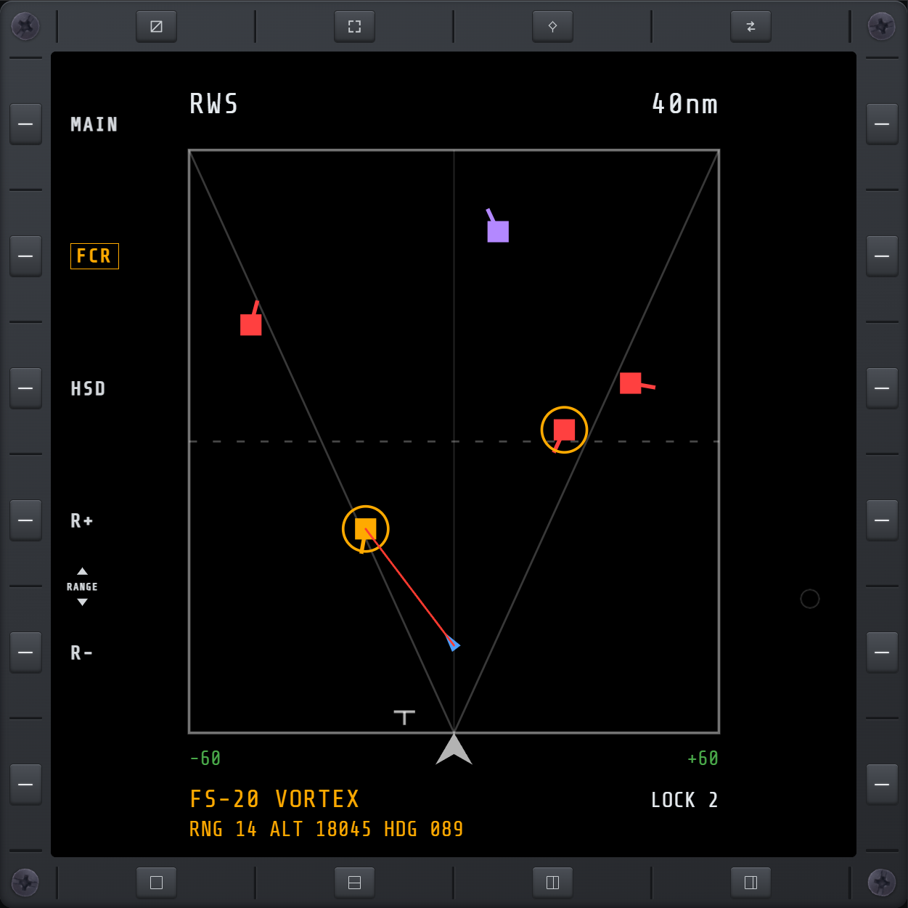
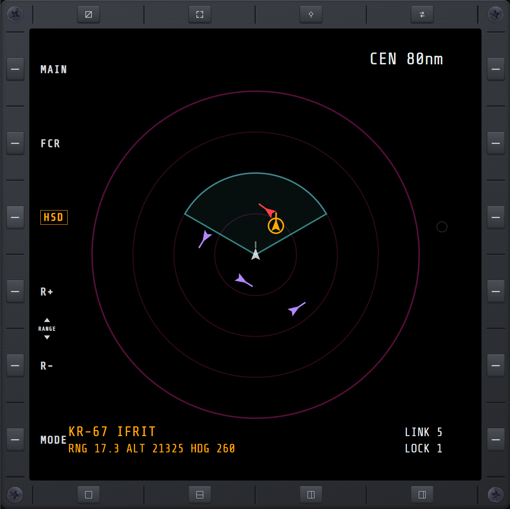
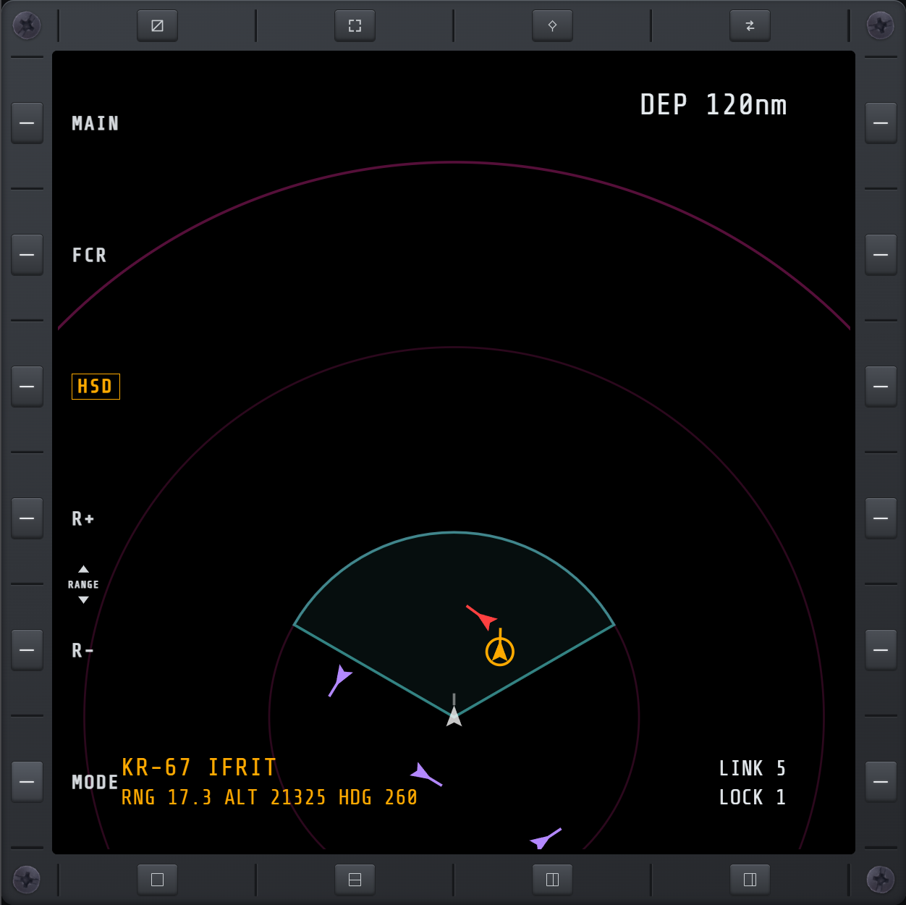
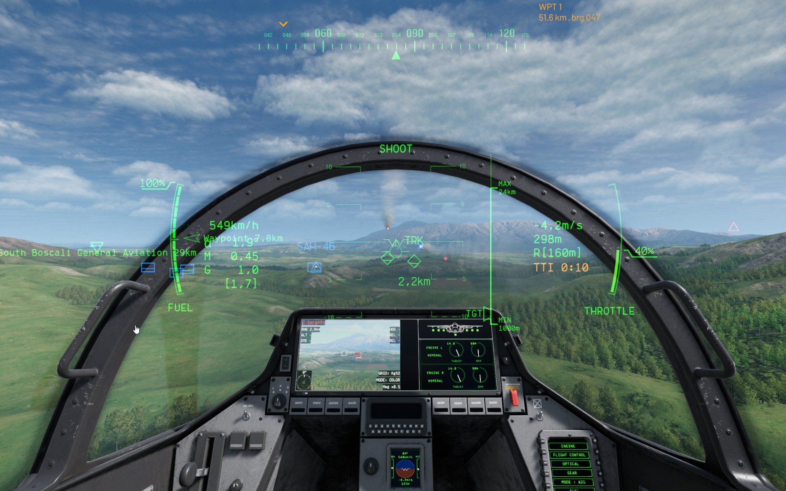

# RDR

A radar-family hub with two sibling pages, reached from the same **RDR** destination:

- **[FCR](#fcr)** — Fire Control Radar, an F-16-style B-scope showing what your own radar sees in
  front of you.
- **[HSD](#hsd)** — Horizontal Situation Display, a 360-degree datalink picture of the air
  situation around your aircraft.

Switch between them with the **FCR** / **HSD** bezel keys — both stay one press away from the
other, and from MAIN.

## FCR

Your own ownship sits at the bottom, bearing spread left-right, and range stretching upward toward
the top of the screen.

### Reading the scope

- **Top-left label** — always reads `RWS`. Cosmetic, matching the game's own radar display; it
  doesn't reflect an actual mode.
- **Sweep needle** — mirrors the game's own in-cockpit radar sweep; only animates while your radar
  is on.
- **Contacts** — colored bricks with a short velocity-vector stub showing which way they're
  heading:
  - **Red** — detected by your own radar.
  - **Purple** — datalink-only: shared by your faction, not currently painted by your own radar.
  - **Amber**, with a ring around it — the lock currently shown in the readout below (see
    [When a target is locked](#when-a-target-is-locked)).
  - Any *other* simultaneous lock keeps its ordinary red or purple — only a ring around it marks
    it as locked, since it isn't the one being read out right now.
- **Your own missiles** — once one of your AA missiles goes pitbull (active seeker, no longer
  needing your radar), it shows as a blue dart pointed at its target, with a flickering line
  connecting the two.

### The numbers on screen

- **Top-right** — the selected display range (see [Changing range](#changing-range) below), in
  nautical miles or kilometers depending on your game's unit setting.
- **Bottom-left and bottom-right, next to your ownship position** — the radar's azimuth cone, in
  degrees left/right off the nose (e.g. `-30` / `+30`). Everything plotted on the scope falls
  within this cone; a contact outside it isn't shown at all.

## HSD

A 360-degree picture of the air situation around your aircraft, built from your faction's shared
datalink rather than your own radar's cone — it shows contacts your radar can't currently see, as
long as someone else's does.

- **Ownship** — the small white arrow, nose always pointing up the screen.
- **Range rings** — concentric dark-pink circles centered on ownship; see
  [CEN and DEP modes](#cen-and-dep-modes) for what each ring is worth.
- **Radar coverage cone** — the teal wedge overlaid forward of ownship, when your own radar is on.
  It's the same cone FCR itself shows, just drawn on HSD's wider picture instead — a reminder of
  how much of what you're seeing here your own radar could also reach.
- **Contacts** — same meaning and colors as FCR's: red (your own radar), purple (datalink-only),
  amber with a ring (the focused lock), or their ordinary color with just a ring (any other lock).
  A datalink contact whose position has gone stale (your faction hasn't refreshed it recently)
  shows white instead — still a real, known contact, just not necessarily where it's drawn anymore.
- **Active route** — if you have a route active on [WPT](wpt.md), its waypoints show as thin white
  lines connecting small white circles, in order. Plain by design: no numbering, no highlight on
  the next waypoint, nothing else overlaid — just the route's shape. A waypoint outside the current
  range isn't drawn, and a line only draws between two waypoints that are both in range.

### CEN and DEP modes

The **MODE** bezel key toggles two display formats, matching the real F-16 HSD:

- **CEN (Centered)** — ownship sits in the middle of the display. Four range rings, each a quarter
  of the selected range (25/50/75/100%).
- **DEP (Depressed)** — ownship moves down near the bottom of the display, trading picture behind
  you for a much larger picture ahead on the same screen. Three range rings instead of four, at a
  third and two-thirds of the selected range plus the outer edge.

Switching modes carries your selected range across with it — CEN's 40nm and DEP's 60nm are treated
as the same setting, not two independent ones, so toggling MODE doesn't reset your range. DEP's
range options reach further than CEN's (up to 240nm vs. 160nm) since there's more forward screen
space to use at the biggest scale.

## When a target is locked

Both FCR and HSD fill their bottom readout in with the same information, for whichever lock is
currently focused:

- **Name** — the contact's identifying label, large and centered.
- **RNG** — its range from you.
- **ALT** — its altitude.
- **HDG** — its heading, as a 3-digit compass bearing (e.g. `270`), not relative to your own nose.
- **LOCK** — a count of every contact currently locked, not just the focused one.
- HSD additionally shows **LINK**, a count of every datalink contact currently on screen.

If you have more than one contact locked at once, only the focused one is shown here and drawn in
amber — the rest still carry their lock ring, just in their ordinary color, since they aren't the
one being read out. **Next Target / Previous Target** (see [KEY](keybinds.md#target-list)) step
which lock is focused on FCR, HSD, and [TGT](tgt.md) together.

Range and altitude use the same unit setting as the rest of the game (nm/ft or km/m).

## In-game HUD cue

The focused lock also gets a **time-to-impact** readout on the in-game HUD, directly below the
radar altitude in the corner of your screen — `TTI M:SS`, in amber. It shows while at least one of
your own missiles or guided bombs is in flight and tracking the focused target; it disappears once
nothing of yours is chasing that lock, and it doesn't estimate anything before you've actually
fired.

With more than one target locked, the focused one also gets a small amber **+** at the top-left of
its own lock symbol out in the world — so you can tell which lock [Single Target Weapon
Release](keybinds.md#weapons) will fire at just by looking through the canopy.

## Locking a target

Click or tap directly on a contact to lock it — on either page. A click never unlocks: tapping an
already-locked contact in a crowded group just moves on to the next unlocked one nearby, so
repeated taps work through a cluster instead of toggling the same contact on and off. The same
works with a HOTAS [PAD cursor](keybinds.md#pad-cursor) aimed at a contact and Select pressed —
that needs the PAD cursor's binds (Cursor Up/Down/Left/Right/Select, and the two axis binds) set
up first on the [KEY](keybinds.md) page. FCR and HSD share the same lock — locking a contact from
either page locks it everywhere, including [TGT](tgt.md).

To unlock a contact from FCR or HSD, use the **Cursor Deselect** bind (also set up on
[KEY](keybinds.md)) aimed at the locked contact — see [PAD cursor](keybinds.md#pad-cursor).
[TGT](tgt.md)'s own target list also removes a lock with a plain tap on its row, on any page.

## Zooming in on a crowded area

Holding **Cursor Select** over FCR or HSD, instead of tapping it, zooms the picture in around
wherever the cursor is sitting — useful when several contacts are close enough together that they
overlap and can't be picked out individually. Hold Select again to zoom back out. This is separate
from [changing range](#changing-range) below: it doesn't change the selected range number, just
magnifies the current picture around the cursor.

## Changing range

**R+ / R−** step the display range in and out. On FCR this is a fraction of the radar's true max
range, not a fixed distance, so it always fills the scope regardless of which radar you're flying
with. On HSD it steps through the fixed nautical-mile ladder for whichever mode (CEN/DEP) is
active. Your choice is remembered across page reloads, per page. On FCR, pushing the PAD cursor
past the scope's top or bottom edge also steps the range the same way as R+/R-.
