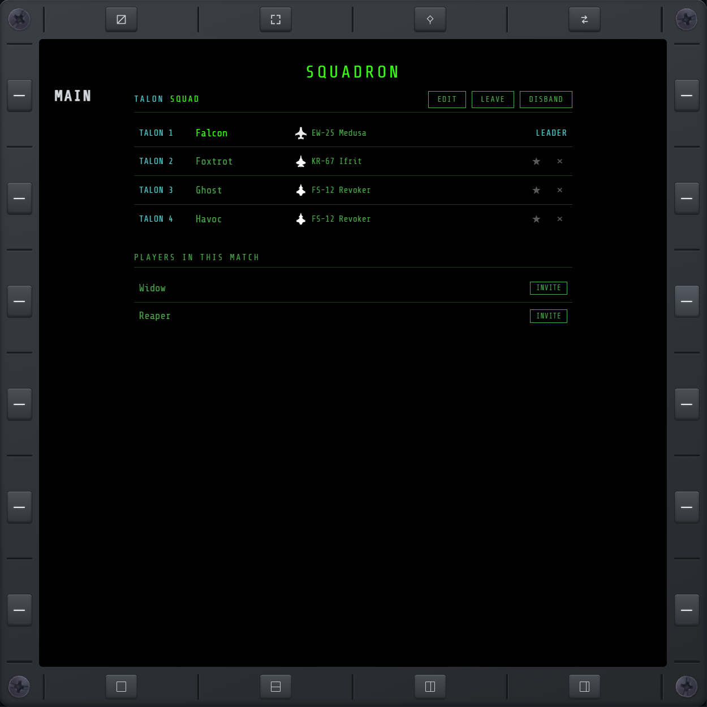

# SQD

Squadron membership over Steam: form a squad with players in your current match, and manage the
roster.

## Creating a squad

**CREATE SQUAD** swaps in a callsign picker and a flight-number picker (1-9) — pick both and
confirm to become the leader. Callsigns are a fixed list of real military callsigns, not free
text. **EDIT** on an existing squad's title lets the leader change both the callsign and the
flight number later — re-numbering the flight immediately updates every member's own designation.

## Roster

Members render as a table: each pilot's callsign designation, their Steam display name, and their
current aircraft (blank when not flying one). A designation reads `CALLSIGN FLIGHT-MEMBER` — e.g.
`TALON 1-2` — where FLIGHT is the squad's current flight number and MEMBER is join order (the
leader is always 1). The leader's row carries a LEADER badge; on every other row the leader sees a
star (promote) and an × (kick). Your own row is highlighted.

**INVITE** picks from faction-mates in the current match who are also running NOXMFD.

## Invites

Incoming invites queue oldest-first and show ACCEPT/REJECT; accepting one declines the rest, since
squad membership is exclusive. An invite never expires on its own — it stays pending until you
accept or reject it, however long that takes.

## Leaving

**LEAVE** always exits your own squad: immediate as a member; as the leader, it hands off to the
oldest remaining member first, then exits. The star on any other member's row does the same
hand-off-and-exit but lets you pick who takes over instead. **DISBAND** (leader only) ends the
squad for every member at once, rather than just yourself.

## Sharing waypoint routes

Once you're a squad leader with at least one member, each route on the [WPT](wpt.md) page gets a
share button. Sharing pushes the route to every member as a read-only entry with ACCEPT/REJECT;
later edits re-broadcast automatically. A member's own progress through a shared route carries
over across updates. Shared routes unlock for editing the moment the squad ends or the sharer
stops being leader.

## Hand off targets

While in a squad, a **TD** nav item appears on [TGT](tgt.md) — see [TD](td.md) for handing specific
targets off to specific members.
