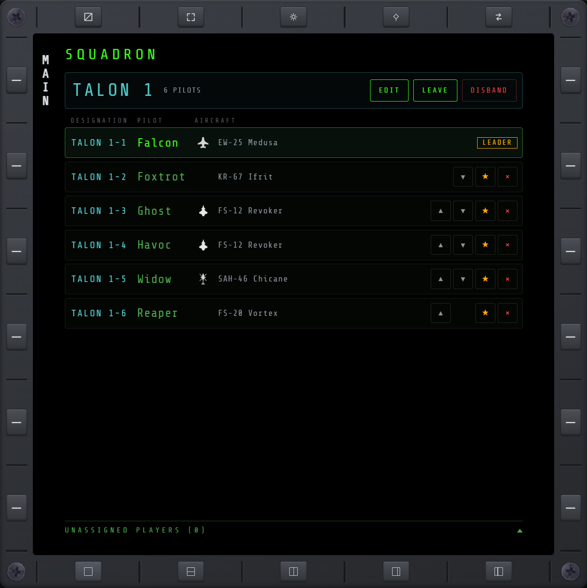
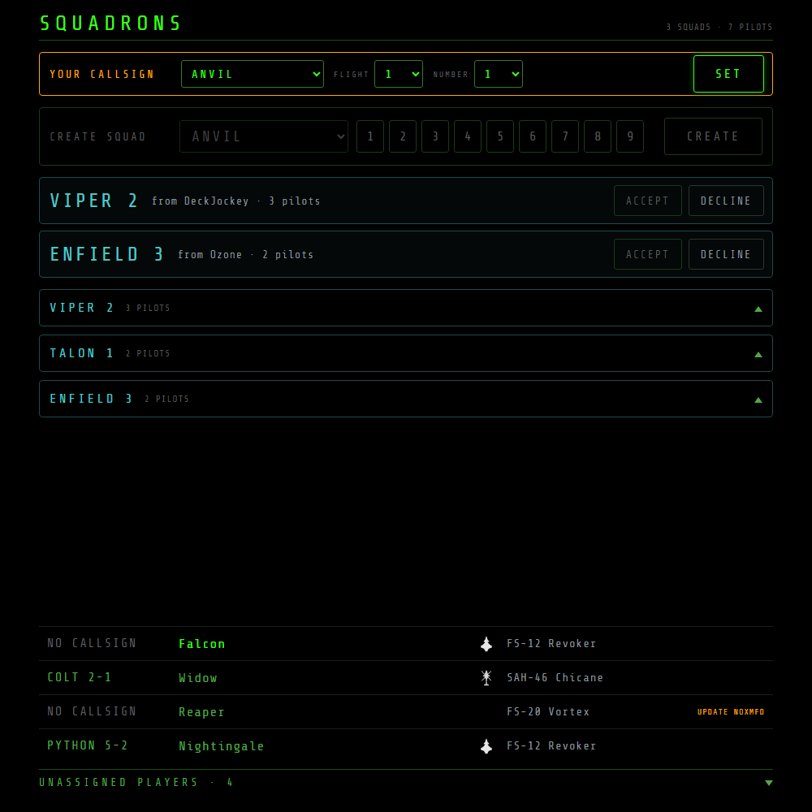
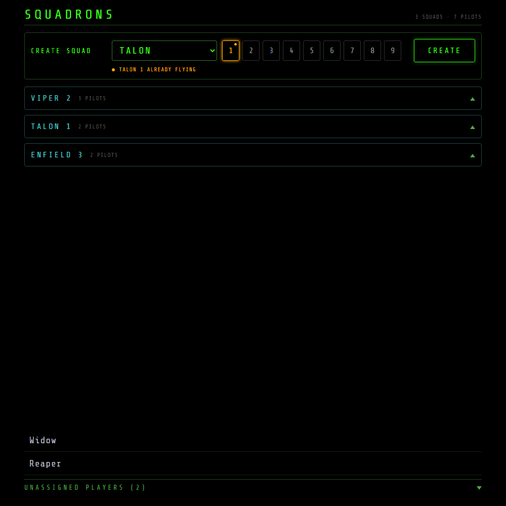
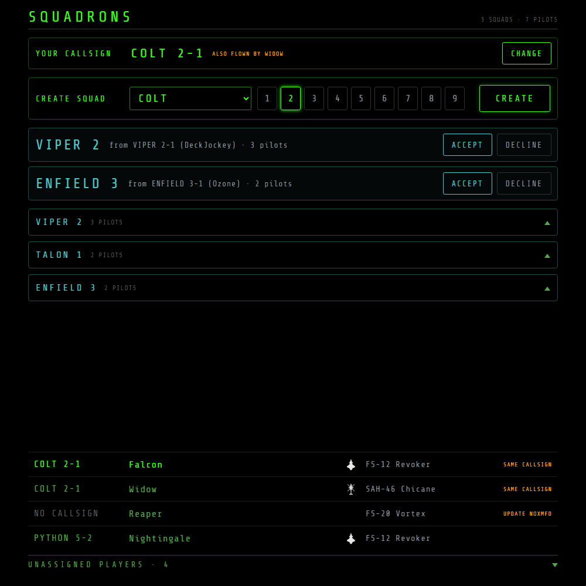
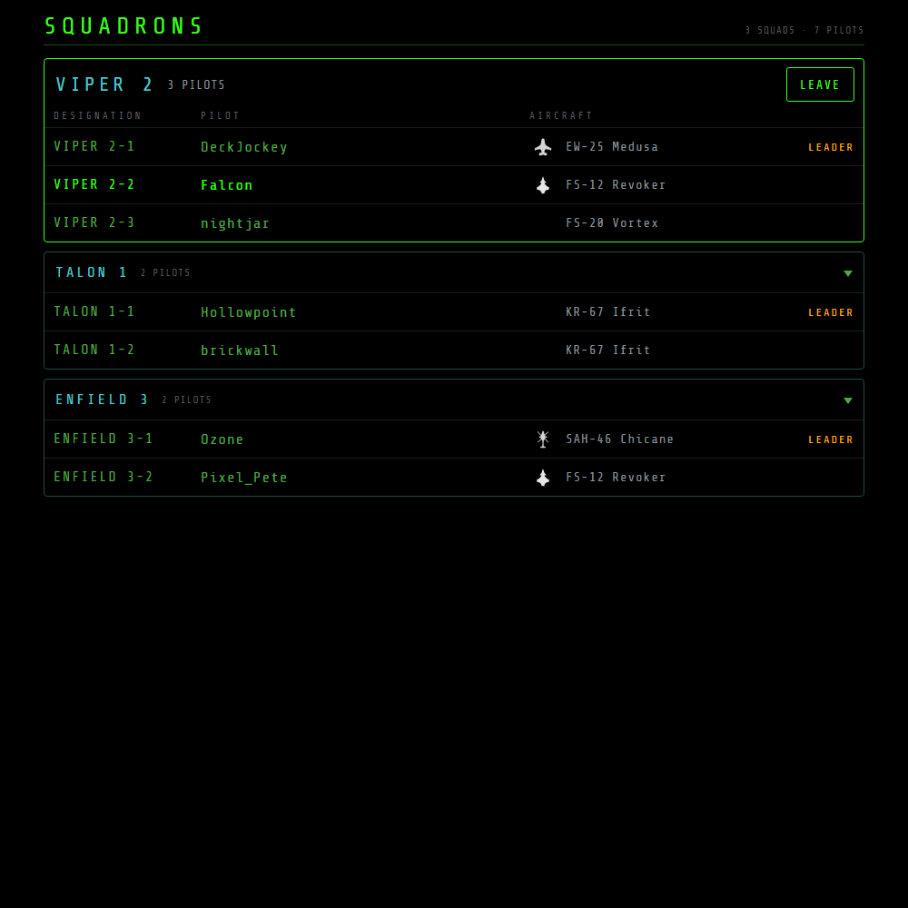

# SQD — Squadrons

Fly under your own callsign, such as `TALON 1-2`, and team up with other NOXMFD pilots in your
match. Your callsign replaces your Steam name in the game for everyone running NOXMFD, whether or
not you're in a squad. A squadron also links its members for shared navigation, target hand-offs and
squad marks on the map and HUD. The SQD page is where you set your callsign, form, join, lead and
leave a squad, and where you see every squad flying in your faction.

## What a squadron does

- **Callsigns everywhere.** Each pilot flies under their own callsign on the game's map, kill feed,
  chat, scoreboard and HUD markers, and on every NOXMFD page. Every NOXMFD player in the faction
  sees these names, including pilots in other squads or in no squad, such as an ATC controller.
- **Shared navigation.** The leader can share routes and steer points from [WPT](wpt.md).
- **Target hand-offs.** The leader assigns targets to specific members from [TD](td.md); members
  answer them on [TGT](tgt.md#squad-designations).
- **Squad marks.** Squadmates' planes show in teal on [MAP](map.md), and the HUD marks units your
  squad has targeted (see [TD → HUD marks](td.md#hud-marks)).

## Before you start

- Every pilot needs NOXMFD, a Steam copy of the game, and to be in the **same match and faction**.
- Squads talk over Steam's own peer-to-peer messaging. There's no server and no account to create.
  On a non-Steam launch the page shows *Squad requires Steam* and the squad feature is off.
- Everyone in a squad needs a NOXMFD version with self-assigned callsigns. A pilot on an older
  version is listed under UNASSIGNED PLAYERS with **UPDATE NOXMFD**, without an INVITE button, and
  an invite from them is declined on arrival with a notice naming them. A group that mixes versions
  has to update together to squad.
- Players without NOXMFD aren't affected: they can't join a squad and keep seeing Steam names.
- A squad lasts until it's left or disbanded. It carries over a mission change or restart, but not
  a game restart: after one, form the squad again. Your callsign does carry over.

## The page

Top to bottom:

1. **SQUADRONS**, with how many squads and pilots fly in your faction on the right.
2. **YOUR CALLSIGN**, always shown.
3. **CREATE SQUAD** — only while you're not in a squad.
4. **Invites** you haven't answered — only while you're not in a squad.
5. **Your squad**, in a green box that always stays open.
6. **Every other squad** in your faction, each in a teal box, collapsed. Click a box's header to
   open or close it.
7. **UNASSIGNED PLAYERS**, docked at the bottom — not shown to squad members. It starts open while
   you're not in a squad and collapsed once you are.

The page remembers which boxes you opened or closed, and the unassigned bar, for the rest of the
browser session.

An amber banner above the list reports anything that happened without you pressing a button,
such as a lost squadmate (see [Notices](#notices)).

## Your callsign

A callsign reads `CALLSIGN FLIGHT-NUMBER`, for example `TALON 1-2`:

- **CALLSIGN** is picked from a fixed list of real military callsigns.
- **FLIGHT** and **NUMBER** are each 1 to 9.

Until you set one, the YOUR CALLSIGN row is amber and open: pick the three values and press **SET**.
Afterwards it shows your callsign with **CHANGE**, which reopens the pickers; **CANCEL** keeps what
you had. You can change it at any time, in or out of a squad. It is saved, so it survives a game
restart, and everyone running NOXMFD sees it within a few seconds.

- Without a callsign you show under your Steam name, and **CREATE** and **ACCEPT** stay disabled
  until you set one.
- Joining or leaving a squad doesn't change your callsign.
- Two pilots may fly the same callsign. Both then show an amber note, **ALSO FLOWN BY** on your own
  row and **SAME CALLSIGN** on the other pilot's row, but nothing stops you. On comms, change a
  number to keep them apart.

## A squad's name

A squad has its own name, a callsign and a flight such as `TALON 1`, shown in its header, on invite
cards and in the list of other squads. Its members fly under their own callsigns, which don't have to
match it: a `TALON 1` squad can hold `VIPER 1-2` and `ENFIELD 3-1`. Keeping them consistent is up to
you.

Two squads may fly the same name. Both then show an amber **SAME DESIGNATION** note, and the squad
pickers mark that pair in amber, but nothing stops you from using it.

## Start a squad

While you're not in a squad, the page has the **CREATE SQUAD** row under your callsign:

1. Pick a callsign for the squad. It starts on your own callsign.
2. Pick a flight number, 1 to 9. It starts on your own flight. A flight another squad already flies
   under that callsign is marked amber, and a line under the row names it.
3. Press **CREATE**. You're the leader.

Creating a squad declines any invites you haven't answered.

## Join a squad

An invite shows as a card under the CREATE SQUAD row with the squad's name, who sent it and how many
pilots it has, for example `from DeckJockey · 3 pilots`.

- **ACCEPT** joins that squad and declines every other invite, since you can only be in one squad.
  It needs your callsign.
- **DECLINE** turns that one invite down.

Invites queue oldest first and never expire: one stays until you answer it. While invites wait you
can still create your own squad, browse the other squads to see who's in them, and accept whichever
you like.

## Lead a squad

As the leader, your squad's header has **EDIT**, **LEAVE** and **DISBAND**. Members are listed in
the order they joined, with you first. Each member's row has a **⋮** button that opens a menu:

| Item | What it does |
|---|---|
| **Promote to leader** | Makes that pilot the leader. You leave the squad. |
| **Kick from squadron** | Removes the pilot from the squad. |

The menu closes when you click elsewhere, press Escape or pick an item.

- **Invite** a pilot from the **UNASSIGNED PLAYERS** bar: open it and press **INVITE** on their row.
  They show as *INVITED* until they answer; an invite can't be withdrawn.
- **EDIT** opens the callsign and flight pickers in the header. **APPLY** renames the squad. Members
  keep their own callsigns.
- **DISBAND** ends the squad for every member.
- **Share** routes and steer points from [WPT](wpt.md#squad-sharing), and hand targets to members
  from [TD](td.md), which appears on TGT's nav row while you lead a squad.

## Fly as a member

As a member, you see your squad with your own row lit green and the leader marked **LEADER**. The
header has only **LEAVE**. What the leader shares reaches you on your own pages:

- Shared routes and steer points appear on [WPT](wpt.md#squad-sharing) with ACCEPT/REJECT.
- Targets the leader assigns you pop up on [TGT](tgt.md#squad-designations).

## Leave a squad

- **LEAVE** as a member takes you out at once.
- **LEAVE** as the leader hands the lead to the member who has been in the squad longest, then takes
  you out. Use **Promote to leader** on a member's row instead to pick who takes over.
- **DISBAND** (leader only) ends the squad for everyone.

Your callsign stays yours throughout.

If a squadmate crashes or force-quits, the rest of the squad notices on its own within about 30
seconds and drops them, with a notice. A pilot still loading after a mission restart gets about two
minutes, so restarting a mission doesn't break the squad.

## Other squads

Every other squad in your faction is listed below your own, read-only. Each box starts collapsed
with the squad's name and pilot count; open it to see each pilot's callsign, Steam name and aircraft,
the leader first. You see them whether you're in a squad or not, so anyone coordinating several
squads, such as an ATC controller, can read every callsign from one page.

The UNASSIGNED PLAYERS bar lists the faction's NOXMFD pilots who aren't in any squad, you included
while you're not in one, with their callsign, Steam name and aircraft.

## Names in the game

Every pilot's callsign replaces their Steam name in your game: the map, kill feed, chat, scoreboard,
HUD markers, and NOXMFD's own pages, including the ATC extension. That holds for your own squad,
every other squad and pilots in no squad.

- Only players running NOXMFD see callsigns; everyone else sees Steam names.
- A name changes within a couple of seconds of a pilot setting or changing their callsign.
- The [AKF](akf.md) feed adds the Steam name in parentheses, e.g. `TALON 1-2 (Roke) [F/A-26]`, and
  the SQD tables show both names.

## Notices

| Notice | Meaning |
|---|---|
| *Your squad was disbanded by the leader.* | The squad ended. |
| *You were removed from the squad by the leader.* | You were kicked. |
| *Lost contact with your squad leader…* | Your leader went silent, probably a crash or disconnect. You're out of the squad. |
| *Lost contact with NAME…* | A member went silent and was dropped. |
| *NAME is already in LEADER's squad — invitation rejected.* | The pilot you invited is in another squad. |
| *NAME tried to recruit MEMBER, who is already in your squad.* | Another leader invited one of your members. Nothing changes. |
| *NAME is on an older NOXMFD, so their squad invite was declined…* | An invite came from a build without self-assigned callsigns. They need to update. |
| *Couldn't hand off leadership to NAME…* | The pilot you promoted didn't answer. You're still the leader; try again. |

## Controls

Everything on the page is a click or tap. With SQD as the [SOI](keybinds.md#sensor-of-interest-soi),
the [PAD cursor](keybinds.md#pad-cursor) can press any button, including the ⋮ menu and its items
(select outside the menu to close it), and **Cursor Zoom In/Out** scrolls the page and the
unassigned list.

## Troubleshooting

- **A pilot isn't in UNASSIGNED PLAYERS.** They need NOXMFD running, the same faction, and no squad
  of their own. A pilot who just launched shows up within a few seconds.
- **A pilot shows UPDATE NOXMFD.** Their NOXMFD is older than this feature. Everyone in a squad needs
  the same version, so ask them to update.
- **CREATE or ACCEPT is greyed out.** Set your callsign first.
- **Someone's name doesn't change.** They need to have set a callsign and be running NOXMFD. Allow a
  couple of seconds after they change it.
- **The page says *Squad requires Steam*.** The game didn't start through Steam, so squads are off
  for this session.

## Privacy

Squads exchange data over Steam with other players. Your callsign, your squad's name and leader, and
your fuel level go to every NOXMFD player in your faction; routes, target hand-offs and squad marks
go only to your own squad. [SECURITY.md](../SECURITY.md) lists exactly what is sent and to whom.
