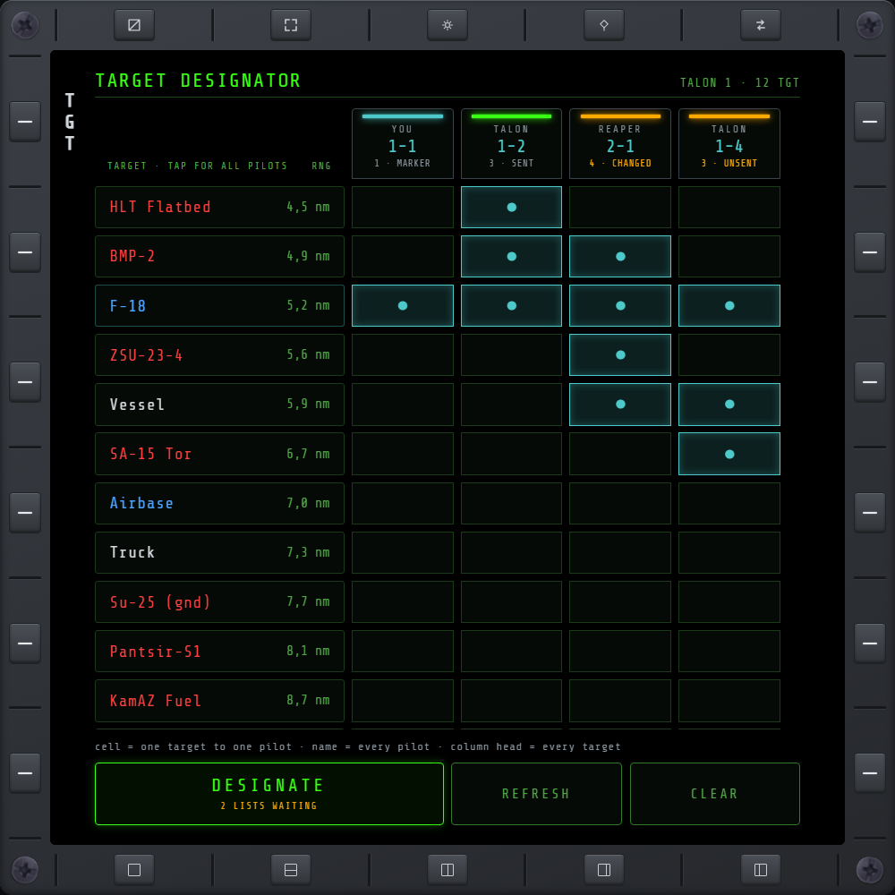
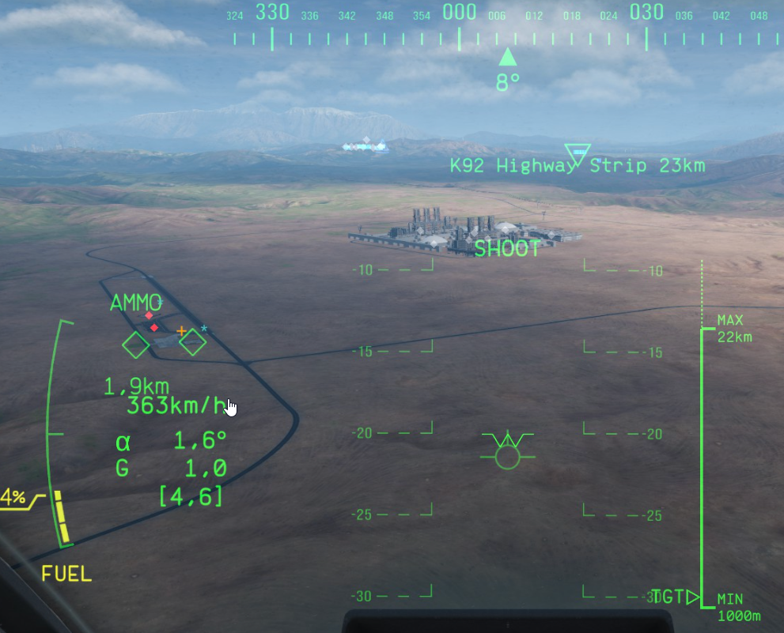

# TD — Target Designator

Hand off targets from your own [TGT](tgt.md) list to specific squad members. Only for the squad
leader: TD appears on TGT's nav row while you lead a [squad](sqd.md). Members don't use this page —
what you designate reaches them on their own TGT page, where they add or dismiss it (see
[TGT](tgt.md#squad-designations)).

## The assignment matrix

Your targets run down the left, one row each, with their range. Your squad runs across the top, one
column per pilot: **YOU** (a personal marker, never sent) and one column per member, labeled with that
pilot's own callsign (`VIPER` over `1-2`), the same callsigns as the [SQD](sqd.md) rows. A member who
leaves takes their assignments with them.

Every control does exactly what it names, with nothing to select first:

- **Tap a cell** to give that target to that member. Tap it again to take it back.
- **Tap a target's name** to give it to every column at once. If it already has every column, the
  tap clears the row instead.
- **Tap a column head** to give that member every target on the table. If they already have them
  all, the tap empties the column instead.

A target can go to as many members as you like.

## Column status

Each column head shows how many targets that member has, and whether they've got them yet:

- **SENT** (green lamp) — the member has exactly this list.
- **CHANGED** (amber) — you've changed the list since the last send.
- **UNSENT** (amber) — never sent yet.
- **EMPTY** — nothing assigned, nothing sent.
- **MARKER** — your own column.

## Buttons

- **DESIGNATE** sends every amber column, then returns you to TGT — where the **TD** column shows
  the callsigns of the members you just assigned. It lights up when something is waiting and counts the
  lists that will go (`2 LISTS WAITING`); `ALL SENT` means there's nothing new. Each send replaces
  that member's whole list, and a list you emptied is sent too, so it withdraws what they had
  pending.
- **REFRESH** pulls in the current TGT list. The table only updates on its own when a target is
  actually selected or deselected in-game (not on every range tick), so it never shifts under your
  finger — REFRESH is the manual way to bring ranges up to date.
- **CLEAR** discards your assignments. Nothing already sent changes; those columns turn CHANGED.

The line above the buttons shows what your last tap did, or a reminder of the three tap targets.

With more targets than fit, the rows stop shrinking at a comfortable tap size and the table
scrolls. **Cursor Zoom In/Out** scrolls it from the HOTAS, and the [PAD cursor](keybinds.md#pad-cursor)
can tap any cell, name, column head or button.

## HUD marks

Whenever a unit is targeted by someone else in the squad, its native in-game HUD icon gets a small
teal mark — visible in the cockpit HUD itself, without opening TD or TGT:

- **`*`** — the squad leader currently has this unit targeted.
- **`⌃`** — at least one member (not the leader) currently has it targeted. One mark regardless of
  how many members.

This is purely informational and works for every squad member, leader included — it shows what the
rest of the squad is doing at a glance, separate from your own local target lock (the amber `+`).
Marks update live and clear automatically once the squad ends.

