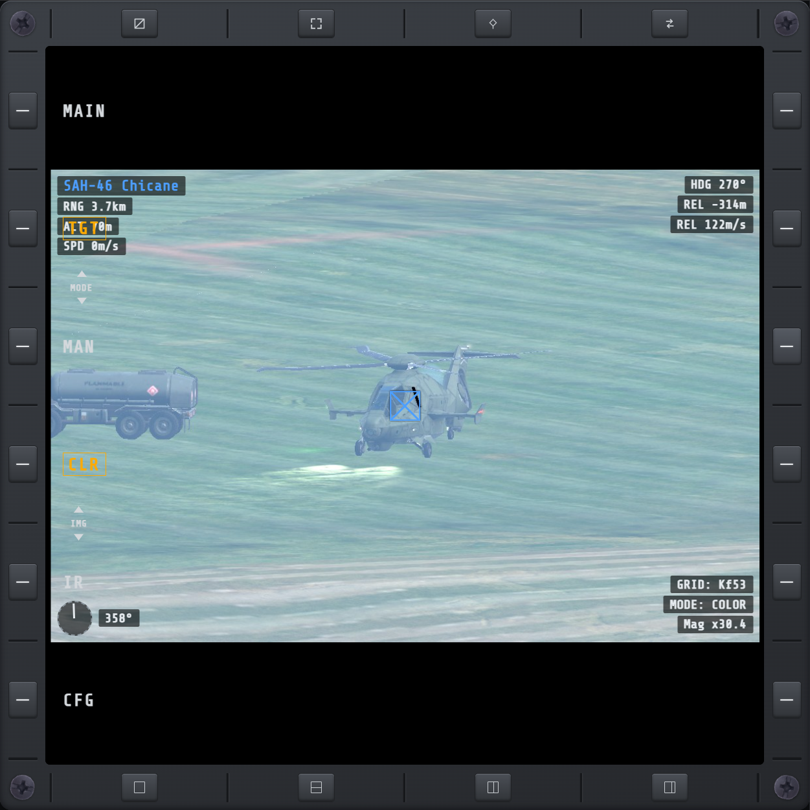
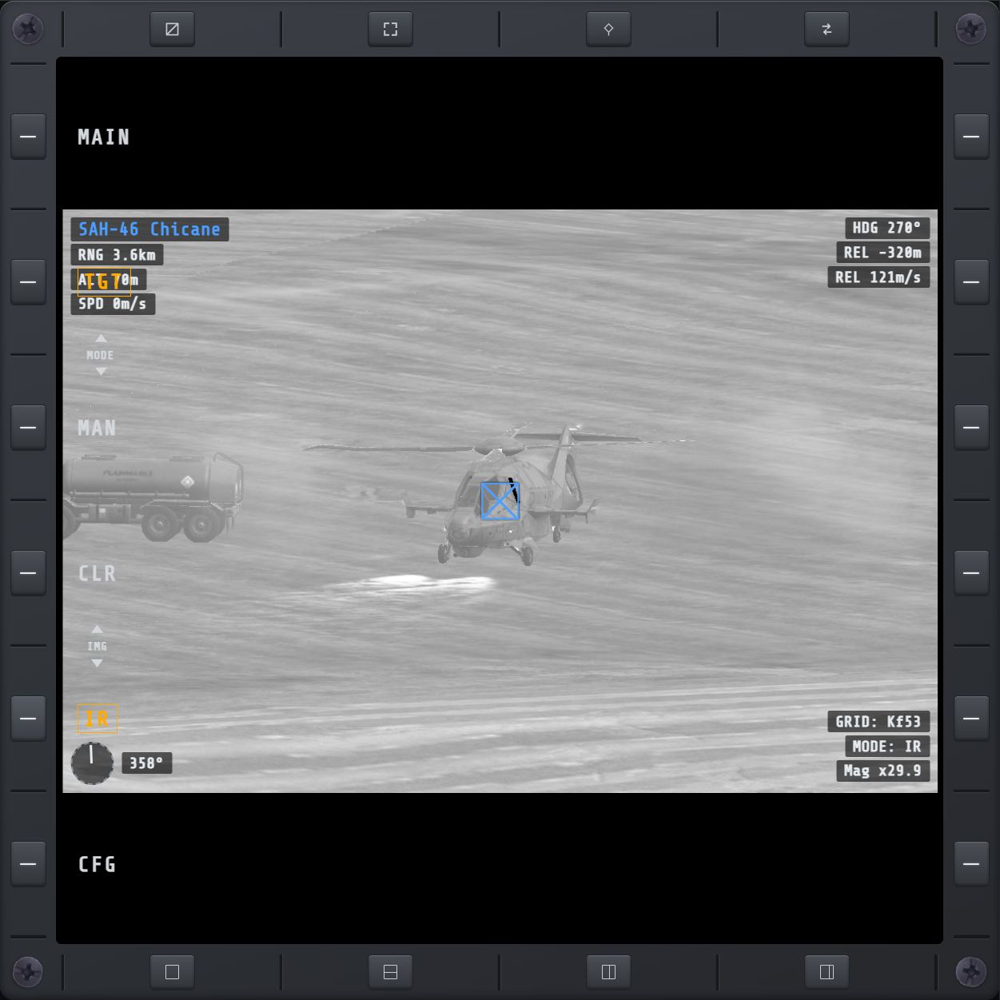
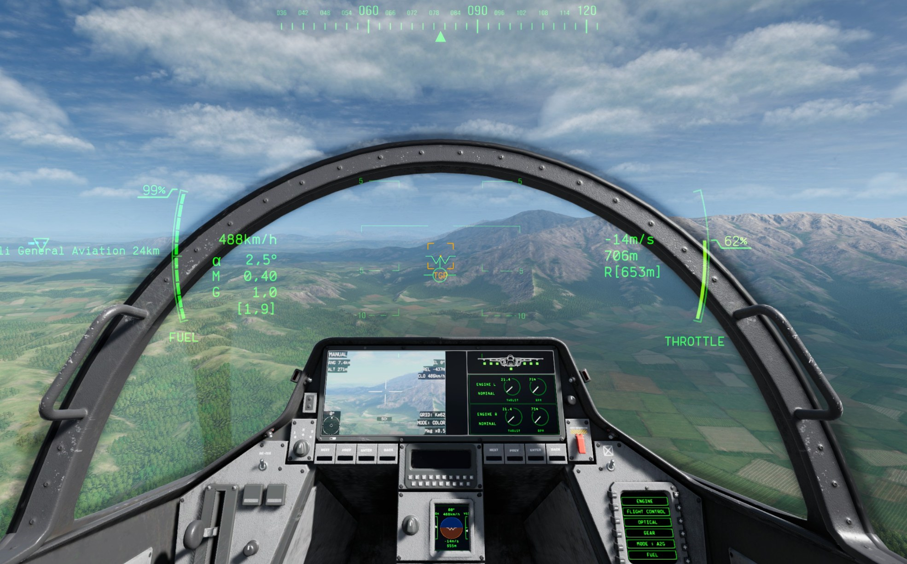
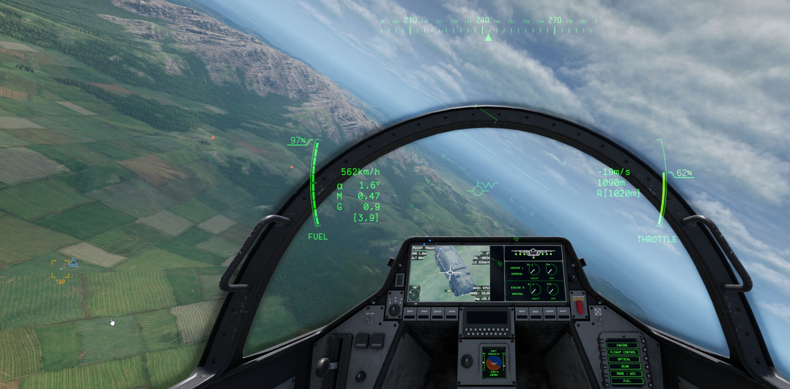
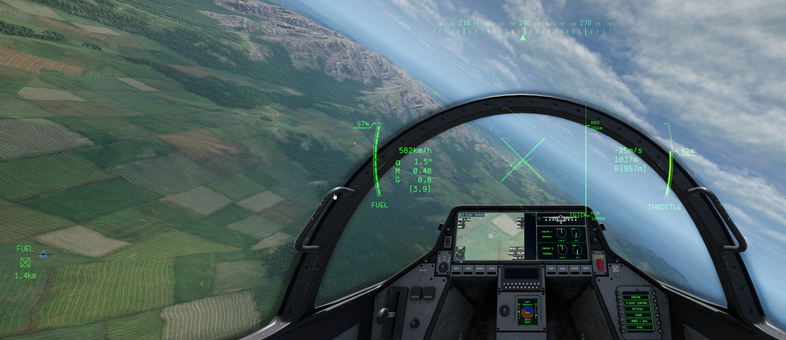
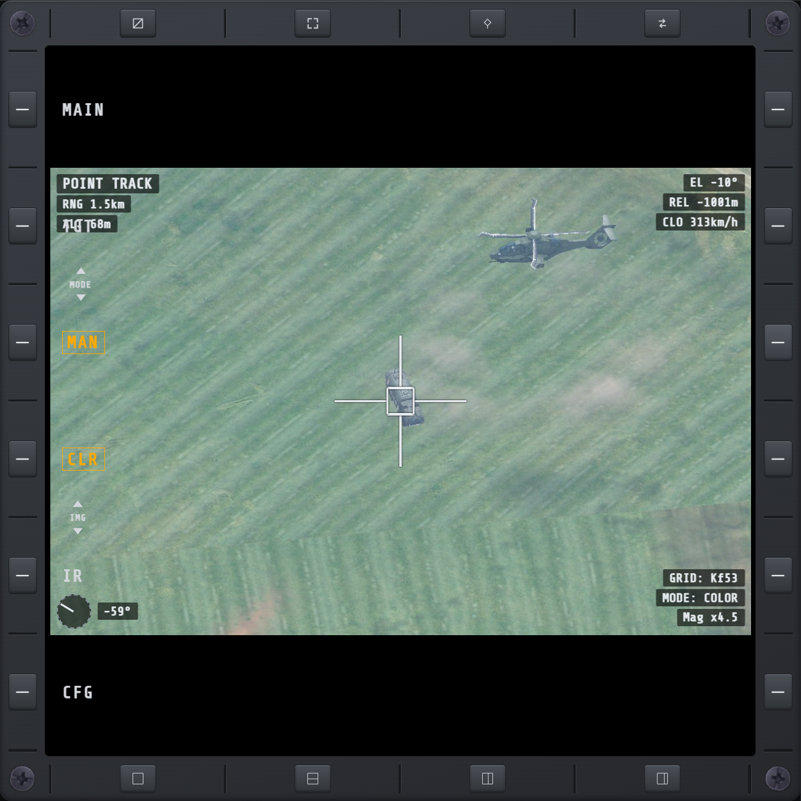

# TGP

Targeting-pod camera feed — zoomed on a locked target, or pointed yourself with
[manual camera control](#manual-camera-control).

## Picture quality

Two independent settings on the [TGP CFG](tgpcfg.md) page — resolution (which camera) and JPEG
quality (how hard the stream is compressed) — covered in full there. The short version: **LOW**
resolution (default) reads the game's own targeting-pod camera exactly as it renders in the
cockpit; **MID**/**HIGH** render a separate, sharper camera instead, with real tree/grass detail
and everything below.

## Mirror-camera overlay

Only shown at MID or HIGH resolution, while a target is locked or
[manual camera control](#manual-camera-control) is on — LOW resolution already has this baked into
the game's own picture either way. Manual mode's own fields are covered separately under
[Manual mode overlay](#manual-mode-overlay); the rest of this section is the locked-target reading.
Reads:

- Target type/name, top-left, with a pilot callsign line underneath when known.
- **[JAM]** / **[LASE]** / **[OLD]** tag next to the name when the target is jammed, actively
  laser-designated, or its tracked position has gone stale.
- Range, altitude, speed (top-left) and heading, relative altitude, relative speed (top-right) —
  the last three blank out for a target too far/stale to read in detail.
- A bearing compass with a needle, bottom-left, pointing at the target relative to the pod's own
  aim, plus the raw bearing in degrees.
- Grid square, IR/COLOR mode, and magnification, bottom-right.
- A lock box drawn at the target's own screen position, one per locked target:
  - White solid — a normal hostile lock.
  - Blue solid, with an X through it — a friendly.
  - Yellow solid — jammed.
  - White dashed — the tracked position is stale.
  - Amber, with a small red cross in the middle — actively laser-designated.

## IR mode

When the pod is in IR (thermal) mode, MID/HIGH resolution shows a black-and-white picture instead
of color — a basic simulated thermal look, not a full radiometric simulation.

## Refresh rate

The feed's update rate is a live-adjustable slider on [TGP CFG](tgpcfg.md) — higher costs more
CPU/GPU and network bandwidth, lower saves it at the cost of smoothness and latency. Defaults to
15 Hz.

## Cockpit feed

[TGP CFG](tgpcfg.md) also has a HIDE COCKPIT FEED toggle. When enabled, the in-cockpit TGP picture
is hidden while an external TGP page is open, leaving the external MFD as the only moving TGP feed.

## Manual camera control

Point the targeting-pod camera yourself, independent of the game's own automatic unit lock —
instead of only ever seeing whatever's currently locked, aim it wherever you're looking.

- Turn it on/off with the **Manual Control Toggle** keybind (see [KEY](keybinds.md#tgp)), or the
  **MAN**/**LCK** buttons on this page's own nav row — see [LCK/MAN, CLR/IR](#lckman-clrir) below.
- Turning it on centers the camera on your aircraft's nose at minimum zoom, and immediately gives
  it PAD Cursor focus so you can start pointing right away.
- It turns back off on its own the moment a real target locks, your aircraft is lost, or the
  landing-gear camera takes over — it never fights the game's own automatic camera.
- **Manual Control Reset** recenters the camera on the nose at minimum zoom without turning it off.

## Area Track and Point Track

Two ways the camera aims while in manual control:

- **Area Track** (default) — a free-look direction that turns with your aircraft, the same way
  looking straight ahead from the cockpit does. Centering/resetting always points dead ahead of
  the nose.
- **Point Track** — locks the aim onto a fixed point in the world instead, holding steady on that
  spot as your aircraft moves around it. Press **Point Track** to lock onto whatever the camera is
  currently pointed at; press it again to release back to Area Track. While locked, Pan/Tilt nudges
  the locked point itself rather than a free direction, and re-locks onto the new point once you
  stop nudging.

## Pointing the camera

Manual control reuses the same PAD Cursor every other display already uses (see
[KEY](keybinds.md#pad-cursor)) — it has no separate pan/tilt/zoom binds of its own:

- **Cursor Up/Down/Left/Right**, or a bound analog axis, pan and tilt the camera.
- **Cursor Zoom In/Out**, or a calibrated **Cursor Zoom Axis**, zoom it — the buttons zoom at a
  steady rate, the axis jumps straight to whatever position it's moved to.
- These only reach the camera while it holds [SOI](keybinds.md#sensor-of-interest-soi) — either
  directly (its own ring entry, cycled with SOI Next/Prev) or by having this TGP page itself
  focused, since the page is the camera's own display. Aiming the same controls at any other
  focused display drives that display's own zoom/scroll instead.
- Manual control keeps running even while SOI is elsewhere on another display — it doesn't stop
  pointing, it just stops listening for input until SOI comes back to it.
- **Z+ / Z−** on this page's own nav row jump the zoom to the next fixed magnification level
  (roughly doubling each press: 0.5x, 1x, 2x, 4x, 8x, 16x, 32x, 40x) — no SOI needed. Press and
  hold to keep stepping through levels until you let go. No effect while a real unit is locked
  instead of the manual camera.
- A **joystick** in the bottom-right corner of the picture, for a mouse or touch screen: press and
  drag it, and the camera pans and tilts toward the direction you dragged, the further the faster.
  Let go and it snaps back to center. Works without SOI too. White and dim while idle, amber while
  you're actively dragging it; dimmed further and inactive while a real unit is locked instead of
  the manual camera. It also gets out of the way on its own the moment you use the physical PAD
  Cursor keys or axis to point the camera instead — tap the picture to bring it back, or leave and
  reopen the page.

## In-game HUD cue

While manual control is on and you're looking through the cockpit, an amber **TGP** marker on the
main flight HUD shows where the camera is pointed — visible from anywhere you look, not just
toward the nose. Four small corner brackets and a centre dot mark it while it's within view; past
the edge of the screen it becomes a caret pinned to that edge instead, pointing toward it. It
disappears the instant manual control ends.

Once [Point Track](#area-track-and-point-track) locks onto a point, the marker moves off-center to
track it — here, aimed down at a vehicle in the field below rather than straight ahead:

## Locking a nearby unit

**Cursor Select** — from either Area Track or Point Track — checks for a real, selectable unit
near wherever the camera is currently looking. If one's close enough, it's put under a normal
target lock and manual control hands off to the game's own camera immediately; otherwise nothing
happens.

## LCK/MAN, CLR/IR

Four extra buttons on this page's own nav row, alongside MAIN/CFG:

- **LCK / MAN** — which camera feeds the page: a real (native) unit lock, or the manual camera.
  Picks one directly, rather than using the Manual Control Toggle keybind.
- **CLR / IR** — the active camera's color mode. Works the same for either camera: switching it
  while a real unit is locked overrides the game's own automatic day/night IR switching with your
  own choice, which sticks until you change it again — the same thing the **Toggle IR** keybind
  does (see [KEY](keybinds.md#tgp)).

All four reflect what's actually showing rather than acting like a page switch — LCK/MAN light up
to show which camera is live, CLR/IR show that camera's current color mode — and all go dark with
no feed up at all.

## Mark steer point

**STP**, another nav-row button, marks whatever the camera is currently showing — a real lock's
position, or the manual camera's current aim point — as a new [steer point](wpt.md#steer-points).
Does nothing with no lock and manual control off, or manual control on but not looking at
anything. A **Mark Steer Point** keybind (see [KEY](keybinds.md#tgp)) does the same thing.

## Manual mode overlay

The stat readout matches the locked-target [mirror-camera overlay](#mirror-camera-overlay)'s own
corner layout and MID/HIGH-only rule, with fields specific to pointing instead of a target:

- **RNG / ALT / REL** — range, altitude, and relative altitude to whatever the camera's current aim
  actually hits; blank when it isn't looking at anything.
- **CLO** takes relative speed's slot — the closing rate toward that same hit point.
- **EL** takes heading's slot — the camera's current elevation angle, since a hit point has no
  heading of its own.
- **GRID**, color **MODE**, and **MAG** (magnification) work exactly like the locked-target overlay.
- The target-name title, top-left, reads **MANUAL** or **POINT TRACK** instead, with no pilot line.
