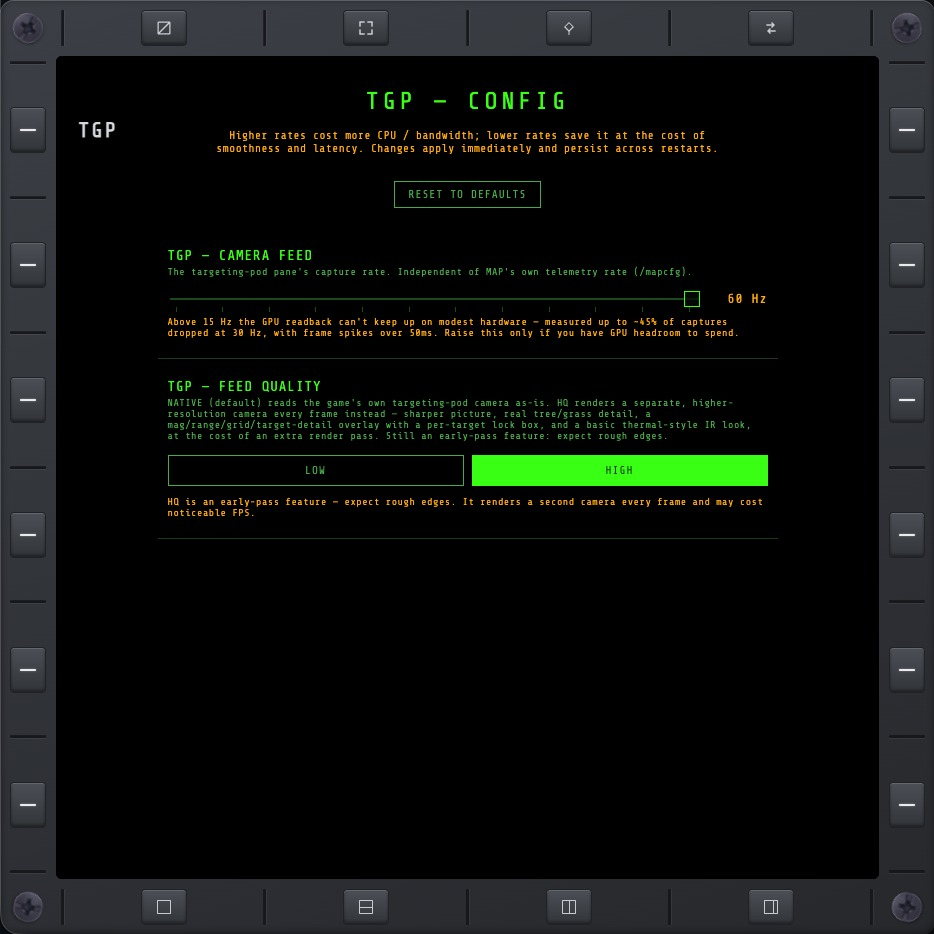

# TGP — CFG

[TGP](tgp.md)'s own settings page, reached from TGP's CFG key. It controls the feed refresh rate,
picture quality, and an optional cockpit-feed hide toggle.

## TGP

The [targeting-pod camera feed](tgp.md)'s capture rate, independent of MAP's own telemetry rate.
Defaults to 15 Hz, adjustable up to 60 Hz — above 15 Hz the GPU readback can start dropping
captures on modest hardware, so raise it only if you have GPU headroom to spend. Higher rates cost
more CPU/GPU and network bandwidth; lower rates save it at the cost of smoothness and latency.
Changes apply immediately and persist across restarts.

## LOW / HIGH

Picks the feed's picture source — the same choice applies whether [TGP](tgp.md) is showing a real
unit lock or [manual camera control](tgp.md#manual-camera-control):

- **LOW** (default) — reads the game's own targeting-pod camera as-is, stat overlay and crosshair
  already baked into the picture either way.
- **HIGH** — renders a separate, higher-resolution camera every frame instead: a sharper picture,
  real tree/grass detail, a stat overlay drawn on top of the page instead (target details when
  locked, [pointing details](tgp.md#manual-mode-overlay) in manual control), and a basic
  thermal-style black-and-white look when the pod is in IR mode. Costs an extra render pass — still
  an early-pass feature, expect rough edges.

## HIDE COCKPIT FEED

When ON, NO XMFD hides the game's in-cockpit TGP picture while an external TGP page is open, so the
external MFD is the only moving TGP feed. The cockpit display falls back to its normal content
instead.

This applies in both LOW and HIGH quality. It is off by default and restores when the toggle is
turned OFF or the external TGP page is closed. A very brief cockpit-feed flash can still happen
during rapid target deselect/reselect transitions.

## RESET TO DEFAULTS

Restores the slider to 15 Hz, quality to LOW, and HIDE COCKPIT FEED to OFF.
