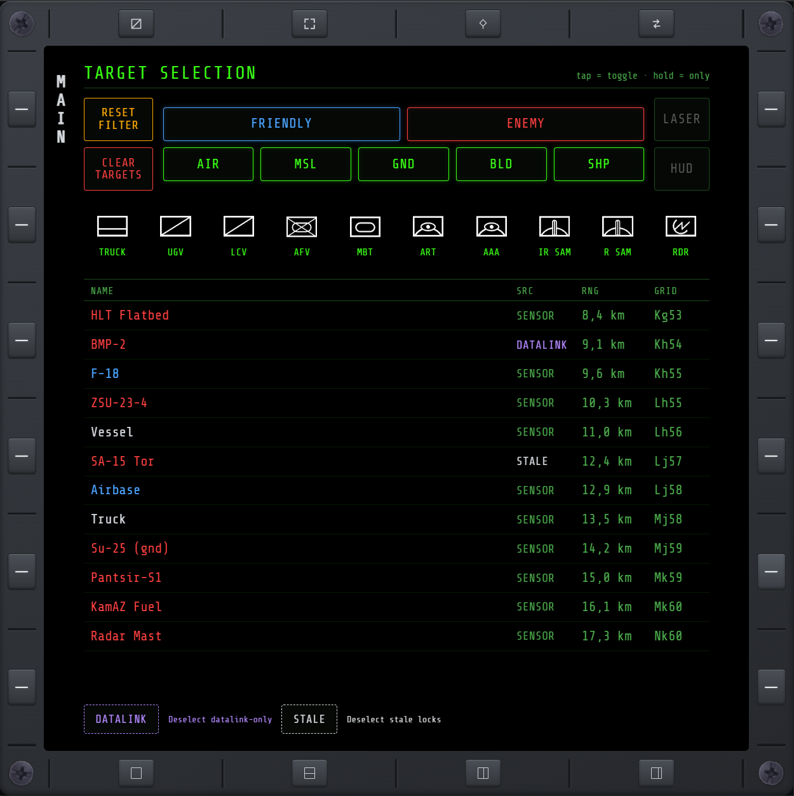

# TGT

A clickable replica of the in-cockpit TARGET SELECTION panel — control which units can be
targeted, and see what you currently have selected.

## Filters

Rows of toggles for faction (friendly/enemy), category, and vehicle type, plus LASER and HUD mode
buttons:

- **Tap** a filter to turn it on or off.
- **Hold** a filter to isolate it — turns everything else in its row off, leaving just that one on.
- **RESET FILTER** turns every filter back on.

## Target list

Every target you currently have selected, one row per target:

- **NAME** — the unit's name, with a **TTI** (time-to-impact) reading beside it whenever one of
  your own missiles or guided bombs is currently in flight and tracking that lock — the same
  reading the in-game HUD's own [time-to-impact readout](rdr.md#in-game-hud-cue) shows for whichever
  target is focused, just available here for every locked target at once, not only the focused one.
- **SRC** — where the lock is coming from: **SENSOR** (your own live sensors), **DATALINK**
  (relayed by your faction, still trustworthy), or **STALE** (relayed, but the game no longer
  trusts the position — the same check behind the TGP page's own "?" marker).
- **RNG** — range to the target.
- **GRID** — its grid position.

If you have more than one target selected, an outline marks whichever one is currently *focused* —
the same one [FCR/HSD](rdr.md#when-a-target-is-locked) read out at the bottom of their own screens.
**Next Target / Previous Target** step which one that is. The outline is **amber** right after
pressing Next/Previous — **Cursor Select** deselects that target directly, no aiming needed. Move
the PAD cursor instead and the outline turns **grey**: the same target is still focused (FCR/HSD
still read it out), but Select now acts on whatever the cursor is pointing at instead.

**Tap anywhere on a row** to deselect that target. **CLEAR TARGETS** deselects everything at once.

## Out in the world

The focused lock isn't just a TGT/FCR/HSD thing — it follows you out of the MFD and onto the real
cockpit view:

- A **time-to-impact** countdown (`TTI M:SS`, amber) appears on the HUD below the radar altitude
  while one of your own missiles or guided bombs is in flight and tracking the focused target — see
  [RDR](rdr.md#in-game-hud-cue) for the full readout and its own per-row version of this same value.
- The focused target's own native lock symbol — the green diamond/square the game already draws
  over anything you've locked — gets a small amber **+** at its top-left, so with several targets
  locked you can tell which one is focused just by looking through the canopy.
- **Single Target Weapon Release** (see [KEY](keybinds.md#weapons)) fires one missile/bomb at
  exactly this target, even with others also locked — instead of the stock Weapon Release trigger's
  own behavior of firing one round at *every* locked target in sequence.

## Bulk-clearing by source

Two buttons below the list clear targets by *why* they're selected, without touching the rest:

- **DATALINK** — deselects every datalink-only lock.
- **STALE** — deselects every stale lock.

## Keybinds and PAD cursor

Next/Previous Target, Clear Datalink, and Clear Stale all have dedicated keybinds, and this page
is fully drivable from a HOTAS [PAD cursor](keybinds.md#pad-cursor) — see [KEY](keybinds.md) for
both.
