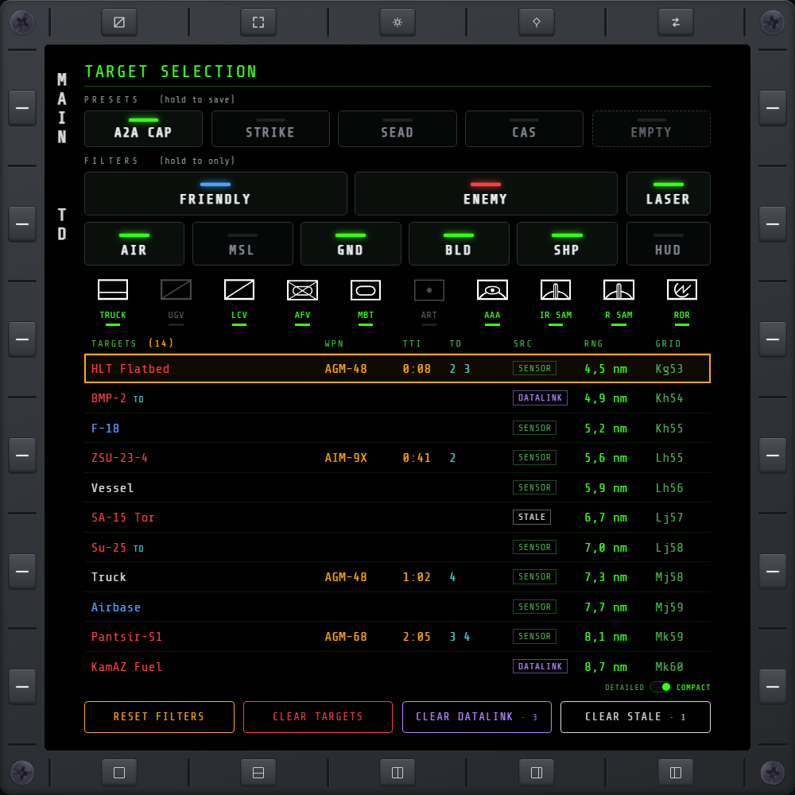
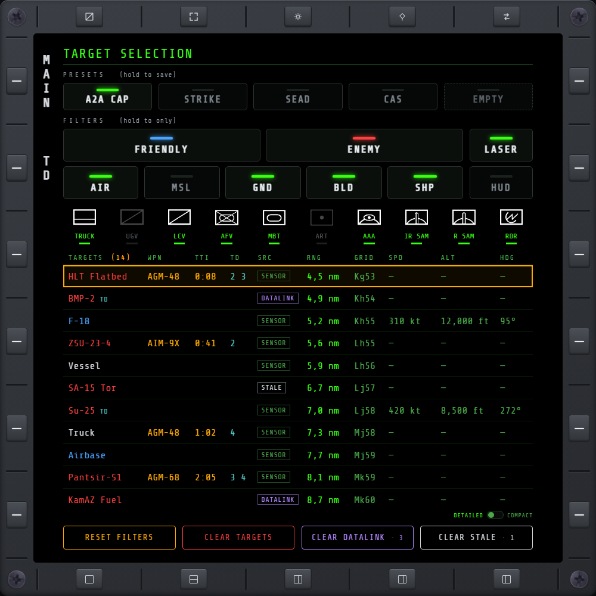
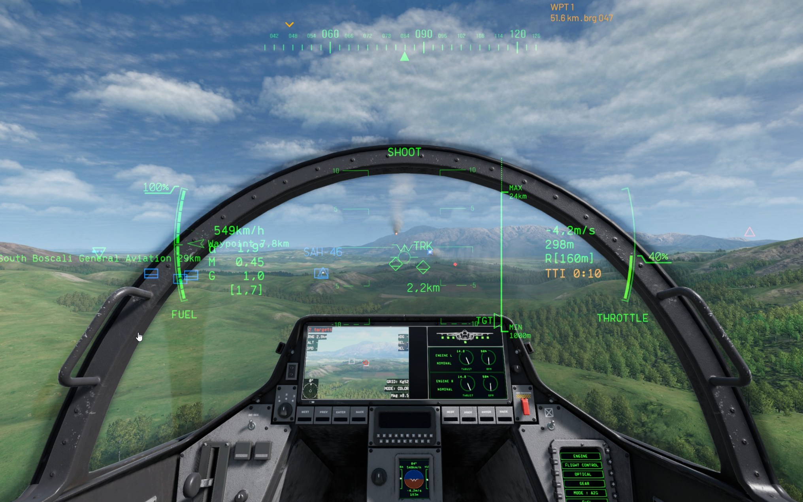
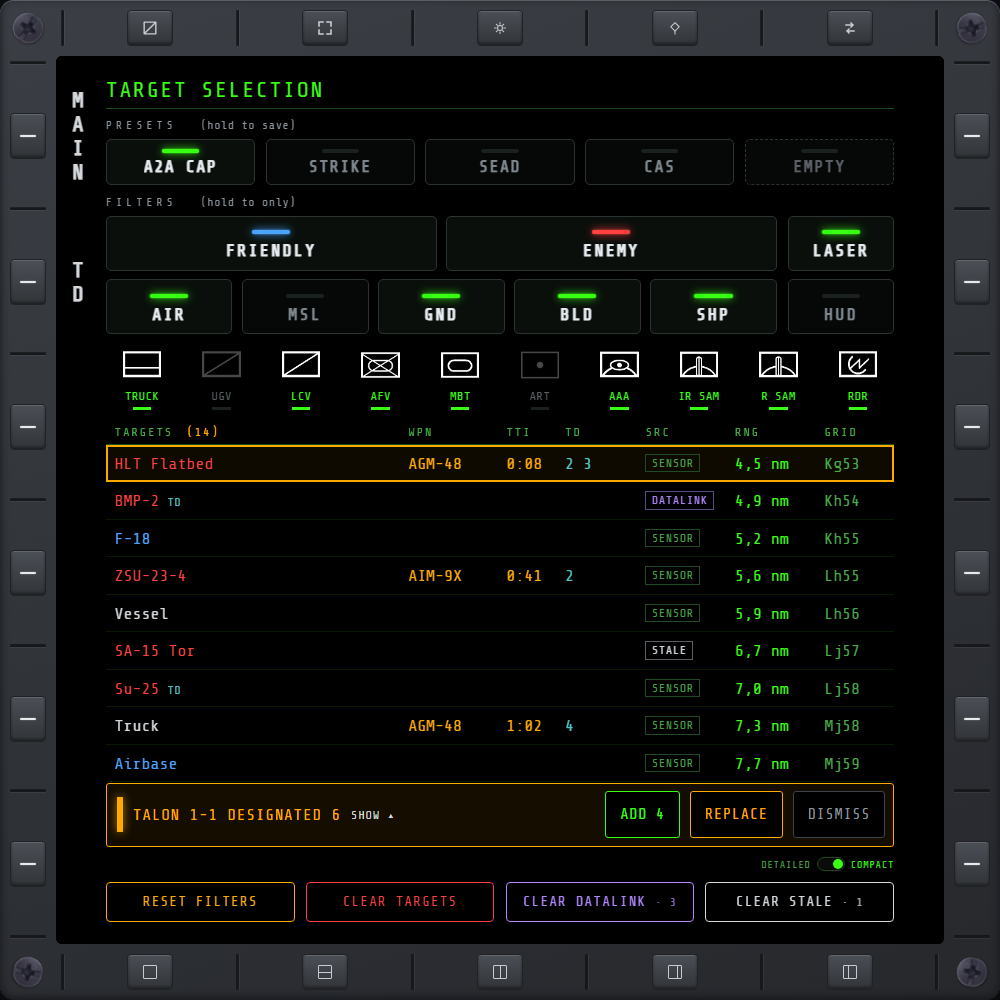
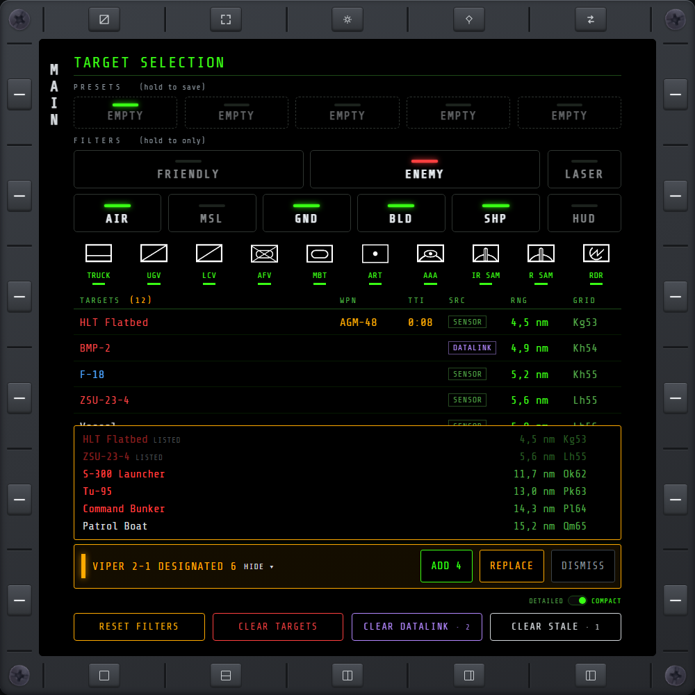

# TGT

A clickable replica of the in-cockpit TARGET SELECTION panel — control which units can be
targeted, and see what you currently have selected.

## Filters

Under a **FILTERS** heading, rows of toggles for faction (friendly/enemy), category, and vehicle
type, plus LASER and HUD mode buttons. Each lights a small lamp above its label while it is on —
green, or blue for FRIENDLY and red for ENEMY:

- **Tap** a filter to turn it on or off.
- **Hold** a filter to isolate it — turns everything else in its row off, leaving just that one on.
- **RESET FILTERS** (bottom row) turns every filter back on.

Units the filters leave out are drawn dimmed on the [MAP](map.md), same as on the in-game map.

## Target list

The first column header reads **TARGETS (N)** — the running total in amber — handy for matching
ordnance count to target count without leaving the map to check the cockpit MFD.

Every target you currently have selected, one row per target:

- **TARGETS** — the unit's name.
- **WPN** — the weapon of yours that is currently in flight and tracking that lock. Blank when
  nothing is.
- **TTI** — that weapon's time to impact as `m:ss`, the same reading the in-game HUD's own
  [time-to-impact readout](rdr.md#in-game-hud-cue) shows for whichever target is focused, just
  available here for every locked target at once, not only the focused one. Blank when nothing is
  tracking the lock. With several weapons on one target, WPN and TTI both describe the one closest
  to impact.
- **TD** — while you're leading a [squad](sqd.md), which member(s), by the number of their callsign (`2` for `ANVIL 1-2`), you've designated this
  target to on the [Target Designator page](td.md) (blank if none). Only you see this column — it's
  your own in-progress/sent designation work, not visible to anyone else, and it doesn't appear at
  all unless you're currently the squad leader.

- **SRC** — where the lock is coming from: **SENSOR** (your own live sensors), **DATALINK**
  (relayed by your faction, still trustworthy), or **STALE** (relayed, but the game no longer
  trusts the position — the same check behind the TGP page's own "?" marker).
- **RNG** — range to the target.
- **GRID** — its grid position.

If you have more than one target selected, an outline marks whichever one is currently *focused* —
the same one [FCR/HSD](rdr.md#when-a-target-is-locked) read out at the bottom of their own screens.
**Next Target / Previous Target** step which one that is. The outline is **amber** right after
pressing Next/Previous — **Cursor Select** deselects that target directly, no aiming needed. Move
the PAD cursor instead and the outline turns **grey**: the same target is still focused (FCR/HSD
still read it out), but Select now acts on whatever the cursor is pointing at instead.

**Tap anywhere on a row** to deselect that target. **CLEAR TARGETS** deselects everything at once.

### Sorting

**Tap the TARGETS, SRC or RNG column header** to sort the list by that column; tap it again to
reverse the order. A green **▲** / **▼** beside the header shows which column is sorting and in
which direction. **Long-press** any of the three to go back to the default order — the order the
game itself holds your locks in. WPN, TTI, GRID and the TD/flight-data columns don't sort.

- TARGETS sorts alphabetically, SRC in the order DATALINK, SENSOR, STALE.
- RNG re-sorts live as ranges change, with any target whose range isn't known always last.
- Targets that tie keep their default order.

The sort is shared: every TGT display — full view, split panes, the F-35 layout, other browsers —
shows the same order, and **Next Target / Previous Target** step through the list in that order,
top to bottom.

## Flight data columns

A DETAILED/COMPACT toggle, bottom right under the target list, appends three more columns
after GRID:

- **SPD** — the target's current speed.
- **ALT** — the target's current altitude.
- **HDG** — the target's current heading.

Same data the [MAP](map.md) page's own hover tooltip already shows for a unit. A target shows
**—** in all three when that data isn't available — a stale lock, or a target that isn't an
aircraft or missile. COMPACT (the TARGETS/WPN/TTI/TD/SRC/RNG/GRID columns only) is the default; the
setting isn't remembered across a reload.

## Out in the world

The focused lock isn't just a TGT/FCR/HSD thing — it follows you out of the MFD and onto the real
cockpit view:

- A **time-to-impact** countdown (`TTI M:SS`, amber) appears on the HUD below the radar altitude
  while one of your own missiles or guided bombs is in flight and tracking the focused target — see
  [RDR](rdr.md#in-game-hud-cue) for the full readout and its own per-row version of this same value.
- The focused target's own native lock symbol — the green diamond/square the game already draws
  over anything you've locked — gets a small amber **+** at its top-left, so with several targets
  locked you can tell which one is focused just by looking through the canopy.
- **Single Target Weapon Release** (see [KEY](keybinds.md#weapons)) fires one missile/bomb at
  exactly this target, even with others also locked — instead of the stock Weapon Release trigger's
  own behavior of firing one round at *every* locked target in sequence.

## Action buttons

Four buttons are docked in one row at the bottom of the page, outside the scrolling list, so they
stay reachable however long the list is:

- **RESET FILTERS** (amber) — turns every filter back on.
- **CLEAR TARGETS** (red) — deselects everything.
- **CLEAR DATALINK** (purple) — deselects every datalink-only lock. Shows how many that is.
- **CLEAR STALE** (white) — deselects every stale lock. Shows how many that is.

The last two clear targets by *why* they're selected, without touching the rest.

## Presets

Five preset slots for your own filters, saved server-side so any connected browser can save or
recall one. Under a **PRESETS (hold to save)** heading, five cards sit in a row, one per slot; a
card's position is its slot. The lit card is the current preset; a slot nobody has saved into reads
**EMPTY** with a dashed border.

- **Tap** a card to recall it — it applies that preset's saved filters (faction, category, vehicle
  type, plus LASER and HUD mode) and becomes the current preset. Tapping an empty slot just makes it
  current.
- **Hold** a card to open its **SAVE PRESET** dialog, styled like the MAP page's TGP slew keypad: an
  amber name entry (prefilled with the slot's existing name) over three buttons. **CANCEL** (white)
  closes it; **CLEAR** (red) empties the slot, name and filters both, and is greyed out on a slot
  that is already empty; **SAVE** (green) saves your current filters into that slot under that name
  and makes it current. Enter saves and Escape cancels. Holding never also recalls.
- The 5 numbered keybinds on [KEY](keybinds.md#tgt-presets) recall a preset directly, and also
  become the current preset.

## Keybinds and PAD cursor

Next/Previous Target, Clear Datalink, and Clear Stale all have dedicated keybinds, and this page
is fully drivable from a HOTAS [PAD cursor](keybinds.md#pad-cursor) — see [KEY](keybinds.md) for
both.

## Hand off to squad members

While you lead a [squad](sqd.md), a **TD** nav item appears here — open the
[Target Designator page](td.md) to assign your targets to specific members. Pressing DESIGNATE
there brings you straight back to this page.

## Squad designations

When your squad leader designates targets to you, an amber bar pops up at the bottom of the target
list, over the rows, and stays until you answer it:

- **`VIPER 2-1 DESIGNATED 6`** says who sent it (your leader's callsign) and how many targets. Tap it (**SHOW ▴**) to list
  their names, ranges and grid squares above the bar; tap again (**HIDE ▾**) to fold them away.
  Targets you already have are dimmed and marked **LISTED**.

  

- **ADD** selects the designated targets you don't already have, keeping your own. Its number is
  how many that is.
- **REPLACE** drops every target you currently have and selects the leader's instead.
- **DISMISS** closes the bar without selecting anything.

Designated targets still go through your own filters — one your filters leave out isn't selected.
A new designation from your leader replaces one you haven't answered yet. While the bar is up, the
list keeps room below its last row, so you can still scroll every target clear of it. The
[PAD cursor](keybinds.md#pad-cursor) can press everything on the bar.
