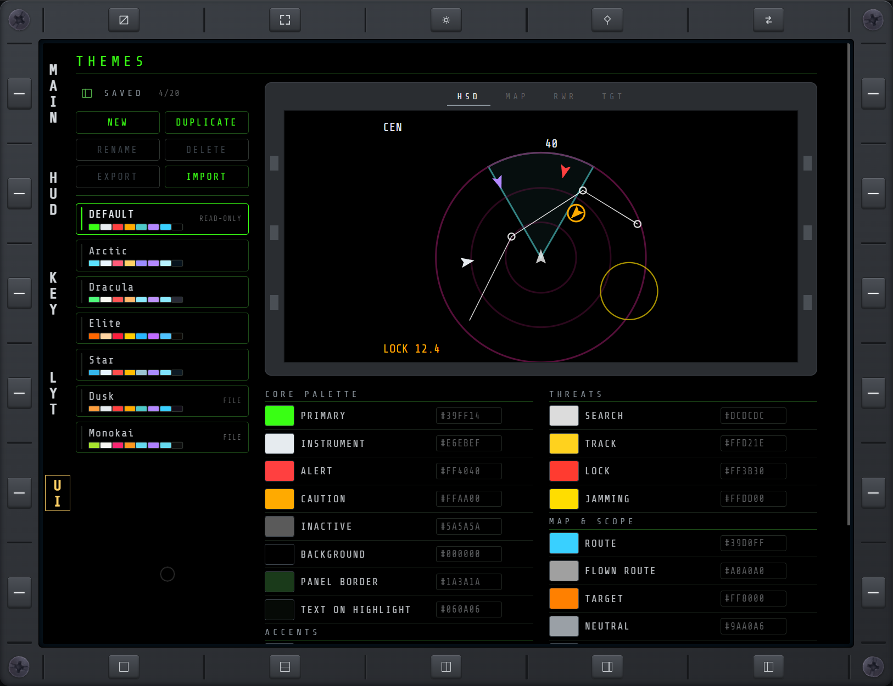
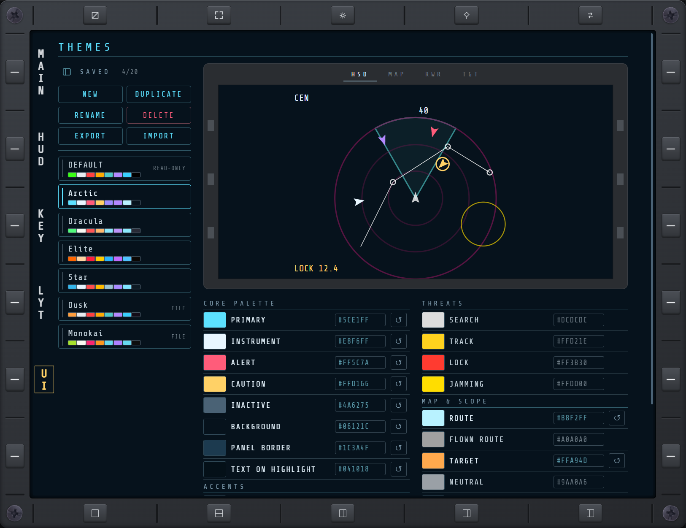
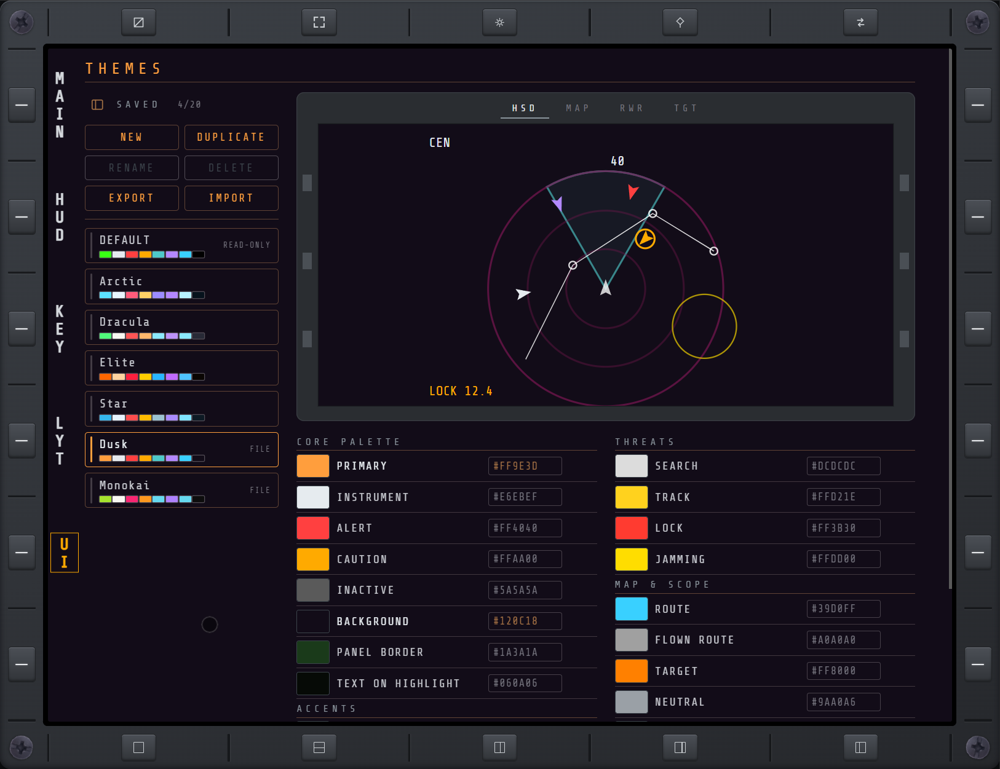

# UI

Display settings, reached from MAIN's CFG key alongside [HUD](hud.md), [KEY](keybinds.md) and
[LYT](layouts.md).

## THEMES

Recolours the whole MFD with saved colour themes. The active theme applies to every connected
browser and device, every page, and extension pages too; changes show immediately, with no reload.
The CLASSIC bezel and the F-35 frame keep their own colours.



### SAVED

The theme list sits on the left, beside the preview and the colours (above them on a narrow
screen). Each row shows the theme's name over a strip of its main colours; the active theme's lamp
is lit. The count beside SAVED shows how many of the 20 themes that can be saved are in use.
The sidebar toggle beside SAVED collapses the list to a narrow strip of each theme's lamp and first
colours, like KEY's sidebar; the choice is remembered per browser, and with no choice made the
sidebar starts collapsed on a screen 1152 px wide or less.

- **DEFAULT** is the stock colour set, tagged **READ-ONLY**: changing a colour while it is active
  asks for a name and saves a new theme with that change.
- Tap a theme row to switch to it.
- **NEW** saves a new theme with the stock colours.
- **DUPLICATE** saves a copy of the active theme under a new name.
- **RENAME** and **DELETE** act on the active theme. Deleting it switches back to DEFAULT.
- **EXPORT** gives the active theme's share code. When the browser allows it, the code goes straight
  to the clipboard; otherwise it is shown, selected, to copy by hand.
- **IMPORT** adds a share code as a new theme and switches to it.



A saved theme such as Arctic can be renamed, deleted and edited; each colour it changes shows a
**↺** to put that colour back to its default.

Saved themes live in the plugin's config file, `BepInEx/config/com.roque.NOXMFD.themes.json`, along
with which theme is active. They are the only editable themes: DEFAULT and the folder themes below
are read-only.

### Themes folder

Theme files can also be dropped into the mod's themes folder, next to DOC's kneeboard folder:
`BepInEx/plugins/NOXMFD/themes/` (created automatically when the plugin loads). Each `.json` file
there shows as a theme row with a **FILE** tag. The folder is read when the game starts and again
every time the UI page opens, so a new or edited file appears the next time you open CFG > UI.

**A folder theme is read-only**, like DEFAULT: you can select it and **EXPORT** its share code, but
not change, rename or delete it from the UI page (RENAME and DELETE are greyed out). Its file is the
theme: to change the folder theme itself, edit its file; deleting the file removes the theme, and if
it was active, DEFAULT takes over.



#### Editing a folder theme

To tweak a folder theme in game, save an editable copy of it as a saved theme:

1. Tap the folder theme (Dusk, say) to make it active.
2. Press **DUPLICATE** and name the copy, for example `Dusk Night`. The copy is made active, with
   the same colours.
3. Change any colour, style or width. The copy is saved in the config file; Dusk's file stays as it
   was.

Changing a colour while the folder theme itself is active does the same in one step: the page asks
for a name, saves a copy with that change, and switches to it.

To turn your edited copy back into a file to keep or share, press **EXPORT** to copy its share code
(anyone can **IMPORT** it), or write its colours into a `.json` file in the themes folder in the
format below.

A theme file names the theme and lists the colours it changes, each by its colour row's name in
lower case with dashes; any colour it leaves out keeps its default:

```json
{
  "name": "Dusk",
  "colors": {
    "primary": "#ff9e3d",
    "background": "#120c18"
  }
}
```

| Group | Keys |
|---|---|
| CORE PALETTE | `primary`, `instrument`, `alert`, `caution`, `inactive`, `background`, `panel-border`, `text-on-highlight`, `nav-label` |
| ACCENTS | `squad`, `mod-controls`, `mod-accent`, `friendly-tgt-td`, `friendly-hud` |
| THREATS | `search`, `track`, `lock`, `jamming` |
| MAP & SCOPE | `route`, `flown-route`, `target`, `neutral`, `nuclear-zone`, `hsd-symbology`, `hsd-aa-rings` |
| SOI | `soi` (a colour), `soi-style` (`solid`, `dashed`, `dotted` or `double`), `soi-width` (`sm`, `md` or `lg`) |

Colour values must be `#rrggbb`. A file without a `name` uses its file name; a file with no valid colour
is skipped and noted in the BepInEx log. Up to 50 files of 64 KB each are read.

### PREVIEW

Small mocks of the [HSD](rdr.md#hsd), [MAP](map.md), [RWR](rwr.md) and [TGT](tgt.md) pages above the
colour rows, one at a time behind HSD / MAP / RWR / TGT tabs, in a grey MFD frame, drawn with the
colours being edited:

- **HSD**: the range rings, the radar cone, a route, an AA threat ring and contacts in each state.
- **MAP**: the grid, a route, units of each faction, a target, a nuclear zone, a jamming line and
  the readout chips.
- **RWR**: search, track and lock contacts and an incoming missile with its notch line, inside the
  SOI focus ring.
- **TGT**: both filter rows, the vehicle-type lamps, a target list with focused, datalink and stale
  rows, the density toggle and all four action buttons.

The previews follow a picker or hex value as it changes, before the change is applied.

### Colour rows

Each row is one colour: tap the swatch to pick a new one, or type a hex value (`#rrggbb`, the `#`
optional) and press Enter. **↺** puts that colour back to its default. Rows are grouped as CORE
PALETTE and ACCENTS in one column, THREATS and MAP & SCOPE in the other (one column on a narrow
screen). Changing a base colour such as PRIMARY also recolours its dimmer and darker shades.
NAV LABEL is the white of the page names beside the bezel keys (the highlighted one follows
CAUTION); TGT's neutral and stale rows and the same text on TD and BDF use it too.

### SOI

The last group sets how the sensor of interest is marked, in both layouts:

- **COLOUR**: the focus ring around the SOI display or pane, and the cursor on the label SELECT will
  press. Until a theme sets it, it matches NAV LABEL.
- **STYLE**: the focus ring's line: **SOLID**, **DASHED**, **DOTTED** or **DOUBLE**.
- **WIDTH**: the focus ring's thickness: **SM** (2 px, the default), **MD** (3 px) or **LG** (4 px).
  DOUBLE needs MD or LG to show as two lines.

The RWR preview is drawn as the SOI, so it shows all three.
