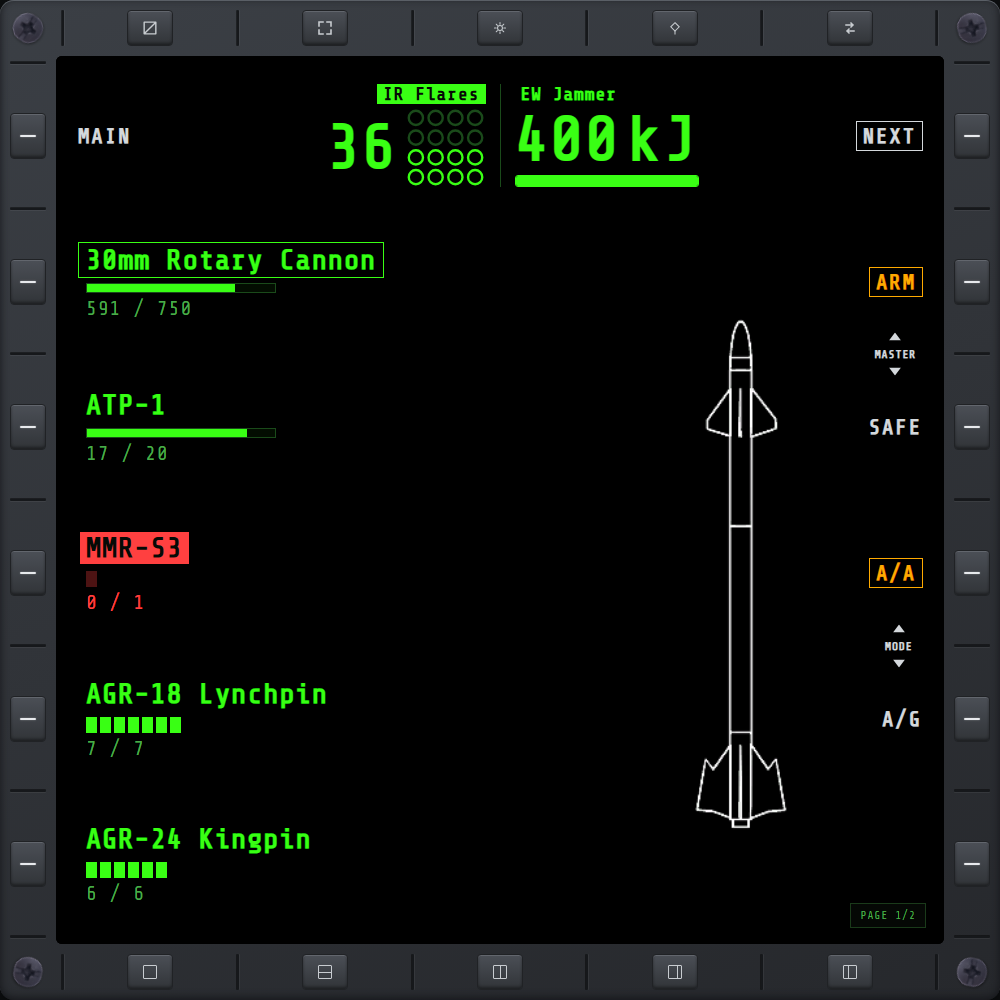

# WPN

Weapon loadout and rounds remaining, plus IR-flare count and jammer charge.

## Ammo gauges

Each weapon has a gauge beside its `rounds / capacity` count. Magazines of 12 or fewer get one
cell per round (lit = remaining); larger ones, like the cannon, get a fill bar. A weapon that
has run dry turns red.

## Master Arm — ARM / SAFE

Two bezel controls next to the weapon list. **ARM** lights up when Master Arm is on; **SAFE**
lights up when it's off — click either to switch. While it's off, guns, missiles, and bombs are
all blocked from firing (including the stock keybind), and the page shows a full-screen SAFE
warning until it's back on. Also has its own dedicated keybinds — see
[Immersion Options](keybinds.md#immersion-options).

## Combat mode — A/A · A/G

Two more bezel controls restrict which missiles you can cycle to: **A/A** limits cycling to
air-to-air missiles, **A/G** to air-to-ground. Guns fire in either mode; bombs only cycle in A/G.
Click one to lock into that mode — its label lights up.

There's no ALL button here: clicking A/A or A/G only ever picks one of the two restricted modes.
To clear back to ALL (unrestricted), hold either mode's keybind — see
[Immersion Options](keybinds.md#immersion-options).
