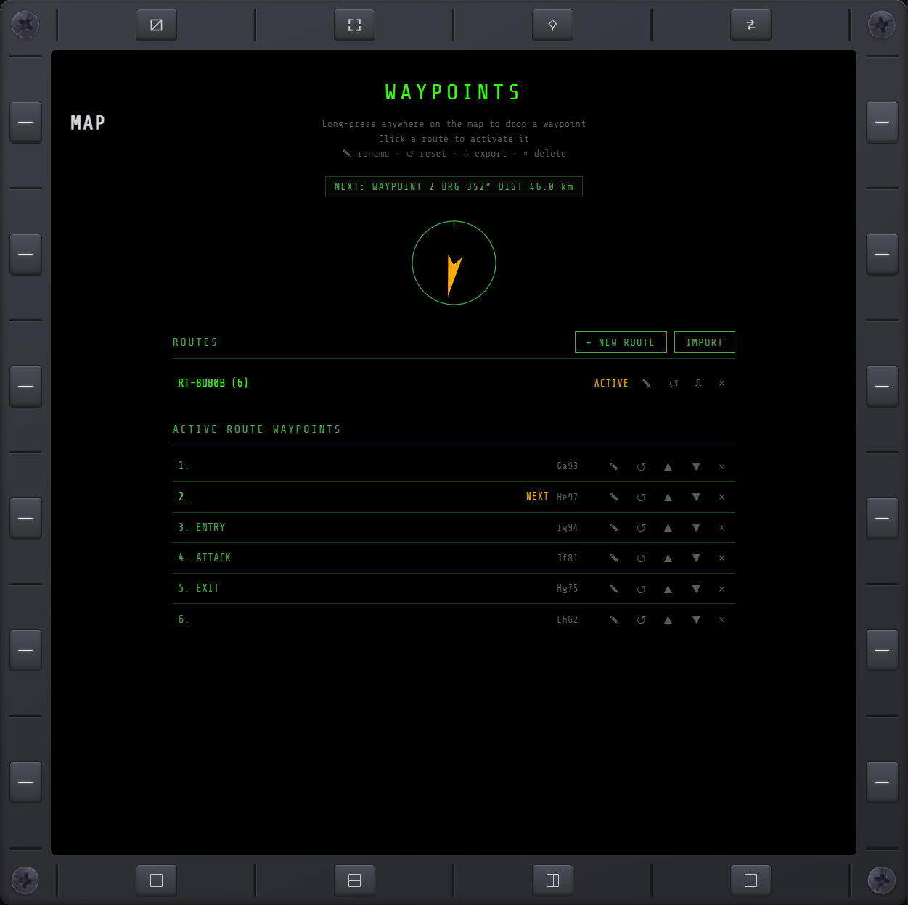
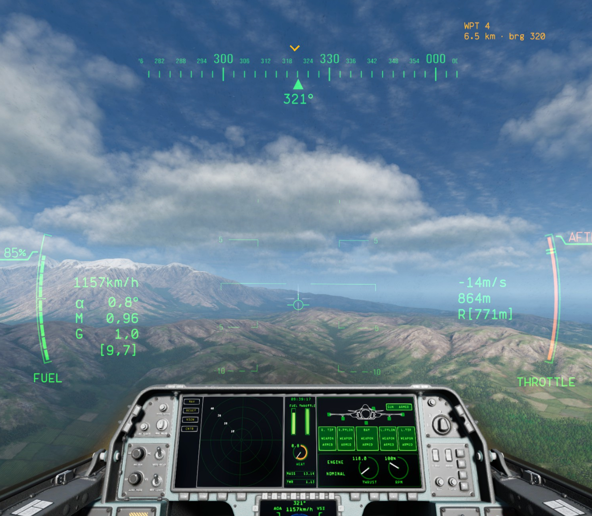

# WPT

Build waypoint routes or select a standalone steer point for in-flight guidance.

## Adding navigation points

Long-press a spot on [MAP](map.md). If a route is active, the point is appended to that route as a
waypoint. If no route is active, it is added to the steer-point table instead.

## Routes

The WPT page lists every route you've saved:

- **Create / rename / delete** a route.
- **Click a route** to activate it. Click the active one again to deactivate it — it stays saved,
  just no longer the one you're navigating.
- **CLEAR** wipes every saved route at once.

## Waypoints (within the active route)

- **Rename, reorder, or delete** any waypoint.
- **Reset progress** back to any waypoint, if you've already passed it.
- A **distance/bearing readout** and a **relative-bearing compass** point to the next waypoint,
  and auto-advance to the one after it as you approach.

## Steer points

Steer points are independent map positions rather than an ordered route. Click one in the lower
table to select it, then rename, delete, import, export, or share it like other navigation data.
The selected point stays active until you select another point or activate a route; flying over it
does not advance or deactivate it.

An active route always has guidance priority. Deactivating that route restores the previously
selected steer point. While no route is active, MAP changes **W+ / W−** to **S+ / S−** and those
buttons cycle the steer-point selection.

## Import / export

**IMPORT**, and each route's own export button, turn a route into pasteable JSON. The steer-point
table has its own IMPORT/EXPORT controls; importing appends the pasted points and selects the first
new one.

## Where navigation data lives

Routes and steer points are stored by the mod itself, not any one browser: they show on every
connected display and survive a full game restart. Route progress keeps advancing whether or not
the WPT page is open; steer points remain static.

## Squad sharing

A squad leader (see [SQD](sqd.md)) can share a route or individual steer point with their squad. It
shows up for members as a read-only entry with ACCEPT/REJECT. Later edits by the leader re-broadcast
automatically, and accepted data unlocks for editing once the squad ends or the leader changes.

## In-game HUD cue

The effective navigation target also shows on the **in-game HUD**: an amber bug rides the game's
own heading tape, with distance and bearing beside it. Route guidance reads `WPT n · NAME`; steer-
point guidance reads `STPn · NAME` (`n` is the point's position in the steer-point table). Past
±45° of the nose, the bug becomes a sideways arrow pinned
at the edge it left, pointing the way to turn.

