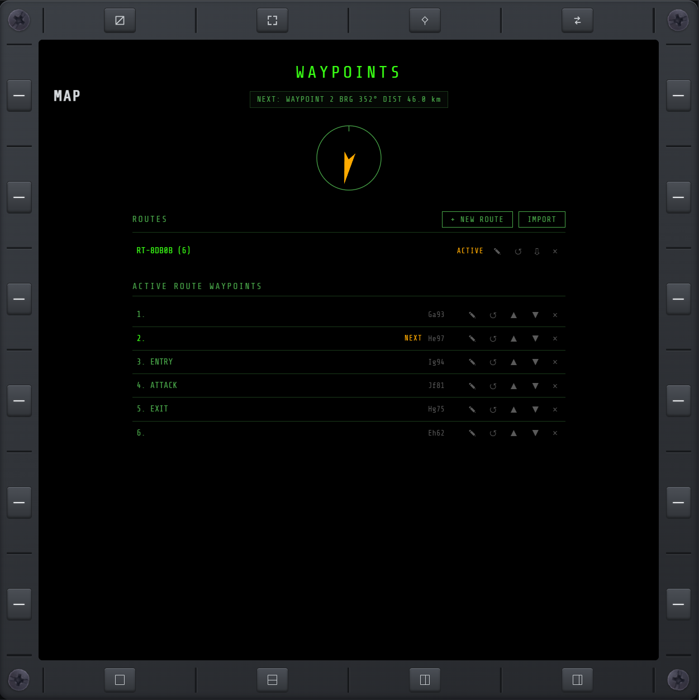

# WPT

Plot custom waypoints on [MAP](map.md) (long-press a spot to drop one into the active route) and
chain them into an ordered route. The WPT page lists every route (create, rename, delete, click
to activate — click the active one again to deactivate it, leaving it saved but unassigned) and
the active route's waypoints (rename, reorder, delete, or reset progress back to any waypoint),
with a distance/bearing readout and a relative-bearing compass to the next one that auto-advances
as you approach it. CLEAR wipes every route at once. Routes are stored by the mod itself, not any
one browser — the same routes show on every connected display (PC, tablet, phone), survive a full
game restart, and advance whether or not the WPT page is even open. IMPORT and each route's own
export button turn a route into pasteable JSON, so you can back one up or hand it to another
pilot.

The active waypoint also shows on the **in-game HUD**: an amber bug rides the game's own heading
tape at the waypoint's bearing, with a `WPT n · NAME` / distance · bearing readout beside it. Past
±45° of the nose — the tape only spans 90° — the bug becomes a sideways arrow pinned at the edge
it left, pointing the way to turn. It shows whenever a route is active.

$\color{green}\textsf{Show screenshot}$

