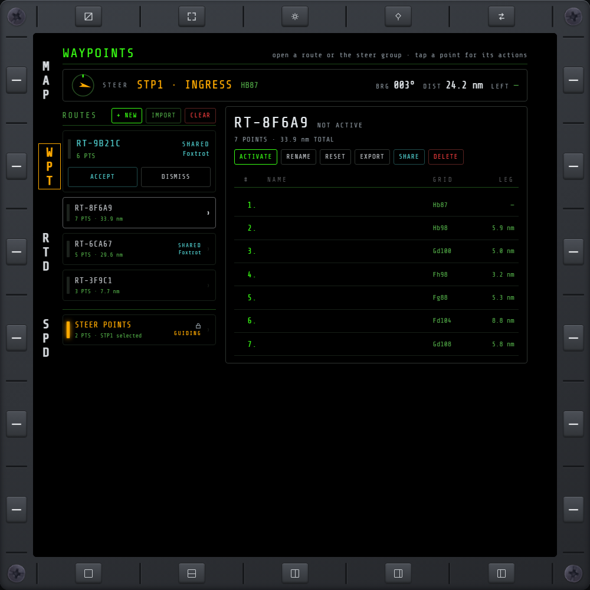
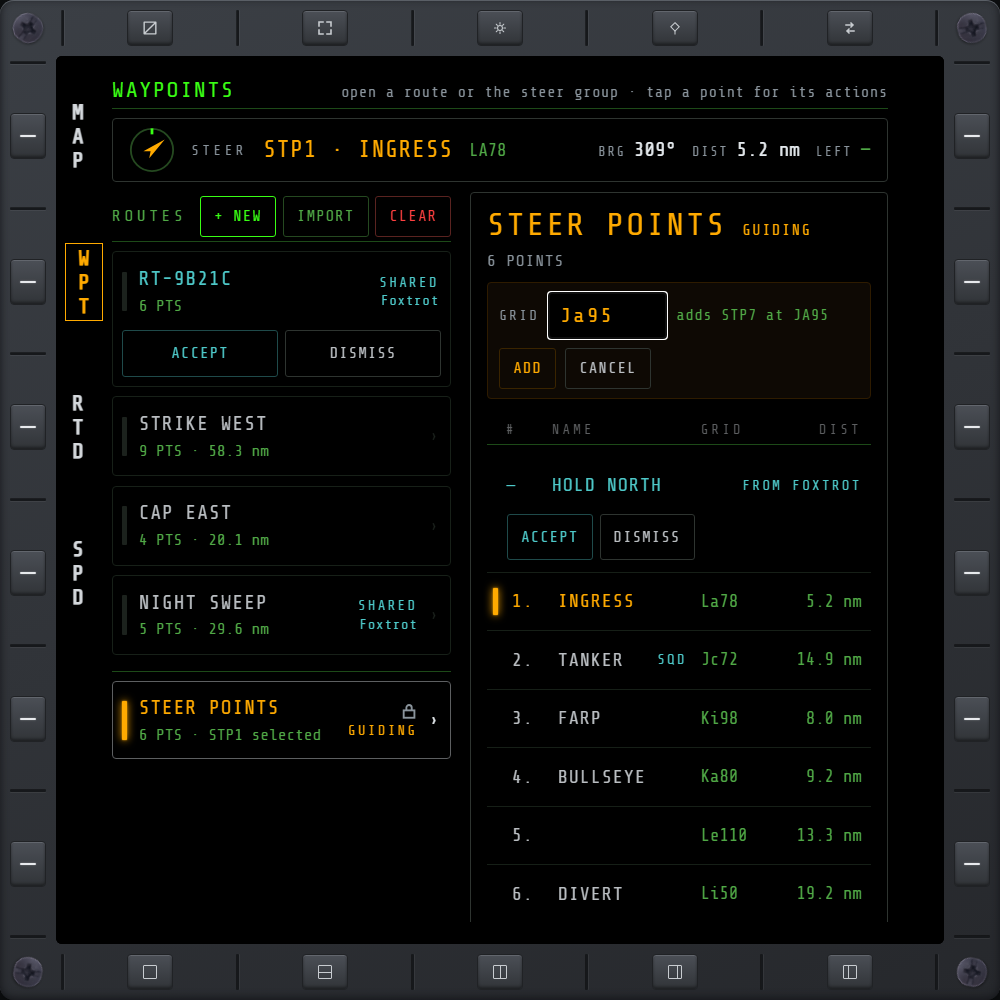
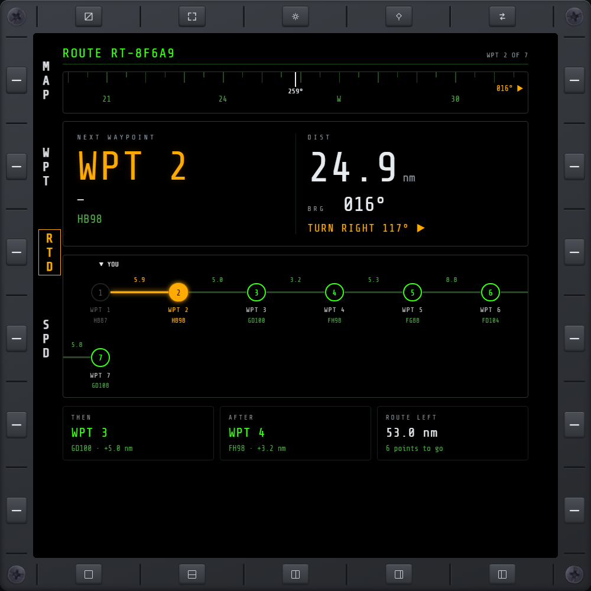
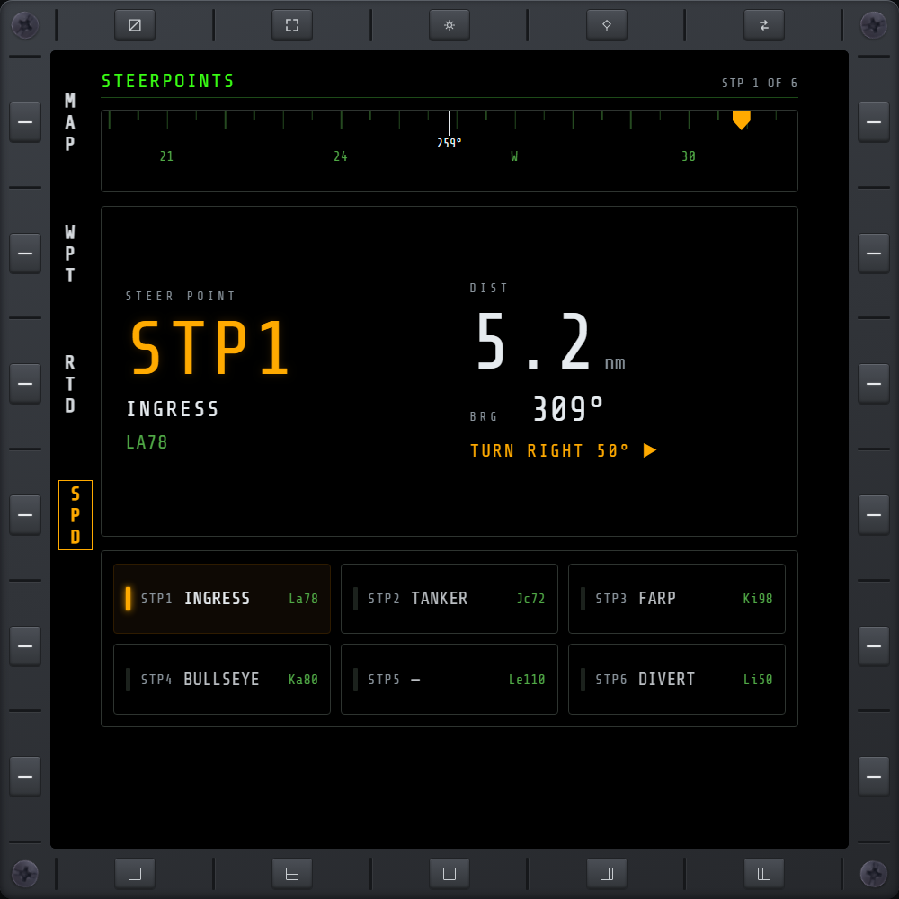
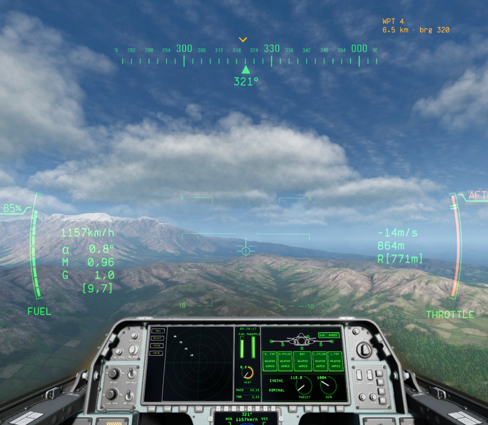

# WPT

Build waypoint routes and steer points, and fly them. Three pages work together, switched from the
left bezel keys:

- **WPT** manages your routes and steer points.
- **RTD** (route details) flies the active route.
- **SPD** (steer-point details) flies the selected steer point.

The keys read **MAP / WPT / RTD / SPD**, with the page you're on lit. WPT is reached from
[MAP](map.md)'s own **WPT** key, and **MAP** takes you back.

## Adding navigation points

Long-press a spot on [MAP](map.md). If a route is active, the point is appended to that route as a
waypoint. If no route is active, it is added to the steer points instead. A steer point can also be
typed in by its grid square (see [Steer points](#steer-points)).

## The WPT page

Across the top, the **next-point strip** shows what you're flying to: a compass needle pointing the
way to turn, the point (`WPT 4 · ENTRY`, or `STP1 · INGRESS` for a steer point) and its grid, then its
bearing (**BRG**), distance (**DIST**) and, on a route, the distance **LEFT** to the end of it.

Below it, the left column lists your **ROUTES**, then the **STEER POINTS** group. Tap a card to open
it on the right.

- A route card shows its name, how many points it has and its length. The lit green lamp and
  **ACTIVE** mark the route you're flying. **SHARED** with a callsign marks a route a squad leader
  shared with you.
- A route someone has just shared appears at the top with **ACCEPT** and **DISMISS**; it becomes a
  normal route once accepted.
- **+ NEW** creates a route (the name is pre-filled; accept it or type over it), **IMPORT** pastes
  one in, and **CLEAR** deletes every route at once.

## Routes

The open route doesn't have to be the active one: you can review and edit any route without
flying it. Its actions sit under its name:

- **ACTIVATE / DEACTIVATE** — fly this route, or stop flying it.
- **RENAME**, **EXPORT**, **DELETE**.
- **RESET** — mark every waypoint not reached, so the route starts over.
- **SHARE** — sends the route to your squad (squad leader only, once a member has joined).

Each waypoint shows its number, name, grid and **LEG** (its distance from the previous point). On the
active route, waypoints already flown are dimmed and the next one is amber with **NEXT**. Progress
advances by itself as you reach each waypoint.

Tap a waypoint to open its actions:

- **RENAME**, **▲ / ▼** to move it, **DELETE**.
- **FLY FROM HERE** — makes it the next waypoint, activating the route first if it isn't active.

A route a squad leader shared with you is read-only: it keeps **FLY FROM HERE**, **RESET** and
**EXPORT**, and **DELETE** becomes **REMOVE** (it only removes your copy).

## Steer points

Steer points are independent map positions rather than an ordered route: fly to one, and it stays
selected until you pick another. Open the **STEER POINTS** card to list them. The guiding point
has a lit amber lamp, and each row shows its grid and its current distance from you (**DIST**).

- **+ NEW STEER POINT** takes a grid square such as `Ja95` and adds a point at its centre. The hint
  beside it says whether the text is a grid, whether it's on this map, and which STP it will be.
  **Enter** adds it, **Escape** cancels.
- Tap a point for **GUIDE TO**, **RENAME**, **SHARE** (squad leader only) and **DELETE**.
- A point a squad leader shared with you lists first with **ACCEPT** and **DISMISS**.

### Route or steer point, never both

A route and a steer point never guide at the same time. Activating a route clears the selected steer
point, and **GUIDE TO** on a steer point deactivates the route. A steer point added while a route is
active is saved but not selected, so adding one never interrupts your route. Deactivating a route
leaves nothing selected until you pick a steer point.

While no route is active, MAP's **W+ / W−** become **S+ / S−** and step through the steer points.

## RTD — route details

The active route, laid out for flying it.

- **Heading tape** — 120° around your heading, with an amber bug on the next waypoint's bearing.
  When the bearing is off the tape, an arrow and the bearing sit at the edge it went off.
- **Readout** — the next waypoint, its name and grid; its distance and bearing; and which way to turn
  (**TURN LEFT / TURN RIGHT** with the angle, or **ON COURSE** within 4°).
- **Timeline** — the whole route, up to six waypoints per row; a longer route continues on the next
  row. Flown legs are dimmed and the leg you're on is lit, with **▼ YOU** along it. Each leg shows its
  length. **Tap a waypoint to fly direct to it.**
- **THEN / AFTER / ROUTE LEFT** — the two waypoints after the next, with their legs, and the distance
  and points left.

With no route active, RTD shows **NO ACTIVE ROUTE**; activate one on WPT.

## SPD — steer-point details

The same heading tape and readout for the selected steer point, with every steer point as a button
underneath. **Tap one to guide to it**; if a route is active, that deactivates it.

## Units

Distances follow the game's Metric/Imperial setting: km or nm.

## Import / export

**IMPORT**, and each route's own **EXPORT**, turn a route into pasteable JSON you can send to another
pilot. Importing always starts the route fresh and activates it.

## Where navigation data lives

Routes and steer points are stored by the mod itself, not any one browser: they show on every
connected display and survive a full game restart. Route progress keeps advancing whether or not
these pages are open; steer points remain static.

## Squad sharing

A squad leader (see [SQD](sqd.md)) can share a route or an individual steer point with their squad.
It shows up for members with **ACCEPT** and **DISMISS**. Later edits by the leader re-broadcast
automatically, and accepted data unlocks for editing once the squad ends or the leader changes.

## In-game HUD cue

The point you're flying to also shows on the **in-game HUD**: an amber bug rides the game's own
heading tape, with distance and bearing beside it. Route guidance reads `WPT n · NAME`; steer-point
guidance reads `STPn · NAME` (`n` is the point's position in the steer-point list). Past ±45° of the
nose, the bug becomes a sideways arrow pinned at the edge it left, pointing the way to turn.

